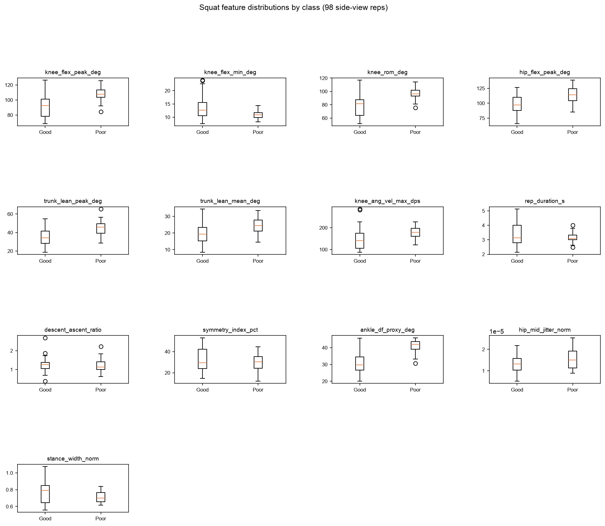
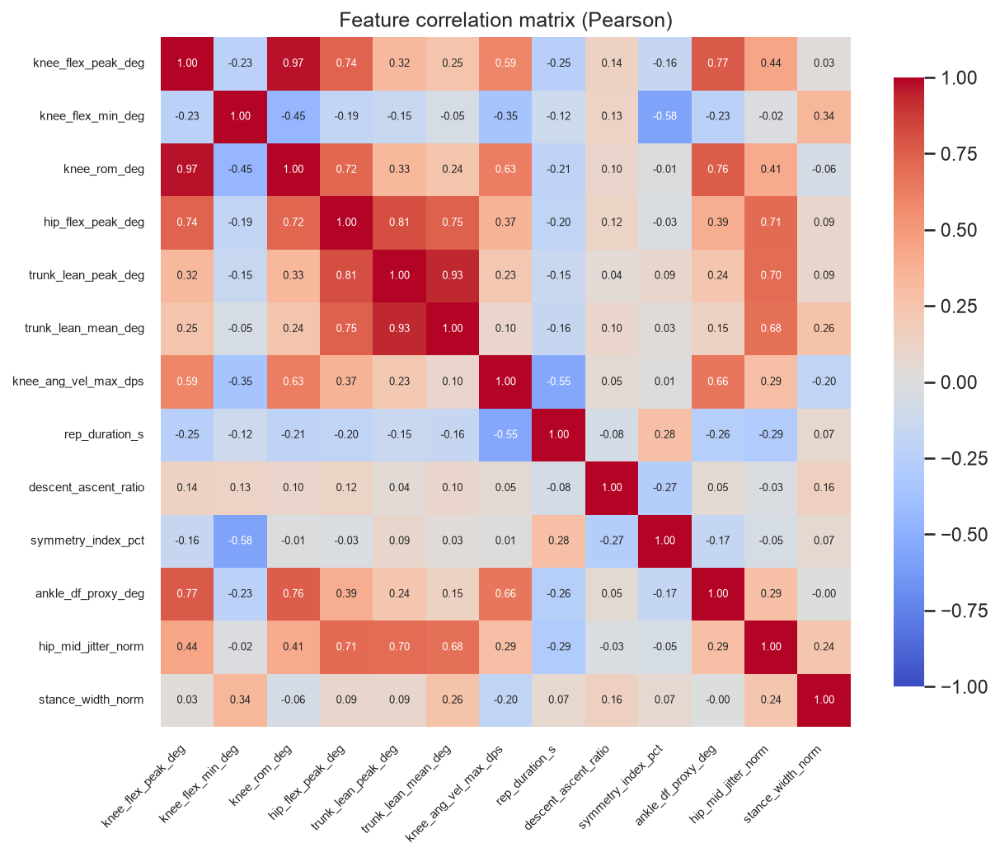

# Stage 5.4 — feature-validity sanity (R5.5 gate)

Source: `ml/data/squat_features.csv` — 98 side-view reps (72 Good / 26 Poor) from 9 subjects, features computed by the backend's `extract_squat_features()` on the preprocessed stream (X1).

## The gate

**knee_flex_peak_deg: AUC 0.837** (Good median 92.8° vs Poor median 107.7°) — **PASS**. 

The gate asks only whether this feature separates the classes. It does: an AUC of 0.837 is 0.337 away from the 0.5 no-separation point, and the direction is consistent across 5/5 of the subjects who can vote on it. Extraction, view filter and windowing are therefore not obviously broken, which is what this gate exists to catch. Training may proceed.

> **The separation runs opposite to the plan's stated expectation, and that matters.** `task.md`'s checklist says *"`knee_flex_peak_deg` should be lower for incorrect reps"* — i.e. it assumed incorrect squats are too shallow. Measured, incorrect reps go **deeper**: Poor median 107.7° vs Good median 92.8°. The gate's pass condition is separation, which holds either way, so this is **not** a gate failure. But the sign should not be carried forward as if the plan's assumption were confirmed: any downstream rule that reads 'deeper = better' would be inverted for this cohort. REHAB24-6's Ex6 'incorrect' reps are a mix of deliberate faults, not specifically shallow ones — so depth alone does not encode correctness in the direction the plan guessed. Flagged for Stage 5.5/5.6, not resolved here.

## Method

- **AUC** = Mann-Whitney U / (n_good x n_poor). 0.5 = no separation; distance from 0.5 is the effect size. AUC > 0.5 means Poor reps score higher.
- **Cross-subject direction consistency.** The 98 reps come from only 9 subjects, so reps are **not independent** — a p-value that treats them as independent is anti-conservative (pseudo-replication). p-values are listed below for completeness but are **not** the verdict basis. Instead each subject with >= 2 reps in *both* classes votes on whether the difference points the same way as the pooled result (5 subjects qualify; the other 3 are single-class Good, and one has a single Poor rep).
- **Pre-declared verdict rule** (fixed before results were seen, so the thresholds are not fitted to the outcome): **KEEP** if |AUC - 0.5| >= 0.1 *and* >= 60% of voting subjects agree on the direction; **KEEP (caveat)** if it separates but the direction is subject-inconsistent (the separation may be one subject's idiosyncrasy); **DROP** otherwise.

## Per-feature verdicts

| feature | Good median | Poor median | AUC | direction | subjects agreeing | p | verdict |
| ------- | ----------- | ----------- | --- | --------- | ----------------- | - | ------- |
| `ankle_df_proxy_deg` | 29.71 | 41.93 | 0.882 | Poor higher | 5/5 | 8.54e-09 | **KEEP** |
| `knee_rom_deg` | 81.46 | 96.42 | 0.859 | Poor higher | 5/5 | 6.54e-08 | **KEEP** |
| `knee_flex_peak_deg` | 92.76 | 107.68 | 0.837 | Poor higher | 5/5 | 4.07e-07 | **KEEP** |
| `hip_flex_peak_deg` | 96.88 | 113.98 | 0.784 | Poor higher | 4/5 | 1.97e-05 | **KEEP** |
| `trunk_lean_peak_deg` | 34.10 | 46.02 | 0.762 | Poor higher | 3/5 | 7.92e-05 | **KEEP** |
| `knee_ang_vel_max_dps` | 141.01 | 179.20 | 0.750 | Poor higher | 4/5 | 0.000169 | **KEEP** |
| `trunk_lean_mean_deg` | 19.37 | 24.55 | 0.695 | Poor higher | 3/5 | 0.00336 | **KEEP** |
| `knee_flex_min_deg` | 12.68 | 10.92 | 0.315 | Poor lower | 4/5 | 0.00543 | **KEEP** |
| `hip_mid_jitter_norm` | 0.00 | 0.00 | 0.650 | Poor higher | 4/5 | 0.0245 | **KEEP** |
| `stance_width_norm` | 0.79 | 0.70 | 0.374 | Poor lower | 1/5 | 0.0592 | **KEEP (caveat)** |
| `symmetry_index_pct` | 29.57 | 30.28 | 0.442 | Poor lower | 4/5 | 0.383 | **DROP** |
| `descent_ascent_ratio` | 1.26 | 1.13 | 0.467 | Poor lower | 2/5 | 0.624 | **DROP** |
| `rep_duration_s` | 3.13 | 3.08 | 0.492 | Poor lower | 3/5 | 0.91 | **DROP** |

**10 keep / 3 drop** of 13 candidate features.

## Justification per feature

- **`ankle_df_proxy_deg`** — KEEP: separates (AUC 0.882, poor higher) and the direction holds in 5/5 subjects — not one subject's artefact.
- **`knee_rom_deg`** — KEEP: separates (AUC 0.859, poor higher) and the direction holds in 5/5 subjects — not one subject's artefact.
- **`knee_flex_peak_deg`** — KEEP: separates (AUC 0.837, poor higher) and the direction holds in 5/5 subjects — not one subject's artefact.
- **`hip_flex_peak_deg`** — KEEP: separates (AUC 0.784, poor higher) and the direction holds in 4/5 subjects — not one subject's artefact.
- **`trunk_lean_peak_deg`** — KEEP: separates (AUC 0.762, poor higher) and the direction holds in 3/5 subjects — not one subject's artefact.
- **`knee_ang_vel_max_dps`** — KEEP: separates (AUC 0.750, poor higher) and the direction holds in 4/5 subjects — not one subject's artefact.
- **`trunk_lean_mean_deg`** — KEEP: separates (AUC 0.695, poor higher) and the direction holds in 3/5 subjects — not one subject's artefact.
- **`knee_flex_min_deg`** — KEEP: separates (AUC 0.315, poor lower) and the direction holds in 4/5 subjects — not one subject's artefact.
- **`hip_mid_jitter_norm`** — KEEP: separates (AUC 0.650, poor higher) and the direction holds in 4/5 subjects — not one subject's artefact.
- **`stance_width_norm`** — KEEP (caveat): separates on pooled data (AUC 0.374) but only 1/5 subjects agree on the direction, so the effect may be driven by a subset of subjects. Kept — Extra Trees can down-weight it — but it should not be read as a reliable clinical signal on its own.
- **`symmetry_index_pct`** — DROP: does not separate (AUC 0.442, only 0.058 from the 0.5 no-separation point).
- **`descent_ascent_ratio`** — DROP: does not separate (AUC 0.467, only 0.033 from the 0.5 no-separation point).
- **`rep_duration_s`** — DROP: does not separate (AUC 0.492, only 0.008 from the 0.5 no-separation point).

### `symmetry_index_pct` — a formula problem, not just a weak signal

Flagged independently of its class separation, because the defect is in the definition rather than the data. It is computed per frame as `|θ_L − θ_R| / (0.5·(θ_L+θ_R)) × 100`, then averaged over the rep. Near standing both knee angles approach 0, so the denominator collapses and the ratio explodes — a 12° left-vs-right difference reads as ~10% mid-squat but can exceed 100% while standing. The rep mean is therefore dominated by the frames where the measure is least meaningful, which is most of why its values sit as high as they do. Whatever its verdict in the table above, the number is not a trustworthy asymmetry percentage; a phase-matched formulation (the feature table's own definition says *"at matched phase"*, which the implementation does not do) or an absolute-degrees difference would be sounder. Not changed here — altering a feature's definition means bumping `feature_schema_version` and re-running Phase 4's tests, which is outside this gate's scope.

## Redundancy

Pairs correlated at |r| >= 0.90 — candidates for dropping one side later (recorded here so any such call is evidence-backed, not asserted):

- `knee_flex_peak_deg` ~ `knee_rom_deg` (r = 0.97)
- `trunk_lean_peak_deg` ~ `trunk_lean_mean_deg` (r = 0.93)

Not dropped here: Extra Trees is not destabilised by correlated inputs the way a linear model is, and dropping one of a pair changes the feature vector, which would mean bumping `feature_schema_version`. Recorded for Stage 5.5 to decide with model evidence in hand.

## Caveat on data-driven dropping (read before Stage 5.5)

Every verdict above was computed on **all 98 reps** — including the reps of subjects that Stage 5.5 will hold out for LOSO. Dropping a feature on that evidence and then reporting LOSO scores over the same data is a mild selection bias: the held-out subject influenced which features existed. This is tolerable here because the stage's purpose is a **sanity gate** (catch a broken pipeline), not statistical feature selection — and because the only DROP verdicts are for features with effectively no signal, which a tree ensemble would ignore anyway. If Stage 5.5 wants a clean claim, the honest options are to train on all 13 features and let the model's own importances speak, or to nest the selection inside each CV fold. Recorded so the choice is deliberate rather than accidental.
