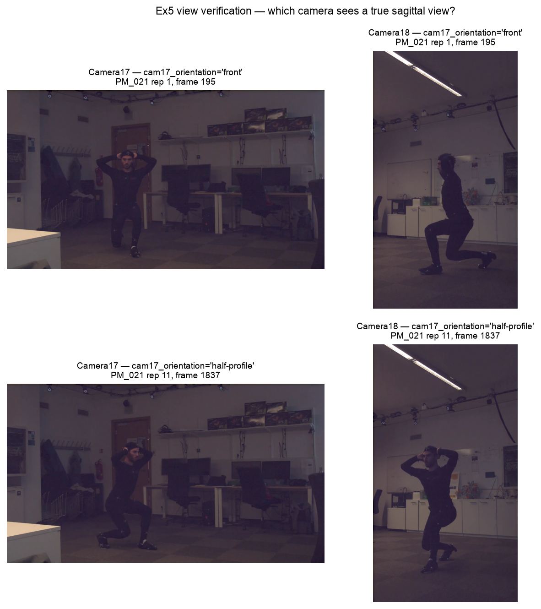

# Stage 5.0 (Lunge) — REHAB24-6 Ex5 Data Audit

**Hard gate.** This report is the required input to a decision only HY can make (see
"The gate" at the bottom). No lunge training work (Stage 5.2 onward) begins until that
decision is recorded.

Generated by `ml/scripts/audit_rehab246.py` and `ml/scripts/make_view_figure.py` against
`/Users/sumhonyou/fypDataset/Segmentation.csv` (1072 rows, read 2026-07-17). Schema
reference: [`rehab24_6_schema.md`](../docs/rehab24_6_schema.md). Squat's equivalent
report is [`DATA_AUDIT.md`](./DATA_AUDIT.md); this one covers **Ex5 (Leg lunge)** and is
written to be read on its own.

`DATA_AUDIT.md` §2 already recorded Ex5's raw totals as a forward reference. This report
supersedes that summary: it re-derives those numbers from the same script, and adds the
view filter, the LOSO analysis, and three structural findings that the earlier
squat-scoped pass did not look for.

---

## 0. Summary of what the audit found

Three findings drive everything below, and two of them are new:

1. **The side-view lunge cohort is small but balanced: 88 reps, 39 Good / 49 Poor.**
   This is a materially different problem from squat's, where the filtered set was
   large-but-lopsided (72 Good / 26 Poor). Lunge's minority class is **Good (39)**, not
   Poor.
2. **Lead-leg is perfectly confounded with subject** — every subject lunged with exactly
   one lead leg, and no subject ever performs both. This is a property of the dataset's
   recording design, not of the view filter, so **no option in the gate below fixes it**.
   It has direct consequences for Stage 5.2's lead-leg feature and it means Stage 4.4's
   cross-rep Symmetry sub-score **has no ground truth in this dataset at all**.
3. **REHAB24-6 is _not_ the only public labelled lunge dataset** — contradicting the
   premise of `task.md`'s Stage 5.0 (Lunge) generalisation note. See §6.

---

## 1. Ex5 — Leg lunge: raw counts (before any view filter)

- **Total reps: 174**
- Correctness: `Good (correctness=1)`: **78**, `Poor (correctness=0)`: **96** — note the
  Poor class is the _majority_ here, the opposite of Ex6 (134 Good / 61 Poor).
- `cam17_orientation` distribution: `front`: **88**, `half-profile`: **86**, `profile`: **0**
- `mocap_erroneous`: **0** reps flagged (Ex6 had 4)
- `exercise_subtype` (**the lead-leg tag** — given by the dataset, not inferred):
  `front leg right` **91**, `front leg left` **83**
- `lights_on`: **154** on, **20** off
- **Subjects: 8 (ids 2-9).** Subject **1 is absent from Ex5 entirely** — Ex6 has 9
  subjects (ids 1-9), Ex5 has 8. Every LOSO fold count below is therefore 8, not 9.
- Reps per `person_id` × correctness:

  | person_id | Good | Poor |
  | --------- | ---- | ---- |
  | 2         | 10   | 10   |
  | 3         | 0    | 21   |
  | 4         | 10   | 10   |
  | 5         | 13   | 12   |
  | 6         | 10   | 10   |
  | 7         | 10   | 10   |
  | 8         | 13   | 12   |
  | 9         | 12   | 11   |

- **Per-subject class presence (LOSO viability, unfiltered):** subject **3** is
  single-class (**21 Poor, 0 Good**). All other 7 subjects carry both classes. Unlike
  Ex6 — where the raw data was clean and the view filter _created_ the single-class
  problem — Ex5's single-class subject exists **before** any filtering.

## 2. Video-level structure (the source of finding #2)

Ex5 is 9 video files across 8 subjects (subject 9 has two: `PM_117a`, `PM_117b`):

| video     | subject | lead leg        | reps | orientation split          |
| --------- | ------- | --------------- | ---- | -------------------------- |
| `PM_021`  | 2       | front leg left  | 20   | front 10 / half-profile 10 |
| `PM_028`  | 3       | front leg right | 21   | front 11 / half-profile 10 |
| `PM_037`  | 4       | front leg right | 20   | front 10 / half-profile 10 |
| `PM_042`  | 5       | front leg right | 25   | front 13 / half-profile 12 |
| `PM_104`  | 6       | front leg left  | 20   | front 10 / half-profile 10 |
| `PM_112`  | 8       | front leg right | 25   | front 12 / half-profile 13 |
| `PM_117a` | 9       | front leg left  | 9    | front 9                    |
| `PM_117b` | 9       | front leg left  | 14   | front 3 / half-profile 11  |
| `PM_125`  | 7       | front leg left  | 20   | front 10 / half-profile 10 |

Two things follow directly, both verified in code rather than eyeballed:

- **`exercise_subtype` is constant within every video, and within every subject.**
  Subjects with both lead legs: **none**. Lead-leg is a subject-level constant.
- **`cam17_orientation` varies _within_ every multi-orientation video** — subjects
  performed some reps facing one way and some facing another, so orientation is a
  genuine per-rep property (consistent with Ex6's own `PM_008` rep 1 vs rep 18 finding).

## 3. The view question — verified for Ex5, not carried over from Ex6

A lunge is a **directional** movement: the subject steps along their facing axis, so
Ex6's squat verification does not automatically transfer and was re-run for Ex5 rather
than assumed. Real frames were extracted from both cameras (`make_view_figure.py`, via
OpenCV) at the mid-rep frame — the deepest point, where view geometry matters most.

- **`cam17_orientation == "front"` (`PM_021` rep 1, frames 140-250, mid-frame 195):**
  Camera17 shows the subject squarely facing the camera — the split stance is
  foreshortened almost to overlap, because the lunge travels _along_ Camera17's optical
  axis. Camera18 shows a **clean true sagittal/profile view**: front leg forward with the
  knee flexed, back knee dropped toward the floor, and hip/knee/ankle separated in the
  image plane — exactly the geometry `CameraSetup.tsx`'s lunge guidance asks the live
  user to produce.
- **`cam17_orientation == "half-profile"` (`PM_021` rep 11, frames 1790-1885, mid-frame
  1837):** both cameras show the subject at a diagonal; **neither is a true side view**.
- **Confirmed on a second subject with the opposite lead leg** (`PM_028`, subject 3,
  `front leg right`, rep 1 mid-frame 227) — same conclusion, so the result is not
  specific to one subject or one lead leg. Ex6's audit verified only a single video;
  this one checks two.
- **`cam17_orientation == "profile"` never occurs for Ex5** (0 of 174), as with Ex6.

**Conclusion: for Ex5, the usable side-view source is `cam17_orientation == "front"`
rows, read from the Camera18 video file** — the same rule Ex6 uses, now independently
established for Ex5.

## 4. Ex5 usable side-view rep count (the gate number)

- **Usable side-view reps: 88** (all `cam17_orientation == "front"`, sourced from
  Camera18) — out of 174 total, i.e. **50.6%** of Ex5 survives the view filter.
- Correctness split: **Good 39**, **Poor 49**.
- Lead-leg split: **front leg left 42**, **front leg right 46** — both cohorts survive
  the filter in near-equal numbers.
- Per-subject counts × correctness (all 8 subjects still present — none is missing
  entirely from the side-view subset):

  | person_id | lead leg | Good | Poor | side-view reps |
  | --------- | -------- | ---- | ---- | -------------- |
  | 2         | left     | 5    | 5    | 10             |
  | 3         | right    | 0    | 11   | 11             |
  | 4         | right    | 5    | 5    | 10             |
  | 5         | right    | 7    | 6    | 13             |
  | 6         | left     | 5    | 5    | 10             |
  | 7         | left     | 5    | 5    | 10             |
  | 8         | right    | 6    | 6    | 12             |
  | 9         | left     | 6    | 6    | 12             |

- **Per-subject class presence on the side-view subset (LOSO viability):** subject **3**
  only — the same subject that was already single-class in the raw data. **The view
  filter creates no new LOSO problem for Ex5**, which is the opposite of what it did to
  Ex6 (where it turned subjects 2, 4 and 9 single-class). 7 of 8 folds carry both
  classes.
- Lead-leg × correctness on the side-view subset:

  | lead leg        | Good | Poor |
  | --------------- | ---- | ---- |
  | front leg left  | 21   | 21   |
  | front leg right | 18   | 28   |

  The right-lead Poor excess is **entirely subject 3** (11 Poor, 0 Good). Excluding
  subject 3, right-lead is 18 Good / 17 Poor — i.e. the apparent lead-leg/label
  association is a single-subject artefact, not a lead-leg effect. Stated here because
  a model given `lead_leg` could otherwise learn it as a real signal (see §5).

## 5. Two structural problems the view filter does not cause and cannot fix

**5.1 Lead-leg is perfectly confounded with subject identity.** Every subject has
exactly one lead leg (§2). Consequences, all of which hold under _every_ gate option
below:

- Under LOSO, `lead_leg` is **perfectly collinear with the held-out subject**. A
  `lead_leg` feature would be a subject-identity proxy, and the fold structure cannot
  separate the two. Stage 5.3 (Lunge) should treat including `lead_leg` as a feature as
  a **leakage risk**, not a free choice.
- **Stage 4.4's cross-rep Symmetry sub-score has no ground truth here.** It compares
  leading-left against leading-right reps _within one set_; no video, and no subject,
  ever contains both. It cannot be validated on REHAB24-6 by any filtering of this
  dataset. It is already report-only (`score=None`, never enters `S_rule`) by HY's
  Stage 4.4 decision, so nothing shipped is _wrong_ — but Phase 5B cannot produce
  evidence for it, and the write-up should say so rather than implying it was validated.

**5.2 An open question for Stage 5.4 (Lunge), flagged not answered.** Because each
subject faces a fixed direction and has a fixed lead leg, whether the _lead_ leg is the
near or far limb from Camera18 may itself be fixed per subject — which would tie the
known far-limb occlusion problem (documented for squat in `PHASE5_CHAPTER_DRAFT.md`
§3.2) to lead-leg, and therefore to subject. The two verification frames are consistent
with this but **cannot establish it** — near/far limb identity is not reliably readable
by eye from a single frame. This needs landmark-level measurement (visibility/`z`
ordering per limb) once Stage 5.2 has extracted them. Recorded as a risk to measure, not
a finding.

## 6. Generalisation note — the premise is false, and that is good news

`task.md`'s Stage 5.0 (Lunge) asks to "confirm that REHAB24-6 is the **only** public
labelled lunge dataset — there is no second source to cross-check against." **It is
not.** At least two others exist, one of which is already on disk:

| dataset       | lunge content                                                     | modality                                     | usable as?                                       |
| ------------- | ----------------------------------------------------------------- | -------------------------------------------- | ------------------------------------------------ |
| **REHAB24-6** | 174 reps, 8 subjects, correctness + rep boundaries + lead-leg tag | **RGB video** (2 cameras) + mocap            | **training** (only option — Stage 5.2 needs RGB) |
| **EC3D**      | **127 sequences**, 4 subjects, 46 Correct / 81 faulty             | 3D poses only (canonicalised), no usable RGB | external check (Stage 5.9 Lunge)                 |
| **UI-PRMD**   | inline lunge + side lunge, 10 subjects, correct/incorrect         | Kinect + Vicon skeletons, no RGB             | external check, not yet assessed                 |

- **REHAB24-6 remains the only viable _training_ source**, because Stage 5.2's pipeline
  extracts MediaPipe landmarks from RGB video (X1/X3) and the other two ship skeletons
  only. So the plan's _practical_ consequence was right even though its premise was
  wrong — the corrected statement is "the only public labelled lunge dataset **with RGB
  video**", not "the only public labelled lunge dataset".
- **EC3D's lunge cohort is already downloaded** (`data_3D.pickle`, the same file Stage
  5.9 used for squat) and is **larger than its squat cohort**: 12,754 lunge frames vs
  11,109 squat. Counts confirmed against the EC3D paper's own Table 1 by exact match,
  not inferred: label `1` = Correct (46), label `4` = "Not low enough" (40), label `6` =
  "Knee passes toe" (41); 127 total, 4 subjects (Hugues 32, Sena 32, Vidit 32, Isinsu 31).
- **Both EC3D lunge faults are sagittal-plane** — unlike EC3D squat, where two of the
  four faults ("Feet too wide", "Knees inward") are frontal and therefore invisible to
  this system by design under Locked Assumption #3. And **"Knee passes toe" is precisely
  the fault Stage 4.2/4.7 already implemented** as lunge's live feedback signal. So an
  EC3D lunge external check would not inherit squat's "half the fault class has no
  detector" problem.
- **This does not imply the check will succeed.** EC3D's canonicalisation (root-centred,
  orientation-normalised, retargeted to one template skeleton) is a property of the whole
  file and will degrade gravity-referenced features for lunge exactly as it did for
  squat. And "Not low enough" means EC3D's incorrect lunges are _shallower_, which is the
  same direction that produced squat's label-inversion finding — whether REHAB24-6's
  incorrect lunges are deeper or shallower is a Stage 5.4 (Lunge) measurement, not known
  yet. The honest summary is: **lunge has a genuinely better-matched external cohort
  available than squat had, and it is still not free of the failure modes squat hit.**

## 7. Comparison against the ~90/category aggregate

The gate text in `task.md` asks whether the filtered count is "materially below the
~90/category aggregate." After the view filter:

| class | Ex5 side-view | vs ~90     | Ex6 side-view (for contrast) |
| ----- | ------------- | ---------- | ---------------------------- |
| Good  | **39**        | ~43% of 90 | 72                           |
| Poor  | **49**        | ~54% of 90 | 26                           |

**Both classes are materially below the reference** — so the gate is triggered, as it
was for squat, but for a different reason and with a different shape. Squat had one
healthy class and one starved one (72/26). Lunge has **two roughly balanced classes that
are both small** (39/49, total 88). Balance is worth something: it removes the
minority-class problem that dominated squat's Stage 5.5 and 5.8 findings. Total N is
essentially the same as squat's (88 vs 98), spread over 8 subjects instead of 9.

---

## The gate

Options with trade-offs specific to the numbers above.

Note first, applying to all three: **the lead-leg/subject confound (§5.1) is not a view
question and no option below resolves it.** It needs its own decision at Stage 5.3
(whether `lead_leg` may be a feature at all), and it is why cross-rep Symmetry will stay
unvalidated whichever option is picked.

**(a) Accept the smaller N (88 reps, 39 Good / 49 Poor, 8 subjects).**

- Pro: simplest, cleanest "side-view only" story, X3-consistent, no new feature, and it
  matches exactly what the live app captures. **Materially stronger than squat's own
  option (a) was:** the classes are near-balanced, and the view filter creates **no** new
  single-class fold — only subject 3 is single-class, and it already was in the raw data.
  7 of 8 LOSO folds carry both classes, versus 6 of 9 for squat.
- Con: 88 reps across 8 subjects is small; subject 3's fold (11 Poor, 0 Good) still has
  undefined Good-class metrics, so Stage 5.5's stratified-group-k-fold fallback may still
  be needed for that one fold. Dropping subject 3 entirely would leave **77 reps, 39 Good
  / 38 Poor, 7 subjects** — near-perfect balance at the cost of one subject and ~12% of
  the data.

**(b) Additionally admit half-profile reps as a separate, flagged cohort; test whether
including them helps or hurts LOSO.**

- Pro: recovers the other half of the data — half-profile Ex5: **86 reps, Good 39 / Poor
  47** (a near-mirror of the side-view cohort's balance), lead-leg left 41 / right 45.
  Combined would give the full 174 (78 Good / 96 Poor), roughly doubling N.
- Con: half-profile is a confirmed-different camera geometry (§3, verified visually on
  two subjects), so angle-based features are not directly comparable across cohorts and
  would need their own validity check — a variant of Stage 5.4 — before being trusted.
  Weaker motivation than it had for squat: squat needed (b) to rescue a starved Poor
  class (26), whereas lunge's side-view classes are already balanced, so (b) here buys
  _size_, not _balance_.

**(c) Relax to both views and add `view` as an explicit feature.**

- Pro: keeps all 174 reps, wastes nothing, makes the geometry effect explicit and
  modelable rather than hidden.
- Con: same objection as squat's (c), unchanged — it cuts against Locked Assumption #3
  (side view only), and the live pipeline does not produce a `view` value at inference
  time, so the model would need a feature the running system cannot supply. Additionally,
  for lunge specifically, `view` would join `lead_leg` as a second
  structurally-confounded categorical in a 174-row dataset.

**✅ Resolved by HY (2026-07-17): option (a) — accept the smaller N.** Stage 5.2 (Lunge)
onward trains on the 88 verified side-view Ex5 reps (39 Good / 49 Poor, 8 subjects) only.
The half-profile cohort (§4's option (b), 86 reps) and the `view`-as-feature route
(option (c)) are not used. The lead-leg/subject confound (§5.1) and the unvalidated
cross-rep Symmetry metric (§5.1) remain open regardless of this choice and carry forward
into Stage 5.3's feature decisions and the eventual write-up.
