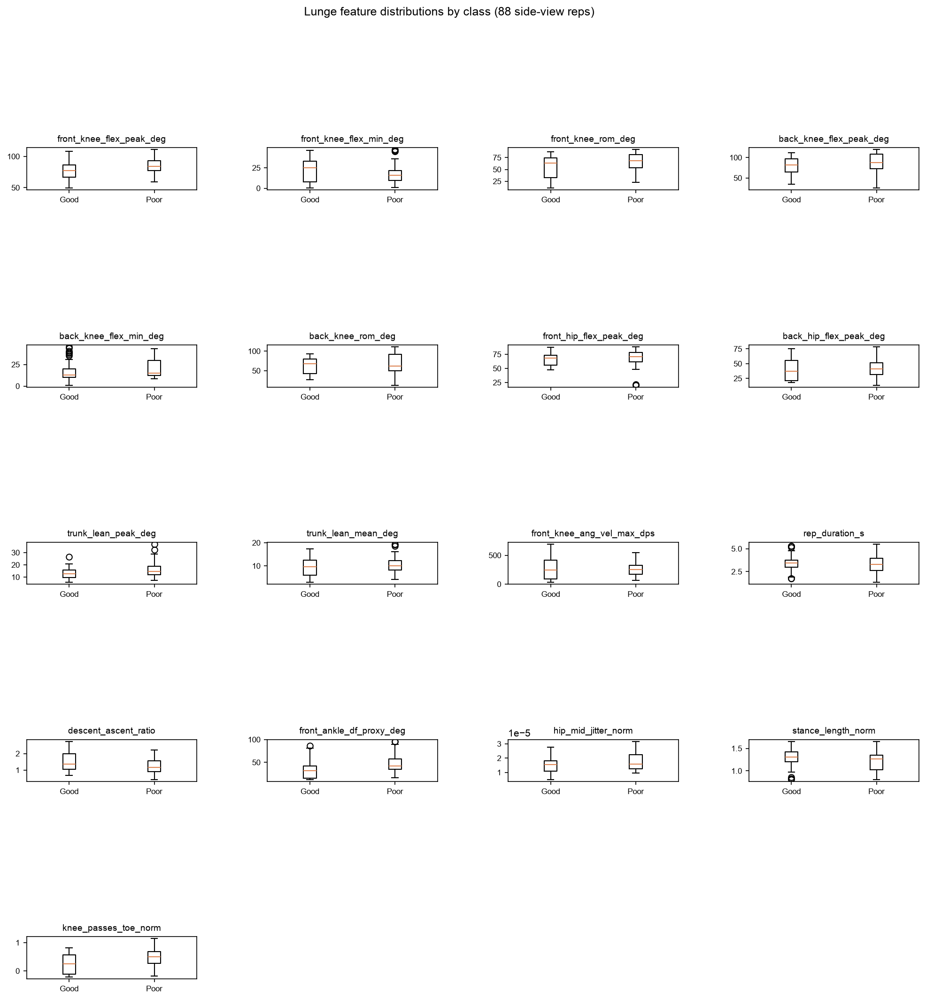
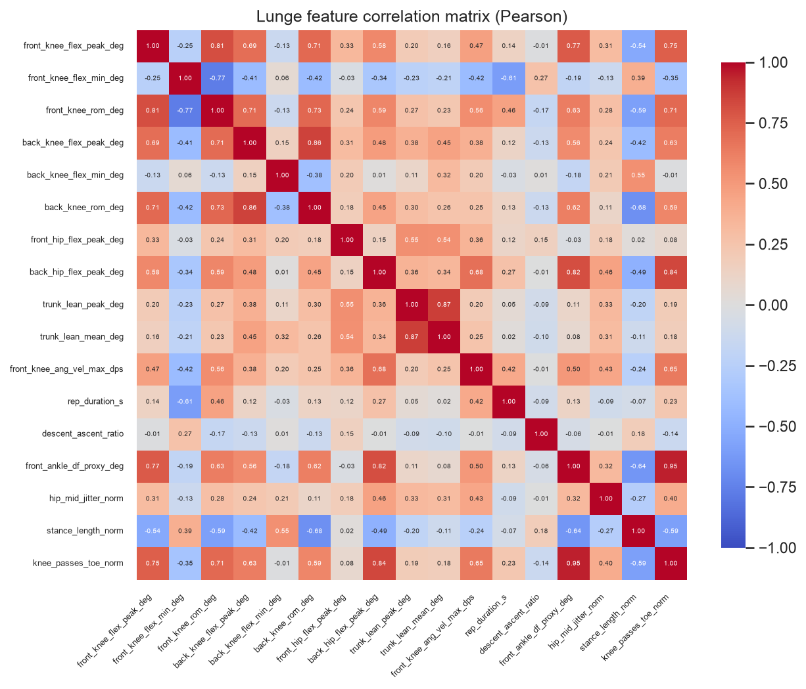

# Stage 5.4 (Lunge) — feature-validity sanity (R5.5 gate)

Source: `ml/data/lunge_features.csv` — 88 side-view reps (39 Good / 49 Poor) from 8 subjects, features computed by the backend's `extract_lunge_features()` on the preprocessed stream (X1).

## The gate

**front_knee_flex_peak_deg: AUC 0.639** (Good median 77.2° vs Poor median 83.8°) — **PASS**.

The gate feature is `front_knee_flex_peak_deg`, not squat's `knee_flex_peak_deg`: a lunge is asymmetric, so no bilateral-mean depth feature exists to gate on, and the front knee is both what the movement is about and the direct correspondent of squat's gate feature.

The gate asks only whether this feature separates the classes. An AUC of 0.639 is 0.139 away from the 0.5 no-separation point, and the direction is consistent across 5/7 of the subjects who can vote on it.

### The gate within each lead-leg cohort

Stage 5.0 established that **lead leg is perfectly confounded with subject** — no subject performs both. So the pooled AUC above mixes two disjoint subject groups, and a pooled separation could in principle be a between-cohort offset rather than a real within-subject effect. Computed separately:

| cohort | n reps | Good median | Poor median | AUC |
| ------ | ------ | ----------- | ----------- | --- |
| lead=left | 42 (21G/21P) | 78.9° | 85.6° | 0.580 |
| lead=right | 46 (18G/28P) | 76.7° | 83.4° | 0.728 |

## Method

- **AUC** = Mann-Whitney U / (n_good x n_poor). 0.5 = no separation; distance from 0.5 is the effect size. AUC > 0.5 means Poor reps score higher.
- **Cross-subject direction consistency.** The 88 reps come from only 8 subjects, so reps are **not independent** — a p-value that treats them as independent is anti-conservative (pseudo-replication). p-values are listed below for completeness but are **not** the verdict basis. Instead each subject with >= 2 reps in *both* classes votes on whether the difference points the same way as the pooled result (7 of 8 subjects qualify).
- **The verdict rule is squat's, reused unchanged and deliberately so:** **KEEP** if |AUC - 0.5| >= 0.1 *and* >= 60% of voting subjects agree on the direction; **KEEP (caveat)** if it separates but the direction is subject-inconsistent; **DROP** otherwise. The rule was fixed before squat's results were seen. Re-picking thresholds now — with lunge's numbers already on disk from Stage 5.3 — would be fitting the rule to the outcome, so it is carried over as-is.

## Per-feature verdicts

The **within-subject AUC** column is a diagnostic, not part of the verdict rule — see the section below it, which is the most consequential finding of this gate. ⚠ marks a feature whose pooled verdict the within-subject evidence contradicts.

| feature | Good median | Poor median | AUC | within-subj AUC | direction | subjects agreeing | p | verdict |
| ------- | ----------- | ----------- | --- | --------------- | --------- | ----------------- | - | ------- |
| `front_ankle_df_proxy_deg` | 31.57 | 42.44 | 0.685 | 0.682 | Poor higher | 5/7 | 0.00303 | **KEEP** |
| `knee_passes_toe_norm` | 0.25 | 0.51 | 0.667 | 0.718 | Poor higher | 5/7 | 0.00737 | **KEEP** |
| `trunk_lean_peak_deg` | 12.74 | 14.78 | 0.647 | 0.715 | Poor higher | 5/7 | 0.0183 | **KEEP** |
| `descent_ascent_ratio` | 1.37 | 1.16 | 0.357 | 0.333 | Poor lower | 7/7 | 0.0218 | **KEEP** |
| `front_knee_flex_peak_deg` | 77.25 | 83.82 | 0.639 | 0.795 | Poor higher | 5/7 | 0.026 | **KEEP** |
| `front_knee_rom_deg` | 63.74 | 68.53 | 0.628 | 0.845 | Poor higher | 7/7 | 0.0404 | **KEEP** |
| `hip_mid_jitter_norm` | 0.00 | 0.00 | 0.605 | 0.545 | Poor higher | 3/7 | 0.093 | **KEEP (caveat)** |
| `stance_length_norm` | 1.31 | 1.26 | 0.402 | 0.235 ⚠ | Poor lower | 5/7 | 0.118 | **DROP** |
| `back_knee_flex_min_deg` | 12.84 | 15.19 | 0.591 | 0.561 | Poor higher | 4/7 | 0.146 | **DROP** |
| `back_knee_flex_peak_deg` | 81.72 | 87.92 | 0.588 | 0.841 ⚠ | Poor higher | 7/7 | 0.158 | **DROP** |
| `front_knee_flex_min_deg` | 25.37 | 15.89 | 0.413 | 0.338 ⚠ | Poor lower | 5/7 | 0.163 | **DROP** |
| `trunk_lean_mean_deg` | 9.64 | 9.95 | 0.579 | 0.638 ⚠ | Poor higher | 5/7 | 0.205 | **DROP** |
| `front_hip_flex_peak_deg` | 68.48 | 70.92 | 0.575 | 0.622 ⚠ | Poor higher | 6/7 | 0.233 | **DROP** |
| `back_hip_flex_peak_deg` | 37.04 | 41.42 | 0.565 | 0.446 | Poor higher | 3/7 | 0.298 | **DROP** |
| `back_knee_rom_deg` | 68.22 | 61.38 | 0.564 | 0.860 ⚠ | Poor higher | 0/7 | 0.305 | **DROP** |
| `rep_duration_s` | 3.47 | 3.30 | 0.471 | 0.345 ⚠ | Poor lower | 4/7 | 0.65 | **DROP** |
| `front_knee_ang_vel_max_dps` | 245.93 | 251.90 | 0.509 | 0.391 ⚠ | Poor higher | 3/7 | 0.886 | **DROP** |

**7 keep / 10 drop** of 17 candidate features.

## Justification per feature

- **`front_ankle_df_proxy_deg`** — KEEP: separates (AUC 0.685, poor higher) and the direction holds in 5/7 subjects — not one subject's artefact.
- **`knee_passes_toe_norm`** — KEEP: separates (AUC 0.667, poor higher) and the direction holds in 5/7 subjects — not one subject's artefact.
- **`trunk_lean_peak_deg`** — KEEP: separates (AUC 0.647, poor higher) and the direction holds in 5/7 subjects — not one subject's artefact.
- **`descent_ascent_ratio`** — KEEP: separates (AUC 0.357, poor lower) and the direction holds in 7/7 subjects — not one subject's artefact.
- **`front_knee_flex_peak_deg`** — KEEP: separates (AUC 0.639, poor higher) and the direction holds in 5/7 subjects — not one subject's artefact.
- **`front_knee_rom_deg`** — KEEP: separates (AUC 0.628, poor higher) and the direction holds in 7/7 subjects — not one subject's artefact.
- **`hip_mid_jitter_norm`** — KEEP (caveat): separates on pooled data (AUC 0.605) but only 3/7 subjects agree on the direction, so the effect may be driven by a subset of subjects. Kept — Extra Trees can down-weight it — but it should not be read as a reliable clinical signal on its own.
- **`stance_length_norm`** — DROP: does not separate (AUC 0.402, only 0.098 from the 0.5 no-separation point).
- **`back_knee_flex_min_deg`** — DROP: does not separate (AUC 0.591, only 0.091 from the 0.5 no-separation point).
- **`back_knee_flex_peak_deg`** — DROP: does not separate (AUC 0.588, only 0.088 from the 0.5 no-separation point).
- **`front_knee_flex_min_deg`** — DROP: does not separate (AUC 0.413, only 0.087 from the 0.5 no-separation point).
- **`trunk_lean_mean_deg`** — DROP: does not separate (AUC 0.579, only 0.079 from the 0.5 no-separation point).
- **`front_hip_flex_peak_deg`** — DROP: does not separate (AUC 0.575, only 0.075 from the 0.5 no-separation point).
- **`back_hip_flex_peak_deg`** — DROP: does not separate (AUC 0.565, only 0.065 from the 0.5 no-separation point).
- **`back_knee_rom_deg`** — DROP: does not separate (AUC 0.564, only 0.064 from the 0.5 no-separation point).
- **`rep_duration_s`** — DROP: does not separate (AUC 0.471, only 0.029 from the 0.5 no-separation point).
- **`front_knee_ang_vel_max_dps`** — DROP: does not separate (AUC 0.509, only 0.009 from the 0.5 no-separation point).

## ⚠ The pooled AUC is misleading on this cohort — the gate's biggest finding

**Squat's pooled-AUC verdict rule does not transfer cleanly to lunge, and acting on the DROP column above without reading this section would discard 8 of the 17 features on an artefact.** This is a lunge-specific problem: it is caused by this cohort's class-mix imbalance across subjects, which squat's cohort did not have to the same degree.

### `back_knee_rom_deg`: every subject says one thing, the pool says the opposite

Pooled, `back_knee_rom_deg` looks like nothing: AUC 0.564 (Good median 68.2° vs Poor 61.4° — *Poor lower*), which the pre-declared rule scores **DROP**. But the direction vote is **0/7** — that is, **not one** of the 7 subjects who can vote agrees with the pooled direction. Every single subject shows Poor reps with a *higher* back-knee ROM than their own Good reps. Subtracting each subject's own median and re-pooling gives a within-subject AUC of **0.860** — from the weakest features in the table to the strongest.

This is **Simpson's paradox**, and the mechanism is measured rather than asserted. It requires subject-level *level* to correlate with subject-level *class mix*, and here it does: **corr(subject median, subject %Poor) = -0.505**.

| subject | lead leg | reps | %Poor | subject median `back_knee_rom_deg` |
| ------- | -------- | ---- | ----- | --------------------------------- |
| P2 | left | 5G/5P | 50% | 91.7° |
| P3 | right | 0G/11P | 100% | 40.1° |
| P4 | right | 5G/5P | 50% | 42.1° |
| P5 | right | 7G/6P | 46% | 81.8° |
| P6 | left | 5G/5P | 50% | 73.2° |
| P7 | left | 5G/5P | 50% | 49.3° |
| P8 | right | 6G/6P | 50% | 87.2° |
| P9 | left | 6G/6P | 50% | 55.9° |

**One subject causes it.** P3 is the cohort's only single-class subject (0 Good / 11 Poor) *and* has the lowest `back_knee_rom_deg` of anyone (40.1°, against 42.1–91.7° for the rest); every other subject is close to 50/50. So P3 pours 11 low-ROM reps into the Poor pool and nothing into the Good pool, dragging the pooled Poor median below the pooled Good median — reversing a direction that holds inside every subject. Excluding P3 alone lifts the pooled AUC from 0.564 to 0.679 — and that is a demonstration, not a fix: it stays well short of the within-subject 0.860, because the remaining between-subject level differences still dilute the effect.

### What this does and does not license

**The within-subject AUC is not achievable accuracy, and must not be quoted as a performance figure.** At inference the model sees one rep with no subject median to subtract against, so it cannot access the within-subject contrast. The column answers one narrower question: *does this feature carry real signal that pooling is masking?* For the ⚠ features, the answer is yes.

The centring uses **no label information** (each subject's median is taken over all their reps regardless of class), so the diagnostic does not leak the outcome into itself. Single-class subjects contribute nothing to it, by construction.

**The pre-declared verdicts above were deliberately NOT rewritten in light of this.** The rule was fixed in advance and is left as it fell; silently swapping in whichever statistic produced the nicer answer is exactly the practice that pre-declaring a rule exists to prevent. The verdicts stand, the contradicting evidence is published beside them, and the resolution is handed to Stage 5.5 explicitly:

- **Stage 5.5 must train on all 17 features** and read the verdicts above as advisory only. Squat's Stage 5.5 already took this route for an unrelated reason (avoiding selection bias against the LOSO folds), so this is the established path, not a special case — and it means **no feature is actually lost to the artefact**. The DROP column is not wired to anything.
- The model's own importances, on the held-out folds, are the trustworthy keep/drop evidence. This gate's job is to catch a broken pipeline, and on that question it is unambiguous.

**This also warns about the evaluation to come.** A statistic pooled across subjects can invert the truth on this cohort. Stage 5.5's LOSO design is the right response — it never pools across the subject boundary — but any pooled summary reported later (a single confusion matrix, a pooled AUC over all folds) inherits exactly this hazard and should be read with it in mind.

## Redundancy

Pairs correlated at |r| >= 0.90 — candidates for dropping one side later (recorded here so any such call is evidence-backed, not asserted):

- `front_ankle_df_proxy_deg` ~ `knee_passes_toe_norm` (r = 0.95)

Not dropped here: Extra Trees is not destabilised by correlated inputs the way a linear model is, and dropping one of a pair changes the feature vector, which would mean bumping `feature_schema_version`. Recorded for Stage 5.5 to decide with model evidence in hand.

## Caveat on data-driven dropping (read before Stage 5.5)

Every verdict above was computed on **all 88 reps** — including the reps of subjects that Stage 5.5 will hold out for LOSO. Dropping a feature on that evidence and then reporting LOSO scores over the same data is a mild selection bias: the held-out subject influenced which features existed. This is tolerable here because the stage's purpose is a **sanity gate** (catch a broken pipeline), not statistical feature selection. The honest options for Stage 5.5 are to train on all 17 features and let the model's own importances speak, or to nest the selection inside each CV fold. Recorded so the choice is deliberate rather than accidental — squat's Stage 5.5 took the former route for exactly this reason.
