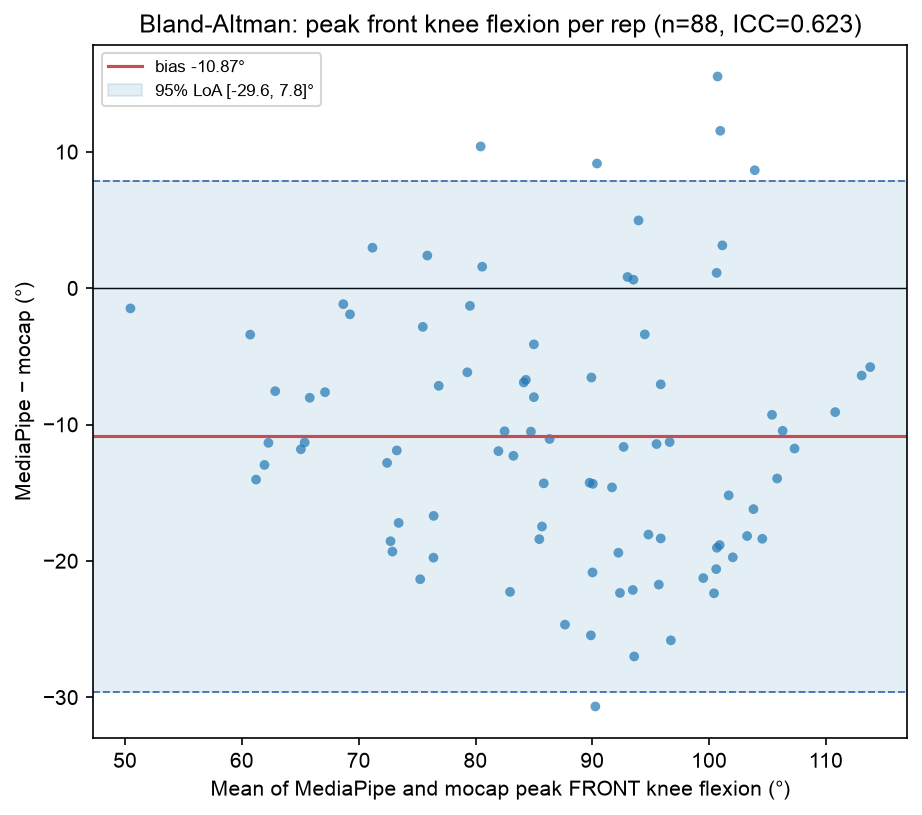

# Stage 5.4 (Lunge) — MediaPipe vs OptiTrack mocap agreement

Does the single-camera pipeline actually measure the knee angles it claims to? Compares, on the same frames, the knee flexion our pipeline derives from MediaPipe world landmarks against the same angle derived from REHAB24-6's OptiTrack 26-joint mocap, on Ex5. **The mocap is a validation reference only — never a training feature (X3).**

## Headline

**`front_knee_flex_peak_deg`: ICC(2,1) = 0.623**, **bias -10.87°**, **95% limits of agreement [-29.57°, 7.84°]**, r = 0.791, n = 88 reps.

The compared quantity is the per-rep peak of the **front** knee — the R5.5 gate feature — so this speaks to the real feature rather than to an angle nothing uses. Negative bias means our pipeline reads *lower* than mocap.

**But the headline is not the finding.** Two results below matter more than the pooled ICC: leg identity is now *settled* for lunge (squat could not settle it), and the far-limb occlusion error turns out to be large enough to invert which knee appears deeper — which loads a **8.9° cohort-dependent bias** onto the gate feature.

## Leg identity: settled — but not by the test that was supposed to settle it

**Why this had to be answered here.** Squat's report closed the same question as unresolvable and worked around it: both knees bend together in a squat, so the leg-difference signal cancels to noise (mean r ≈ +0.02, signs mixed), and that report escaped via the **bilateral mean**, which is invariant to a left/right swap and is exactly what `knee_flex_peak_deg` uses. No such escape exists for lunge: every feature is front/back split, so a swapped mapping transposes *all* of them. There is nothing swap-invariant to retreat to.

### The expected test failed, and that is reported rather than dropped

The reasonable expectation was that a lunge's asymmetry would rescue squat's test: the front and back knees do different jobs, so `θ_L − θ_R` should carry a large structured signal instead of a cancelled common mode. **It did not.** Correlated against mocap's own leg difference, the result is a mean r of **+0.276** across the 9 videos (range -0.04 to +0.73, **signs mixed**) — **UNRESOLVED** against a rule fixed before the numbers were seen (|mean r| >= 0.5 with consistent signs). Re-running it at each video's own alignment offset rather than at lag 0 changes nothing (r moves by <0.03), so this is not a synchronisation artefact.

The reason it fails is itself informative, and it connects to the occlusion result below: the leg-difference signal is **dominated by the far limb's own measurement error**, so it cannot arbitrate labels. A test built on the difference of two angles inherits the noise of the worse-measured one.

| video | lead leg | leg-difference r vs mocap |
| ----- | -------- | ------------------------- |
| PM_021 | left | +0.273 |
| PM_028 | right | +0.464 |
| PM_037 | right | +0.133 |
| PM_042 | right | +0.378 |
| PM_104 | left | +0.383 |
| PM_112 | right | -0.045 |
| PM_117a | left | +0.732 |
| PM_117b | left | +0.105 |
| PM_125 | left | +0.062 |

### The test that works: identity from foot position

Flexion is the wrong instrument, because flexion is what occlusion corrupts. **Foot position is not** — a planted foot's location is far more robust than the joint angle above it. And the dataset supplies an independent key the flexion test lacks: `exercise_subtype` annotates **which leg leads**, and the front foot is anterior by definition.

So each source is asked, from geometry alone, which foot is planted forward — and checked against the annotation independently. For mocap the anterior direction is derived from the feet themselves (toe minus ankle), needing no knowledge of the room axes; for MediaPipe it is the same rule `features.py::_anterior_sign` already uses live.

| result | agreement with the annotated lead leg |
| ------ | ------------------------------------- |
| OptiTrack mocap forward foot | **9/9** |
| MediaPipe forward foot | **9/9** |

**Verdict: leg identity CONFIRMED.** Both sources independently recover the annotated lead leg in every video, so both label sets are correct as labelled — and therefore the mapping between them is correct too. `MOCAP_LEGS['left']` is the same anatomical leg as `MP_LEGS['left']`. The front/back split that every lunge feature depends on rests on verified ground, which is what this gate needed to establish.

| video | annotated lead | mocap forward foot | MediaPipe forward foot |
| ----- | -------------- | ------------------ | ---------------------- |
| PM_021 | left | left ✓ | left ✓ |
| PM_028 | right | right ✓ | right ✓ |
| PM_037 | right | right ✓ | right ✓ |
| PM_042 | right | right ✓ | right ✓ |
| PM_104 | left | left ✓ | left ✓ |
| PM_112 | right | right ✓ | right ✓ |
| PM_117a | left | left ✓ | left ✓ |
| PM_117b | left | left ✓ | left ✓ |
| PM_125 | left | left ✓ | left ✓ |

## Occlusion is severe enough to invert which knee looks deeper

With identity confirmed, a second observation can be read correctly. **Mocap says the right knee bends deeper in all 9 videos; MediaPipe says the left does in all 9** — the two disagree on **9/9**, a perfect reversal (chance would be ~4/9).

Had identity been left open, this would have looked like decisive proof of a **swapped mapping** — it is exactly the signature a swap produces. The position test rules that out, leaving one explanation: **the far limb's error is bigger than the real left-right difference.** The pipeline under-reads the occluded far limb by 18.2° against 2.5° for the near limb — a differential of ~15.7°, while the true left-right difference is only a few degrees. The artefact is larger than the signal, so the ordering flips.

This is the strongest available statement of what monocular occlusion costs here, and it is worth stating as such: **the far limb is not merely noisier — it is wrong by more than the anatomy it is meant to resolve.**

| quantity per rep | bias (MediaPipe − mocap) | 95% LoA | ICC | r | n |
| ---------------- | ------------------------ | ------- | --- | - | - |
| **front** knee peak (`front_knee_flex_peak_deg`) | -10.87° | [-29.6, 7.8]° | 0.623 | 0.791 | 88 |
| **back** knee peak (`back_knee_flex_peak_deg`) | -9.89° | [-42.9, 23.2]° | 0.453 | 0.604 | 88 |
| **near** limb (left) knee peak | -2.54° | [-27.1, 22.0]° | 0.676 | 0.713 | 88 |
| **far** limb (right) knee peak | -18.23° | [-37.3, 0.9]° | 0.477 | 0.824 | 88 |
| bilateral mean (squat's headline quantity, for comparison) | -11.26° | [-26.0, 3.5]° | 0.650 | 0.907 | 88 |

The near/far rows answer the question **Stage 5.3 (Lunge) deferred to this gate** — is the occluded far limb's estimate accurate, or merely plausible? Squat's equivalent had to leave it formally open, because answering it needs exactly the per-leg comparison its unverified leg mapping made impossible. **The answer for lunge: merely plausible.** The far limb tracks the movement's shape well (r = 0.824, comparable to the near limb's 0.713) but mis-states its magnitude by 18.2° — the classic signature of a landmark regressor hedging toward a mean pose when it cannot see the joint.

### Is it low confidence, or confident error?

'Occlusion' is a mechanism, not a measurement, so the claim is tested rather than assumed. Splitting the per-rep peak error by **(cohort, limb)** and putting MediaPipe's own raw visibility beside it separates two very different explanations — a landmark flagged uncertain (the confidence filter engages; fixable upstream) versus one MediaPipe is confident about and wrong anyway (no signal exists to key any mitigation off).

| cohort | limb | role | near/far | reps | raw visibility | peak bias |
| ------ | ---- | ---- | -------- | ---- | -------------- | --------- |
| lead=left | left | front | near | 42 | 0.977 | -6.19° |
| lead=left | right | back | far | 42 | 0.774 | -21.61° |
| lead=right | left | back | near | 46 | 0.995 | +0.81° |
| lead=right | right | front | far | 46 | 0.938 | -15.13° |

**The error follows the limb, not the role.** Averaged by near/far the two differ by **15.7°**; averaged by front/back, by only **0.3°**. The right knee is badly under-read whether it is doing the front leg's job or the back leg's, and the left knee is well measured in both. Which side faced the camera is what matters.

**And it is confident error, not flagged uncertainty — the more troubling of the two.** The decisive cell is the far limb where MediaPipe was *most* sure of itself: lead=right, right knee, raw visibility **0.938** — a healthy confidence, nowhere near the `MIN_VISIBILITY` cut-off — and a bias of **-15.13°** regardless. The pipeline is not saying 'I cannot see this knee'; it is saying 'this knee is at 75°' when the markers say 90°. **No confidence-threshold policy can catch that**, because the confidence is high. The companion visibility report measures where the landmark *does* drop below the threshold — a real but much smaller effect — and the two together show the filter is not the lever here.

## The consequence: a cohort-dependent bias on the gate feature

This is the finding with the furthest reach, and it closes an open question carried since Stage 5.2 — *whether the lead limb is the near or far limb is fixed per subject, which would couple occlusion to lead leg and therefore to subject.* **It is, and it does.**

The far limb is `right` in all 9 videos (a camera-orientation artefact, not a lead-leg effect — Stage 5.2). Lead leg is fixed per subject. Therefore the front leg **is** the occluded limb for right-lead subjects and the clearly visible one for left-lead subjects:

| cohort | front leg is the... | reps | front-knee bias |
| ------ | ------------------- | ---- | --------------- |
| lead=left | near limb | 42 | -6.19° |
| lead=right | far (occluded) limb | 46 | -15.13° |

**`front_knee_flex_peak_deg` — the feature the R5.5 gate turns on — is measured with a 8.9° systematic offset between the two cohorts, purely as a camera artefact.** No subject moves differently to produce it; it is a property of which side of the body faced the lens.

Three consequences, none of them resolved here:

1. **Stage 5.0's leakage warning is now quantified, not hypothetical.** It flagged `lead_leg` as a LOSO leakage risk because it is confounded with subject. This shows the confound is *physically encoded in the feature values themselves* — a model can infer the cohort from the measurement bias without ever seeing a `lead_leg` column. Excluding `lead_leg` from the feature vector (Stage 5.3 did) is therefore necessary but **not sufficient** to remove the confound.
2. **It compounds the pooling hazard the feature-validity gate found independently.** That report showed pooled statistics inverting the within-subject truth via class-mix imbalance; this is a second, unrelated mechanism pushing the same way. Two independent reasons to distrust cross-subject pooling on this cohort.
3. **It bounds what any lunge ROM banding can claim** — more tightly than squat's equivalent. A ~11° under-read is bad enough for thresholds derived from true joint angles; one that also differs by 8.9° depending on which leg the user happens to lead with cannot be corrected by a single global constant. Stage 5.6 (Lunge) is already directed to derive its band edges from this cohort's own distribution and tag them [dataset-derived] — this is the measurement that justifies that instruction, and a reason not to soften it.

**It does not invalidate the classifier**, which learns from our measurements on their own scale. But the bias is cohort-structured rather than global, so it is not the harmless monotone offset squat's report could wave through: it is a systematic difference between two subject groups that the model may learn instead of the movement. That is Stage 5.5's problem to watch for, and it is flagged here rather than discovered there.

## Method notes (verified, not assumed)

- **Frame alignment.** An offset scan (-5..5 frames) picks the lag maximising correlation per video rather than trusting index 0. Selected: [-3] frame(s) for every video — consistent with the causal One Euro filter's own delay, the same magnitude squat's run found.
- **Same geometry helper both sides.** Both series go through the live pipeline's `knee_flexion_deg`; an unsigned hip-knee-ankle angle is invariant to the coordinate frame, so mocap's room axes and MediaPipe's hip-origin axes need no alignment.
- **Our side is the preprocessed stream** (confidence filter → gap fill → One Euro), i.e. what the model actually consumes, not raw landmarks.
- **Front/back assignment comes from the dataset's own `exercise_subtype`**, not from our geometric inference — so the agreement figures measure the angle pipeline, not the front-leg resolver. (The resolver is validated separately, and independently, by the forward-foot table above: 9/9.)

## Per-video alignment detail

| video | lead leg | chosen offset (frames) | correlation at that offset | mean front-knee bias (°) |
| ----- | -------- | ---------------------- | -------------------------- | ------------------------ |
| PM_021 | left | -3 | 0.8591 | +0.62 |
| PM_028 | right | -3 | 0.8917 | -14.91 |
| PM_037 | right | -3 | 0.9308 | -18.98 |
| PM_042 | right | -3 | 0.9714 | -12.16 |
| PM_104 | left | -3 | 0.9614 | -9.58 |
| PM_112 | right | -3 | 0.9361 | -15.34 |
| PM_117a | left | -3 | 0.9264 | -5.70 |
| PM_117b | left | -3 | 0.9086 | -16.41 |
| PM_125 | left | -3 | 0.9505 | -7.00 |

## Caveats kept explicit

- **Not independent samples.** 88 reps come from 8 subjects; reps within a subject are correlated, so the ICC is a descriptive agreement figure, not an inferential claim with a meaningful confidence interval.
- **Mocap is a reference, not truth.** OptiTrack marker placement has its own error, and its skeleton joint centres are not defined identically to MediaPipe's landmarks — an unknown share of the bias is definitional (where a 'knee centre' is) rather than pipeline error. The bias should not be read as a calibration constant to subtract without establishing that share first. Note this caveat does **not** weaken the cohort-gap result: a definitional offset would apply to both cohorts equally and cannot produce a difference between them.
- **Peak only.** Agreement is computed on per-rep peak values, the quantity the gate feature uses. It does not certify the angle at every instant.
- **Near/far is a fixed property of this cohort, not a controlled variable.** Stage 5.2 measured left as the higher-visibility limb in all 9 videos, so 'near vs far' here is also 'left vs right'. The two cannot be separated with this data, and any genuine anatomical left/right asymmetry would be indistinguishable from an occlusion effect. What makes the occlusion reading the better explanation is the *size* of the effect — a 15.7° systematic left-right difference is far beyond any plausible population-level limb asymmetry, and it points the same way in every subject.
