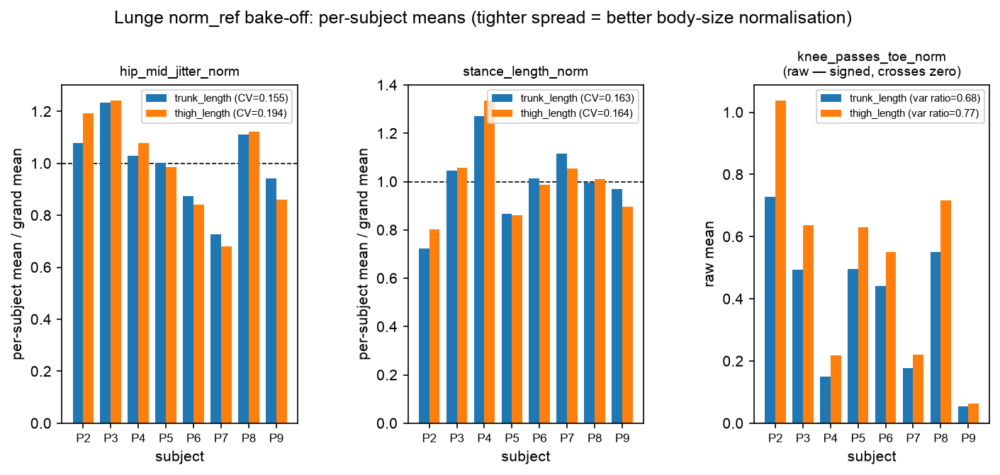

# Stage 5.4 (Lunge) — `norm_ref` bake-off (R5.3)

`norm_ref` is the body-size reference that `hip_mid_jitter_norm`, `stance_length_norm` and `knee_passes_toe_norm` divide by (the other 14 features do not use it). The better reference cancels body-size differences more completely — leaving **less spread between subjects** doing the same movement.

**Winner: `trunk_length`** (mean cross-subject variance ratio 1.606 vs 2.118 for `thigh_length`). Backend default was `trunk_length`.

## Why the verdict statistic is not squat's

Squat's bake-off decided on the **coefficient of variation** of the per-subject means, having established that `task.md`'s literal "pick the lower variance" is **scale-confounded**: the two references have different magnitudes, so dividing by the larger one shrinks the feature and its raw variance too, and a reference that is uniformly 2x larger would win on raw variance while normalising nothing. That reasoning still holds here, and raw variance is still reported below so the confound stays visible.

**But CV cannot be used for `knee_passes_toe_norm`, and that is a real lunge-specific problem rather than a technicality.** CV = std/mean presumes a ratio scale with a stable non-zero mean. `knee_passes_toe_norm` is a *signed* excursion — positive when the front knee passes the toe (the fault it exists to detect), negative when the knee stays behind it — and it genuinely crosses zero in this cohort: **18 of 88 reps are negative, and one subject's mean sits at +0.06**. Near a zero mean the denominator collapses and CV explodes; had the cohort's zero fallen slightly differently, a CV verdict would have flipped on that accident alone. Squat never hit this because both its normalised features are unsigned magnitudes.

So the verdict is taken on the **variance ratio**: between-subject variance of the per-subject means, over the mean within-subject variance. Lower is better. It is a ratio of two variances in the same units, so it is scale-invariant like CV — but it needs no non-zero mean, and it measures something CV cannot: a reference that cancels between-subject spread *by inflating within-subject noise* is not actually normalising, and the ratio catches that trade where CV would reward it. CV is still reported for the two strictly-positive features, so lunge stays comparable to squat and the two statistics can be checked against each other.

## Numbers

| feature | candidate | variance ratio (verdict) | CV | between-subj variance | within-subj variance | mean |
| ------- | --------- | ------------------------ | -- | --------------------- | -------------------- | ---- |
| `hip_mid_jitter_norm` | trunk_length | 0.224 **<-** | 0.1548 | 6.484e-12 | 2.900e-11 | 1.644e-05 |
| `hip_mid_jitter_norm` | thigh_length | 0.319 | 0.1936 | 1.699e-11 | 5.318e-11 | 2.129e-05 |
| `stance_length_norm` | trunk_length | 3.917 **<-** | 0.1627 | 4.214e-02 | 1.076e-02 | 1.262e+00 |
| `stance_length_norm` | thigh_length | 5.266 | 0.1640 | 7.000e-02 | 1.329e-02 | 1.613e+00 |
| `knee_passes_toe_norm` | trunk_length | 0.677 **<-** | n/a (signed) | 5.417e-02 | 8.002e-02 | 3.868e-01 |
| `knee_passes_toe_norm` | thigh_length | 0.770 | n/a (signed) | 1.031e-01 | 1.340e-01 | 5.095e-01 |

Note how the raw between-subject variance column moves with the feature's absolute scale (the `mean` column) while the variance ratio does not — that is the scale confound above, made concrete.

The first two panels plot each subject's mean **divided by that candidate's own grand mean**, so both candidates centre on 1.0 and the visible spread is the quantity being compared — plotting raw bars would have made the longer reference look tighter through scale alone, letting a reader see the right answer for the wrong reason. `knee_passes_toe_norm` is plotted **raw against a zero line** instead, for the same reason its CV is omitted: mean-scaling a zero-crossing quantity produces meaningless bars.

**The verdict is unanimous across features:** `trunk_length` wins the variance ratio on all three, so it does not rest on how the three were averaged.

**Cross-check: CV agrees.** `trunk_length` also wins on mean CV over the two features where CV is defined (0.1588 vs 0.1788), so the choice of verdict statistic did not decide the outcome — it only means the variance ratio is the honest number to quote for all three.
