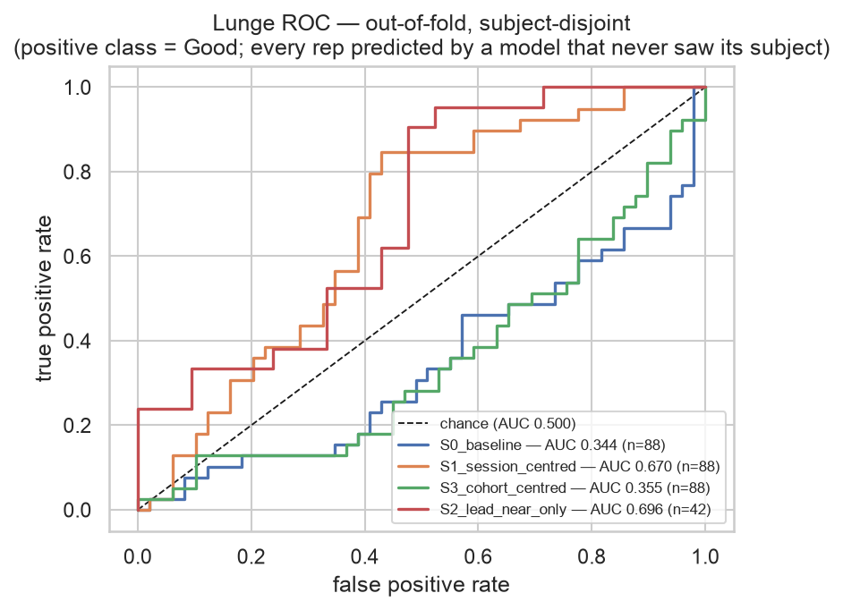
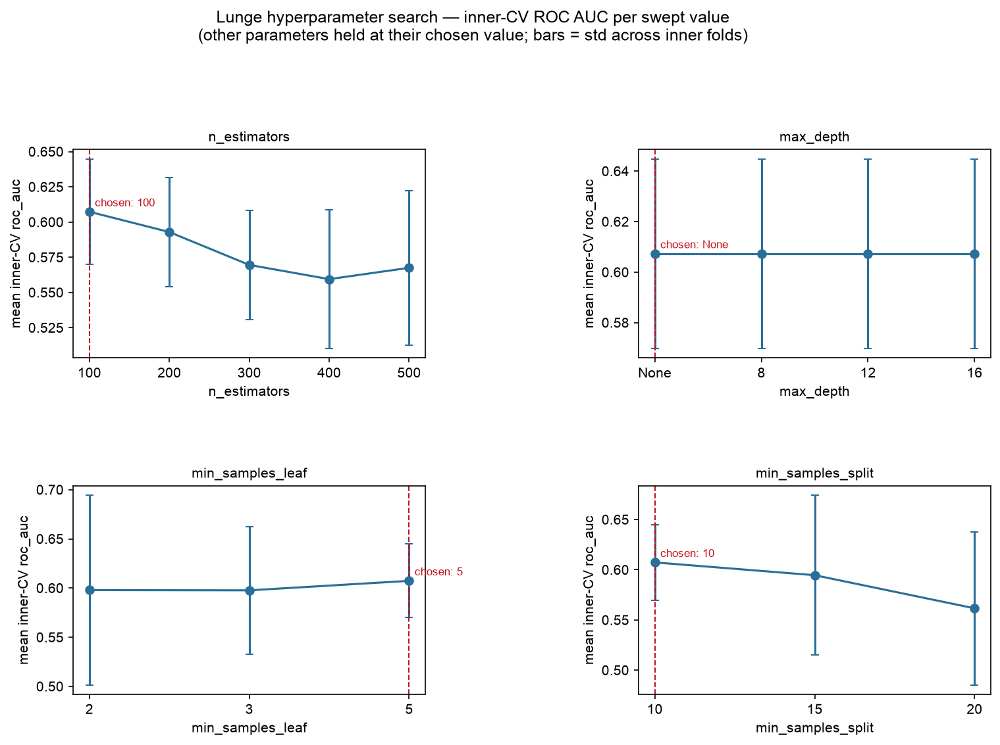
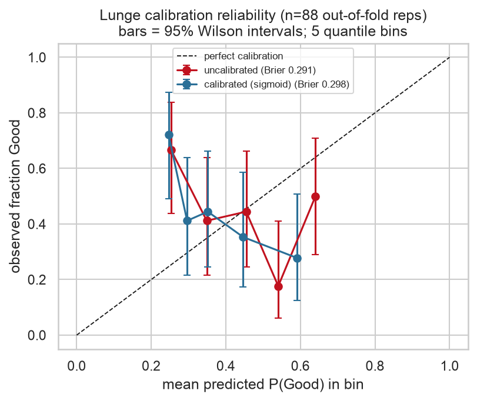

# Stage 5.5 (Lunge) — training the Extra Trees classifier

Source: `ml/data/lunge_features.csv` — 88 side-view reps (39 Good / 49 Poor) from 8 subjects, 17 features. Binary Good/Poor (Option A), `random_state=42`.

## Headline: a documented negative result, and two things that fix it

**The lunge classifier trained the plan's way does not work. Its out-of-fold ROC AUC is 0.344, and a permutation test cannot distinguish it from chance** (p = 0.657 over 200 label shuffles). Squat's equivalent scored 0.832. This is not a tuning problem: the same code, the same grid and the same CV machinery produced squat's working model.

**Two interventions recover genuine signal**, and both are attacks on the lead-leg confound rather than on the model:

- **Restricting to lead-near reps** (the geometry the turn-around capture protocol produces): AUC **0.696**, p = 0.005 — real signal.
- **Session-centring** (subtracting each subject's own median): AUC **0.670**, p = 0.005 — real signal.

That both fixes target the confound, and that neither touches the classifier, is the finding. The features carry information about lunge correctness; the between-subject measurement differences bury it.

**On the below-0.5 figure — what it does NOT mean.** An AUC of 0.344 invites the reading that the model predicts *backwards*. The permutation test rules that out: the null distribution is centred at 0.487 with a standard deviation of 0.085 and spans 0.279–0.715, so a point estimate below 0.5 is comfortably inside the range random labels produce. The honest statement is **no detectable cross-subject signal**, not **inverted signal**. The distinction matters: one is an absence of evidence, the other would be a claim.

Secondary metrics for the baseline, for completeness: macro-F1 0.375, Good recall 0.128, Poor recall 0.694, Brier 0.291 → 0.298. They describe a chance-level model and should not be quoted as performance.

**This is the model's AUC, not a feature's** — the 0.639 at the feature-validity gate is the univariate separation of `front_knee_flex_peak_deg` alone, a different quantity that must not be compared with these.

_Figure. ROC per confound strategy, out-of-fold and subject-disjoint. The baseline hugging the diagonal is the negative result; S1 and S2 lifting off it are the recovered signal._

### ⚠ Decision required before Stage 5.8

Stage 5.8 is scheduled to export `S0_baseline` as the shipped lunge model. On this evidence it would be exporting a **chance-level classifier**. The fusion would still produce plausible-looking Good/Fair/Poor verdicts, because the rule sub-score and the calibrated probabilities are both well-formed — the output would look exactly like squat's. Nothing downstream detects a model that is merely uninformative.

This stage does not decide that. The options, none of them free:

1. **Ship S0 anyway, announced.** Consistent with how Phase 4 shipped `stub-0`, but a chance-level model presented as a trained one is a materially different claim from an announced placeholder.
2. **Ship the lead-near model (S2)** and let the turn-around protocol enforce its input distribution. It has real signal (0.696) and the protocol is already implemented — but it rests on 4 subjects and 42 reps.
3. **Keep the placeholder and document the negative result**, as Stage 5.10 does for squat's EC3D finding.

**HY's call.** It is a scope and honesty decision, not a technical one.

## Cross-validation scheme

**StratifiedGroupKFold(5, groups=person_id)** — subject 3 has reps of only one class, so LOSO would give a single-class test fold.

This is the plan's documented fallback, and it was **triggered by the data, not chosen**: `_choose_cv()` inspects the labels rather than hardcoding the answer. No subject appears in both train and test, so there is no identity leakage — but each test fold holds roughly two subjects, so the write-up must say **subject-wise 5-fold, not LOSO**.

| fold | test subjects | lead cohorts | reps | Good | Poor | AUC (uncal) | AUC (cal) | Platt slope |
| ---- | ------------- | ------------ | ---- | ---- | ---- | ----------- | --------- | ----------- |
| 1 | 3, 7 | left, right | 21 | 5 | 16 | 0.700 | 0.700 | -2.39 |
| 2 | 2, 8 | left, right | 22 | 11 | 11 | 0.306 | 0.306 | -4.51 |
| 3 | 4, 9 | left, right | 22 | 11 | 11 | 0.554 | 0.446 | +2.70 ⚠ **flipped** |
| 4 | 6 | left | 10 | 5 | 5 | 0.360 | 0.640 | +0.96 ⚠ **flipped** |
| 5 | 5 | right | 13 | 7 | 6 | 0.214 | 0.214 | -2.92 |

### ⚠ A fold where the model anti-predicts, and the calibrator inverted it

**In 2 of 5 folds the calibrator learned an *inverted* mapping.** Fold 3 (test subjects 4, 9) fitted a Platt slope of **+2.70** — positive, where the normal orientation is negative — sending that fold's AUC from 0.554 to **0.446**, exactly its mirror about 0.5.

**This was caught by an assertion, and the assertion's own premise turned out to be wrong.** Squat's training script asserts that calibration preserves AUC exactly, on the stated grounds that *"a sigmoid cannot reorder predictions"*. That is false in general: Platt fits `P = 1/(1+exp(a·f + b))`, and nothing constrains the sign of `a`. When the inner folds show the forest's score anti-correlating with the label, the sigmoid correctly fits a positive `a`, the mapping becomes monotone *decreasing*, and the ranking reverses. Squat never encountered this because its signal is consistent across subjects; lunge's is not. The assertion here was corrected to the true invariant — a monotone map either preserves the ranking or exactly reverses it — rather than deleted.

**What it means, which is the important part.** The flip is not a numerical quirk. The sigmoid is fitted on subject-disjoint inner folds of the training data, so a positive slope says the forest's scores **anti-correlate with the truth on subjects it has not seen** (measured: inner out-of-fold AUC 0.368 on that fold's training subjects). The model does not merely fail to generalise there — it generalises backwards.

This is the same phenomenon the feature-validity gate found, now at model level. That gate measured relationships that **invert between subject groups** (`back_knee_rom_deg` pools to 0.564 while every individual subject points the other way). A model trained on one group of subjects and applied to another inherits exactly that inversion. Two independent analyses, one on features and one on the fitted model, are describing the same instability.

**The exported model is not inverted** — its own Platt slope is **-1.3057** (negative, the normal orientation), so the model Stage 5.8 ships maps higher forest scores to higher P(Good) as intended. This is checked rather than assumed because the fold above proves the sign is not guaranteed on this cohort: an inverted shipped model would report P(Good) *rising* as technique worsened, and nothing downstream would notice, because the probabilities would still look perfectly well-formed. **Stage 5.8 must re-run this check on whatever it exports.**

## The lead-leg confound: four responses, measured

Stage 5.4 established an **8.9° measurement bias aligned with the subject cohorts**: the far/occluded limb is the right leg in every recording and lead leg is fixed per subject, so the leading knee is the occluded limb for right-lead subjects (−15.1° against OptiTrack) and the clearly-visible one for left-lead subjects (−6.2°). The confound is encoded in the feature **values**, so excluding the `lead_leg` column — which the feature table does — is necessary but not sufficient.

Four responses were measured under one identical nested CV:

| strategy | n | out-of-fold AUC | permutation null | p | real signal? | what it does |
| -------- | - | --------------- | ---------------- | - | ------------ | ------------ |
| `S0_baseline` | 88 | **0.344** | 0.487 ± 0.085 | 0.657 | no | All 17 features, raw. The plan's default and the exported deliverable. |
| `S1_session_centred` | 88 | **0.670** | 0.487 ± 0.085 | 0.005 | **YES** | Each subject's own per-feature median subtracted (transductive; needs the user's own set, which the live POST provides). |
| `S3_cohort_centred` | 88 | **0.355** | 0.485 ± 0.084 | 0.423 | no | The lead-cohort's mean subtracted, estimated on training folds only (mocap-free, deployable via the live facing detector). |
| `S2_lead_near_only` | 42 | **0.696** | 0.474 ± 0.107 | 0.005 | **YES** | Trained and tested only on the lead-near reps — the train/serve match implied by the turn-around capture protocol, and the only subset where true LOSO is possible. |

**Reading the columns.** The AUC column is the nested, calibrated out-of-fold figure — the headline statistic. The permutation columns use a **different, simpler statistic**: fixed hyperparameters (`{'max_depth': None, 'min_samples_leaf': 5, 'min_samples_split': 10, 'n_estimators': 100}`) and uncalibrated scores, because 200 nested searches per strategy is intractable. So the p-value tests whether *that* statistic beats chance, not the AUC printed beside it. The two are close but not identical (baseline: 0.457 fixed-param vs 0.344 nested), and the difference is the per-fold tuning plus the calibration flips documented above. The grid is a plateau, so the tuning is not what carries either result.

The smallest p this test can report is 1/(200+1) ≈ 0.005; a p at that floor means **no** shuffle out of 200 reached the observed value, not that p is zero.

**⚠ This table is not a leaderboard, and the highest number in it is not the result.** Every strategy is scored on the same 88 reps that every other choice in this phase was made against. Selecting the winner by these figures would be selection on the test folds — the same error the feature-validity gate refused to make when it declined to rewrite its pre-declared verdicts. **`S0_baseline` remains the exported deliverable** regardless of where it places here.

**A correction that was ruled out on principle, not on score:** subtracting the measured 8.9° bias directly. It is the most obvious fix and it is absent deliberately — the bias is an OptiTrack measurement, and X3 forbids marker-based capture from becoming an input to the shipped model. `S3_cohort_centred` is the mocap-free way to attack the same offset, estimating it from the features themselves on training folds only.

### Reading each result

- **S0 baseline — 0.344, and indistinguishable from chance (p = 0.657).** The plan's default, and what Stage 5.8 is currently scheduled to export. It has no detectable cross-subject signal. The model is not broken — it reaches an in-sample AUC of 0.982, so it fits the training reps almost perfectly and then carries none of that to a new subject. That gap **is** the confound: what it learns is largely who the subject is, which does not transfer.
- **S1 session-centred — 0.670** (+0.326 vs baseline; p = 0.005, **real signal**). Subtracting each subject's own median is what lifted `back_knee_rom_deg` from a pooled 0.564 to a within-subject 0.860 at the feature gate, so this asks whether that signal survives into a model. **It cannot ship as-is regardless of its score**, for a reason no metric shows: centring redefines the question from *"is this rep good?"* to *"is this rep better than your other reps?"*. A set in which every rep is poor would centre to look average, and the system would tell a user their uniformly poor technique is fine. That is a safety-relevant failure, not a modelling trade-off.
- **S3 cohort-centred — 0.355** (+0.012 vs baseline; p = 0.423, **no detectable signal**). On paper the most deployable correction — no mocap, no per-user history, just the cohort, which the live pipeline can detect from limb visibility. **It does not work**, and the contrast with S1 is informative: subtracting the *cohort's* mean removes an 8.9° group offset, while subtracting the *subject's* own median removes far more. So the between-subject variation burying the signal is mostly **not** the cohort-level camera bias — it is individual differences in build and movement, which the camera artefact only adds to. Correcting the artefact alone is not enough, and that is why the turn-around protocol is a capture fix rather than a modelling one.
- **S2 lead-near only — 0.696** (+0.352 vs baseline, on 42 reps not 88, so the AUCs are not directly comparable; p = 0.005 against its own null, **real signal**). The most interesting of the four, and for two reasons beyond its score. First, it is the **train/serve match**: the turn-around capture protocol means deployment will only ever see lead-near reps, so this subset is the distribution the model will actually meet. Second, it is the **only subset where true LOSO is possible** — all four of its subjects carry both classes, whereas the lead-far cohort contains the single-class subject that forced the fallback. Its cost is severe: 4 subjects and 42 reps, so its confidence interval is very wide and it is the most over-fit-prone of the four.

**What this settles, and what it does not.**

It settles that **the features are not the problem**. Two independent interventions — one removing each subject's own offset, one restricting to a single camera geometry — both lift the result from chance to real signal without touching the classifier, the grid, or the feature set. Information about lunge correctness is present in these 17 features; between-subject variation buries it.

It does **not** settle the confound. The best figure above (0.696, `S2_lead_near_only`) is not a solution. No strategy here can separate a camera artefact from a genuine between-subject difference, because in this cohort the two are perfectly aligned — no subject performed both lead legs. S3's failure sharpens this: correcting the cohort-level offset alone recovers nothing, so the artefact is a component of the between-subject variation, not the whole of it.

Only new data can settle it: a cohort in which subjects perform both lead legs, or a capture protocol that removes the geometry difference at source. **The turn-around protocol is the second of those, and S2 is the closest available estimate of what it buys** — which is the strongest reason to keep it.

## Hyperparameter search

Best parameters: `{'max_depth': None, 'min_samples_leaf': 5, 'min_samples_split': 10, 'n_estimators': 100}`.

**The grid is a plateau, not a peak — and that matters more than the winner.** Across all 180 combinations the mean inner-CV AUC spans only 0.0773 (0.5300 to 0.6073), while the median standard deviation across inner folds is 0.0679 — i.e. **the spread between combinations is smaller than the noise on each one**. 95 of 180 combinations sit within one standard deviation of the best. The chosen parameters are therefore not meaningfully better than most alternatives, and the search's value is showing that the result is insensitive to them rather than identifying an optimum.

_Figure. Inner-CV ROC AUC per swept value, other parameters held at their chosen value; bars are the standard deviation across inner folds._

`GridSearchCV.best_score_` is deliberately **not** quoted as a generalisation estimate anywhere: it is the maximum over 180 combinations and is optimistically biased by that selection alone. The out-of-fold figure in the headline is the honest one.

### Full search table

Every combination tried, not just the winner. Losing combinations are kept deliberately — they are the evidence the search was an investigation.

| n_estimators | max_depth | min_samples_leaf | min_samples_split | mean AUC | std | mean F1-macro |
| ------------ | --------- | ---------------- | ----------------- | -------- | --- | ------------- |
| 100 | 16 | 5 | 10 | 0.6073 | 0.0375 | 0.4599 |
| 100 | 8 | 5 | 10 | 0.6073 | 0.0375 | 0.4599 |
| 100 | None | 5 | 10 | 0.6073 **←** | 0.0375 | 0.4599 |
| 100 | 12 | 5 | 10 | 0.6073 | 0.0375 | 0.4599 |
| 200 | 8 | 2 | 20 | 0.6042 | 0.0844 | 0.4656 |
| 200 | 12 | 2 | 20 | 0.6042 | 0.0844 | 0.4656 |
| 200 | 16 | 2 | 20 | 0.6042 | 0.0844 | 0.4656 |
| 200 | None | 2 | 20 | 0.6042 | 0.0844 | 0.4656 |
| 100 | 8 | 2 | 10 | 0.6031 | 0.0953 | 0.4530 |
| 100 | 8 | 3 | 10 | 0.6002 | 0.0643 | 0.4536 |
| 100 | 12 | 2 | 10 | 0.5979 | 0.0963 | 0.4624 |
| 100 | 16 | 2 | 10 | 0.5979 | 0.0963 | 0.4624 |
| 100 | None | 2 | 10 | 0.5979 | 0.0963 | 0.4624 |
| 100 | None | 3 | 10 | 0.5977 | 0.0650 | 0.4536 |
| 100 | 12 | 3 | 10 | 0.5977 | 0.0650 | 0.4536 |
| 100 | 16 | 3 | 10 | 0.5977 | 0.0650 | 0.4536 |
| 500 | 8 | 2 | 10 | 0.5973 | 0.0860 | 0.4530 |
| 200 | None | 2 | 15 | 0.5949 | 0.0977 | 0.4530 |
| 200 | 16 | 2 | 15 | 0.5949 | 0.0977 | 0.4530 |
| 200 | 12 | 2 | 15 | 0.5949 | 0.0977 | 0.4530 |
| 100 | None | 5 | 15 | 0.5946 | 0.0795 | 0.4974 |
| 100 | 8 | 5 | 15 | 0.5946 | 0.0795 | 0.4974 |
| 100 | 12 | 5 | 15 | 0.5946 | 0.0795 | 0.4974 |
| 100 | 16 | 5 | 15 | 0.5946 | 0.0795 | 0.4974 |
| 500 | 16 | 2 | 10 | 0.5945 | 0.0793 | 0.4530 |
| 500 | None | 2 | 10 | 0.5945 | 0.0793 | 0.4530 |
| 500 | 12 | 2 | 10 | 0.5945 | 0.0793 | 0.4530 |
| 200 | 12 | 3 | 10 | 0.5943 | 0.0772 | 0.4436 |
| 200 | 16 | 3 | 10 | 0.5943 | 0.0772 | 0.4436 |
| 200 | None | 3 | 10 | 0.5943 | 0.0772 | 0.4436 |
| 200 | 8 | 2 | 15 | 0.5935 | 0.0958 | 0.4530 |
| 200 | None | 5 | 10 | 0.5929 | 0.0389 | 0.4334 |
| 200 | 8 | 5 | 10 | 0.5929 | 0.0389 | 0.4334 |
| 200 | 16 | 5 | 10 | 0.5929 | 0.0389 | 0.4334 |
| 200 | 12 | 5 | 10 | 0.5929 | 0.0389 | 0.4334 |
| 200 | 8 | 3 | 10 | 0.5904 | 0.0767 | 0.4436 |
| 100 | 16 | 2 | 20 | 0.5896 | 0.0952 | 0.4556 |
| 100 | 12 | 2 | 20 | 0.5896 | 0.0952 | 0.4556 |
| 100 | None | 2 | 20 | 0.5896 | 0.0952 | 0.4556 |
| 100 | 8 | 2 | 20 | 0.5896 | 0.0952 | 0.4556 |
| 500 | None | 3 | 10 | 0.5882 | 0.0867 | 0.4530 |
| 500 | 16 | 3 | 10 | 0.5882 | 0.0867 | 0.4530 |
| 500 | 12 | 3 | 10 | 0.5882 | 0.0867 | 0.4530 |
| 200 | 8 | 5 | 15 | 0.5857 | 0.0535 | 0.4443 |
| 200 | 12 | 5 | 15 | 0.5857 | 0.0535 | 0.4443 |
| 200 | 16 | 5 | 15 | 0.5857 | 0.0535 | 0.4443 |
| 200 | None | 5 | 15 | 0.5857 | 0.0535 | 0.4443 |
| 200 | 8 | 2 | 10 | 0.5856 | 0.0856 | 0.4530 |
| 500 | 8 | 3 | 10 | 0.5855 | 0.0858 | 0.4436 |
| 300 | 16 | 2 | 20 | 0.5846 | 0.0703 | 0.4550 |
| 300 | 12 | 2 | 20 | 0.5846 | 0.0703 | 0.4550 |
| 300 | 8 | 2 | 20 | 0.5846 | 0.0703 | 0.4550 |
| 300 | None | 2 | 20 | 0.5846 | 0.0703 | 0.4550 |
| 200 | 16 | 3 | 15 | 0.5822 | 0.0724 | 0.4327 |
| 200 | 8 | 3 | 15 | 0.5822 | 0.0724 | 0.4327 |
| 200 | None | 3 | 15 | 0.5822 | 0.0724 | 0.4327 |
| 200 | 12 | 3 | 15 | 0.5822 | 0.0724 | 0.4327 |
| 200 | 12 | 2 | 10 | 0.5817 | 0.0856 | 0.4436 |
| 200 | 16 | 2 | 10 | 0.5817 | 0.0856 | 0.4436 |
| 200 | None | 2 | 10 | 0.5817 | 0.0856 | 0.4436 |
| 300 | None | 2 | 15 | 0.5796 | 0.0704 | 0.4436 |
| 300 | 8 | 2 | 15 | 0.5796 | 0.0704 | 0.4436 |
| 300 | 16 | 2 | 15 | 0.5796 | 0.0704 | 0.4436 |
| 300 | 12 | 2 | 15 | 0.5796 | 0.0704 | 0.4436 |
| 300 | 8 | 5 | 15 | 0.5791 | 0.0495 | 0.4340 |
| 300 | 16 | 5 | 15 | 0.5791 | 0.0495 | 0.4340 |
| 300 | 12 | 5 | 15 | 0.5791 | 0.0495 | 0.4340 |
| 300 | None | 5 | 15 | 0.5791 | 0.0495 | 0.4340 |
| 400 | 8 | 2 | 10 | 0.5791 | 0.0901 | 0.4436 |
| 400 | 16 | 3 | 10 | 0.5788 | 0.0816 | 0.4530 |
| 400 | None | 3 | 10 | 0.5788 | 0.0816 | 0.4530 |
| 400 | 12 | 3 | 10 | 0.5788 | 0.0816 | 0.4530 |
| 400 | 8 | 3 | 10 | 0.5788 | 0.0816 | 0.4530 |
| 300 | 16 | 2 | 10 | 0.5781 | 0.0970 | 0.4436 |
| 300 | None | 2 | 10 | 0.5781 | 0.0970 | 0.4436 |
| 300 | 12 | 2 | 10 | 0.5781 | 0.0970 | 0.4436 |
| 300 | 8 | 2 | 10 | 0.5768 | 0.0978 | 0.4436 |
| 300 | 12 | 3 | 10 | 0.5738 | 0.0881 | 0.4436 |
| 300 | None | 3 | 10 | 0.5738 | 0.0881 | 0.4436 |
| 300 | 16 | 3 | 10 | 0.5738 | 0.0881 | 0.4436 |
| 400 | 16 | 2 | 10 | 0.5737 | 0.0826 | 0.4530 |
| 400 | 12 | 2 | 10 | 0.5737 | 0.0826 | 0.4530 |
| 400 | None | 2 | 10 | 0.5737 | 0.0826 | 0.4530 |
| 300 | 8 | 3 | 10 | 0.5711 | 0.0842 | 0.4436 |
| 500 | 16 | 2 | 15 | 0.5707 | 0.0696 | 0.4550 |
| 500 | 12 | 2 | 15 | 0.5707 | 0.0696 | 0.4550 |
| 500 | None | 2 | 15 | 0.5707 | 0.0696 | 0.4550 |
| 100 | 12 | 2 | 15 | 0.5705 | 0.1027 | 0.4624 |
| 100 | None | 2 | 15 | 0.5705 | 0.1027 | 0.4624 |
| 100 | 16 | 2 | 15 | 0.5705 | 0.1027 | 0.4624 |
| 500 | 8 | 2 | 20 | 0.5700 | 0.0560 | 0.4354 |
| 200 | 8 | 3 | 20 | 0.5698 | 0.0611 | 0.4251 |
| 200 | None | 3 | 20 | 0.5698 | 0.0611 | 0.4251 |
| 200 | 12 | 3 | 20 | 0.5698 | 0.0611 | 0.4251 |
| 200 | 16 | 3 | 20 | 0.5698 | 0.0611 | 0.4251 |
| 300 | 12 | 5 | 10 | 0.5696 | 0.0386 | 0.4234 |
| 300 | 16 | 5 | 10 | 0.5696 | 0.0386 | 0.4234 |
| 300 | 8 | 5 | 10 | 0.5696 | 0.0386 | 0.4234 |
| 300 | None | 5 | 10 | 0.5696 | 0.0386 | 0.4234 |
| 500 | 8 | 2 | 15 | 0.5693 | 0.0677 | 0.4453 |
| 400 | 8 | 2 | 15 | 0.5692 | 0.0638 | 0.4647 |
| 400 | 12 | 2 | 15 | 0.5680 | 0.0681 | 0.4647 |
| 400 | None | 2 | 15 | 0.5680 | 0.0681 | 0.4647 |
| 400 | 16 | 2 | 15 | 0.5680 | 0.0681 | 0.4647 |
| 100 | 8 | 2 | 15 | 0.5680 | 0.1048 | 0.4624 |
| 500 | 12 | 5 | 10 | 0.5675 | 0.0548 | 0.4340 |
| 500 | None | 5 | 10 | 0.5675 | 0.0548 | 0.4340 |
| 500 | 16 | 5 | 10 | 0.5675 | 0.0548 | 0.4340 |
| 500 | 8 | 5 | 10 | 0.5675 | 0.0548 | 0.4340 |
| 100 | 12 | 3 | 15 | 0.5674 | 0.0902 | 0.4752 |
| 100 | None | 3 | 15 | 0.5674 | 0.0902 | 0.4752 |
| 100 | 16 | 3 | 15 | 0.5674 | 0.0902 | 0.4752 |
| 100 | 8 | 3 | 15 | 0.5674 | 0.0902 | 0.4752 |
| 200 | 16 | 5 | 20 | 0.5670 | 0.0486 | 0.4354 |
| 200 | None | 5 | 20 | 0.5670 | 0.0486 | 0.4354 |
| 200 | 12 | 5 | 20 | 0.5670 | 0.0486 | 0.4354 |
| 200 | 8 | 5 | 20 | 0.5670 | 0.0486 | 0.4354 |
| 300 | 12 | 3 | 15 | 0.5664 | 0.0676 | 0.4436 |
| 300 | 8 | 3 | 15 | 0.5664 | 0.0676 | 0.4436 |
| 300 | None | 3 | 15 | 0.5664 | 0.0676 | 0.4436 |
| 300 | 16 | 3 | 15 | 0.5664 | 0.0676 | 0.4436 |
| 500 | None | 2 | 20 | 0.5650 | 0.0592 | 0.4354 |
| 500 | 16 | 2 | 20 | 0.5650 | 0.0592 | 0.4354 |
| 500 | 12 | 2 | 20 | 0.5650 | 0.0592 | 0.4354 |
| 400 | 12 | 3 | 15 | 0.5649 | 0.0564 | 0.4453 |
| 400 | None | 3 | 15 | 0.5649 | 0.0564 | 0.4453 |
| 400 | 16 | 3 | 15 | 0.5649 | 0.0564 | 0.4453 |
| 100 | None | 3 | 20 | 0.5631 | 0.0811 | 0.4450 |
| 100 | 16 | 3 | 20 | 0.5631 | 0.0811 | 0.4450 |
| 100 | 8 | 3 | 20 | 0.5631 | 0.0811 | 0.4450 |
| 100 | 12 | 3 | 20 | 0.5631 | 0.0811 | 0.4450 |
| 400 | 8 | 3 | 15 | 0.5624 | 0.0584 | 0.4453 |
| 400 | 16 | 2 | 20 | 0.5623 | 0.0582 | 0.4354 |
| 400 | 8 | 2 | 20 | 0.5623 | 0.0582 | 0.4354 |
| 400 | None | 2 | 20 | 0.5623 | 0.0582 | 0.4354 |
| 400 | 12 | 2 | 20 | 0.5623 | 0.0582 | 0.4354 |
| 300 | 8 | 3 | 20 | 0.5619 | 0.0553 | 0.4354 |
| 100 | 8 | 5 | 20 | 0.5616 | 0.0762 | 0.4752 |
| 100 | 12 | 5 | 20 | 0.5616 | 0.0762 | 0.4752 |
| 100 | 16 | 5 | 20 | 0.5616 | 0.0762 | 0.4752 |
| 100 | None | 5 | 20 | 0.5616 | 0.0762 | 0.4752 |
| 400 | 8 | 5 | 15 | 0.5598 | 0.0569 | 0.4453 |
| 400 | None | 5 | 15 | 0.5598 | 0.0569 | 0.4453 |
| 400 | 16 | 5 | 15 | 0.5598 | 0.0569 | 0.4453 |
| 400 | 12 | 5 | 15 | 0.5598 | 0.0569 | 0.4453 |
| 400 | None | 5 | 10 | 0.5595 | 0.0492 | 0.4340 |
| 400 | 16 | 5 | 10 | 0.5595 | 0.0492 | 0.4340 |
| 400 | 8 | 5 | 10 | 0.5595 | 0.0492 | 0.4340 |
| 400 | 12 | 5 | 10 | 0.5595 | 0.0492 | 0.4340 |
| 300 | 12 | 3 | 20 | 0.5594 | 0.0562 | 0.4354 |
| 300 | None | 3 | 20 | 0.5594 | 0.0562 | 0.4354 |
| 300 | 16 | 3 | 20 | 0.5594 | 0.0562 | 0.4354 |
| 500 | None | 3 | 20 | 0.5593 | 0.0530 | 0.4354 |
| 500 | 16 | 3 | 20 | 0.5593 | 0.0530 | 0.4354 |
| 500 | 12 | 3 | 20 | 0.5593 | 0.0530 | 0.4354 |
| 500 | 8 | 3 | 20 | 0.5593 | 0.0530 | 0.4354 |
| 500 | 8 | 3 | 15 | 0.5573 | 0.0627 | 0.4453 |
| 500 | None | 3 | 15 | 0.5573 | 0.0627 | 0.4453 |
| 500 | 12 | 3 | 15 | 0.5573 | 0.0627 | 0.4453 |
| 500 | 16 | 3 | 15 | 0.5573 | 0.0627 | 0.4453 |
| 300 | None | 5 | 20 | 0.5568 | 0.0504 | 0.4251 |
| 300 | 16 | 5 | 20 | 0.5568 | 0.0504 | 0.4251 |
| 300 | 12 | 5 | 20 | 0.5568 | 0.0504 | 0.4251 |
| 300 | 8 | 5 | 20 | 0.5568 | 0.0504 | 0.4251 |
| 500 | None | 5 | 15 | 0.5534 | 0.0627 | 0.4443 |
| 500 | 8 | 5 | 15 | 0.5534 | 0.0627 | 0.4443 |
| 500 | 12 | 5 | 15 | 0.5534 | 0.0627 | 0.4443 |
| 500 | 16 | 5 | 15 | 0.5534 | 0.0627 | 0.4443 |
| 400 | 8 | 3 | 20 | 0.5491 | 0.0561 | 0.4354 |
| 400 | None | 3 | 20 | 0.5465 | 0.0577 | 0.4354 |
| 400 | 12 | 3 | 20 | 0.5465 | 0.0577 | 0.4354 |
| 400 | 16 | 3 | 20 | 0.5465 | 0.0577 | 0.4354 |
| 500 | 8 | 5 | 20 | 0.5364 | 0.0624 | 0.4347 |
| 500 | None | 5 | 20 | 0.5364 | 0.0624 | 0.4347 |
| 500 | 12 | 5 | 20 | 0.5364 | 0.0624 | 0.4347 |
| 500 | 16 | 5 | 20 | 0.5364 | 0.0624 | 0.4347 |
| 400 | 12 | 5 | 20 | 0.5300 | 0.0682 | 0.4251 |
| 400 | 16 | 5 | 20 | 0.5300 | 0.0682 | 0.4251 |
| 400 | 8 | 5 | 20 | 0.5300 | 0.0682 | 0.4251 |
| 400 | None | 5 | 20 | 0.5300 | 0.0682 | 0.4251 |

## Calibration

Sigmoid (Platt), not isotonic. `task.md` says *"isotonic if N allows, else sigmoid"* — N does not allow: 49 Poor reps across 8 subjects. Isotonic fits a free-form step function and needs on the order of a thousand samples before it stops memorising; on this N it would look perfect in-fold and generalise to nothing. Sigmoid fits two parameters. That is a limitation, not a preference.

Brier score **0.291 → 0.298**. Calibration is a monotone rescaling, so it cannot change the ranking — `nested_cv()` asserts per fold that AUC is preserved exactly, which turns that claim into a check rather than a hope.

_Figure. Predicted vs observed frequency, before and after calibration, with 95% Wilson intervals per quantile bin. Wilson rather than Wald because Wald collapses to zero width at p=0 and p=1, asserting perfect certainty from a handful of reps._

The Fair band Stage 5.6 will derive depends entirely on these probabilities being meaningful, which is why this figure exists rather than an assertion that calibration helped.

## Feature importances, and what they say about the Stage 5.4 verdicts

All 17 features were trained on; Stage 5.4's DROP verdicts were **not** executed. Two reasons, both from that report's own caveats. (a) Its verdicts were computed on all 88 reps *including* the subjects held out here, so acting on them and then quoting a held-out score would be selection bias. (b) That report found pooling inverts the truth for 9 of 17 features, so its DROP column is the least trustworthy part of it. Training on everything and letting the model's own importances speak is the option it named as honest.

| rank | feature | Gini importance | Stage 5.4 pooled AUC | Stage 5.4 verdict | pooling misleads? |
| ---- | ------- | --------------- | -------------------- | ----------------- | ----------------- |
| 1 | `knee_passes_toe_norm` | 0.1040 | 0.667 | KEEP | no |
| 2 | `front_ankle_df_proxy_deg` | 0.0984 | 0.685 | KEEP | no |
| 3 | `back_knee_flex_peak_deg` | 0.0893 | 0.588 | DROP | **yes** |
| 4 | `back_knee_rom_deg` | 0.0848 | 0.564 | DROP | **yes** |
| 5 | `front_knee_ang_vel_max_dps` | 0.0783 | 0.509 | DROP | **yes** |
| 6 | `front_knee_flex_min_deg` | 0.0745 | 0.413 | DROP | **yes** |
| 7 | `front_knee_rom_deg` | 0.0691 | 0.628 | KEEP | no |
| 8 | `hip_mid_jitter_norm` | 0.0578 | 0.605 | KEEP (caveat) | no |
| 9 | `descent_ascent_ratio` | 0.0510 | 0.357 | KEEP | no |
| 10 | `front_knee_flex_peak_deg` | 0.0462 | 0.639 | KEEP | no |
| 11 | `back_knee_flex_min_deg` | 0.0440 | 0.591 | DROP | no |
| 12 | `trunk_lean_peak_deg` | 0.0407 | 0.647 | KEEP | no |
| 13 | `back_hip_flex_peak_deg` | 0.0402 | 0.565 | DROP | no |
| 14 | `trunk_lean_mean_deg` | 0.0356 | 0.579 | DROP | **yes** |
| 15 | `rep_duration_s` | 0.0308 | 0.471 | DROP | **yes** |
| 16 | `stance_length_norm` | 0.0303 | 0.402 | DROP | **yes** |
| 17 | `front_hip_flex_peak_deg` | 0.0249 | 0.575 | DROP | **yes** |

**The model disagrees with the pooled verdicts, and that corroborates the gate's own warning.** 3 of the model's top 5 features by importance were scored DROP by the pooled rule: `back_knee_flex_peak_deg`, `back_knee_rom_deg`, `front_knee_ang_vel_max_dps`. These are features the gate flagged as ones where pooling misleads — so the model, which never sees the pooled statistic, is independently recovering signal the pooled AUC hid. That is the clearest vindication available of the decision to train on all 17.

Gini importance is impurity-based and biased toward high-cardinality continuous features; it ranks, it does not prove causation, and it is reported here as corroboration of the gate rather than as a feature-selection instrument.

## Limitations of this result

- **88 reps from 8 subjects.** Every figure here is a small-sample estimate. Reps within a subject are correlated, so the effective sample size is nearer the subject count than the rep count.
- **Subject-wise 5-fold, not LOSO** — the fallback was forced by a single-class subject. Each test fold holds ~2 subjects, so per-fold AUCs are noisy.
- **The cohort confound is not solved, only measured** (see above). No strategy here can separate a camera artefact from a genuine subject difference, because in this cohort they are perfectly aligned.
- **No external validation.** Squat's EC3D check returned a documented negative result; nothing equivalent has been run for lunge, and EC3D's lunge partition has no RGB video, so this pipeline cannot consume it.
- **The strategy comparison is in-sample.** Its numbers describe fit on these 8 subjects, not generalisation.
