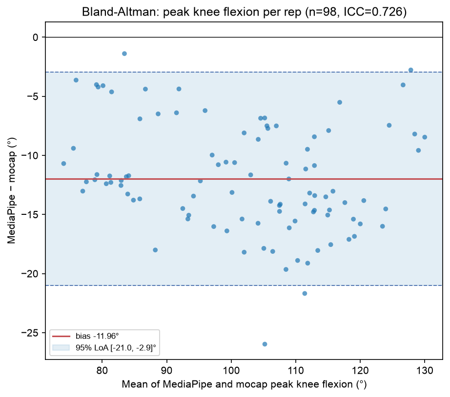

# Stage 5.4 — MediaPipe vs OptiTrack mocap agreement

Does the single-camera pipeline actually measure the knee angle it claims to? Compares, on the same frames, the knee flexion our pipeline derives from MediaPipe world landmarks against the same angle derived from REHAB24-6's OptiTrack 26-joint mocap. **The mocap is a validation reference only — never a training feature (X3).**

## Headline

**ICC(2,1) = 0.726**, **bias -11.96°**, **95% limits of agreement [-21.00°, -2.94°]**, r = 0.956, n = 98 reps.

The compared quantity is the **peak of the bilateral mean knee flexion per rep** — i.e. exactly `knee_flex_peak_deg`, the feature the R5.5 gate turns on — so this speaks to the real feature rather than to an angle nothing uses. Negative bias means our pipeline reads *lower* than mocap. The bilateral mean is also **invariant to any left/right swap**, which matters given the leg-identity problem documented below.

## The headline number needs unpacking: high correlation, large bias

r = 0.956 but ICC = 0.726. That gap is the whole story: Pearson r only asks whether the two move together (they do, very closely), while ICC(2,1) is an **absolute**-agreement measure and is dragged down by the systematic -11.96° offset. Our pipeline tracks the shape of the movement faithfully and mis-states its magnitude.

### It is range compression, not a constant offset

Comparing the rep's minimum and its ROM as well as its peak shows the shape of the error:

| quantity per rep | bias (MediaPipe − mocap) | 95% LoA | ICC | r |
| ---------------- | ------------------------ | ------- | --- | - |
| peak flexion (`knee_flex_peak_deg`) | -11.96° | [-21.0, -2.9]° | 0.726 | 0.956 |
| minimum flexion (`knee_flex_min_deg`) | +1.60° | [-8.8, 12.0]° | 0.438 | 0.507 |
| ROM (`knee_rom_deg`) | -13.56° | [-27.3, 0.2]° | 0.707 | 0.934 |

The pipeline **under-reads the peak by 12.0° while over-reading the minimum by 1.6°**, so the measured range is compressed by ~14° per rep. The knee never looks as straight at the top nor as bent at the bottom as it really is. This is characteristic of landmark regression from a single view (the model hedges toward the mean pose), and is compounded here by the far limb being occluded.

> **Consequence for the ROM rule — flagged, not fixed here.** `squat/config.py`'s ROM bands (`<60°` / `60-90°` shallow / `90-110°` parallel / `>=110°` deep) are tagged **[clinical norm, S1]**, i.e. they come from literature describing *true* joint angles. Feeding a systematically 12°-under-read measurement into thresholds derived from true angles will systematically under-credit depth: a genuine 110° deep squat reaches our pipeline as ~98° and gets banded 'parallel'. The clean fixes are to calibrate the measurement or to re-derive the band edges against this pipeline's own scale — either changes Phase 4 banding behaviour and belongs to Stage 5.6's threshold work, not to this gate. **It does not affect the classifier**, which learns from our measurements consistently and is unaffected by a monotone offset.

## Method notes (verified, not assumed)

- **Frame alignment, and a filter-lag finding.** An offset scan (-5..5 frames) picks the lag maximising correlation per video rather than trusting index 0. Selected: [-3] frame(s) for every video. Raw landmarks align at exactly **0**, so the streams do start together and the extra trailing mocap frame is harmless; the preprocessed stream lags by **3 frames (~100 ms)**, which is the causal One Euro filter's own delay. Worth knowing beyond this report: live on-screen feedback inherits that ~100 ms lag.
- **Same geometry helper both sides.** Both series go through the live pipeline's `knee_flexion_deg`; an unsigned hip-knee-ankle angle is invariant to the coordinate frame, so mocap's room axes and MediaPipe's hip-origin axes need no alignment.
- **Our side is the preprocessed stream** (confidence filter → gap fill → One Euro), i.e. what the model actually consumes, not raw landmarks.

## Leg identity could not be established — and that is itself a finding

Stage 5.3 deferred one question to this gate: *is the occluded far leg's estimate accurate, or merely plausible?* Answering it needs a per-leg comparison, which needs knowing which mocap leg is which MediaPipe leg. That mapping does not survive scrutiny.

- Comparing each leg's **absolute** angle is useless: both knees bend together in a squat, so every pairing correlates ~0.97 whether the labels match or not. It cannot discriminate.
- The **leg-difference** signal (`θ_L − θ_R`) cancels that common mode and is the only thing that can confirm the labels. Correlated against mocap's own leg difference it gives a mean r of **-0.053** across the 9 videos (range -0.71 to +0.56, signs mixed) — **essentially no relationship**.
- Geometry says the mapping *must* be consistent: every subject stands the same way round (all nine mocap hip axes align, cosine similarity 0.99–1.00 — identical orientation) and MediaPipe calls the far knee 'right' in all nine. So the mixed signs above are **noise, not genuine per-subject inconsistency** — which means the difference signal carries no usable information rather than that the mapping flips.

**Therefore the per-leg split below is reported without a verdict**, and the Stage 5.3 far-leg question stays formally open. The honest partial answer: the bilateral mean *includes* the far leg and still tracks mocap at r = 0.956, so the far limb cannot be grossly wrong — a badly broken leg would visibly degrade the mean. That supports the decision to release hold-last rather than freeze it, but it is weaker evidence than a clean per-leg ICC would have been, and is not claimed as more.

| leg (identity UNVERIFIED) | ICC(2,1) | bias (°) | 95% LoA (°) | r | n |
| ------------------------- | -------- | -------- | ----------- | - | - |
| MediaPipe left vs mocap left | 0.613 | -16.76 | [-25.89, -7.64] | 0.958 | 98 |
| MediaPipe right vs mocap right | 0.814 | -7.12 | [-19.42, 5.19] | 0.925 | 98 |

### This independently condemns `symmetry_index_pct`

The finding above is not just an inconvenience for this report — it is direct evidence about a feature. `symmetry_index_pct` is defined as `|θ_L − θ_R| / mean × 100`: it is *entirely* a function of the leg-difference signal, and that signal correlates with the marker-based truth at r = **-0.053**. The feature is measuring noise, not asymmetry. Stage 5.4's distribution check independently gave it a DROP verdict on weak class separation; this is the mechanistic reason why, and it is the stronger argument — the feature is not weak, it is **not measuring the thing it claims**. A single sagittal camera cannot resolve left-right knee asymmetry when one leg occludes the other, which is the same monocular limitation that already removed frontal-plane valgus (Locked Assumption #3).

## Per-video alignment detail

| video | chosen offset (frames) | correlation at that offset |
| ----- | ---------------------- | -------------------------- |
| PM_008 | -3 | 0.9742 |
| PM_022 | -3 | 0.9781 |
| PM_029 | -3 | 0.9573 |
| PM_038 | -3 | 0.9721 |
| PM_043 | -3 | 0.9686 |
| PM_105 | -3 | 0.9779 |
| PM_113 | -3 | 0.9673 |
| PM_118 | -3 | 0.9757 |
| PM_126 | -3 | 0.9051 |

## What this does and does not license

**Does:** the pipeline measures the intended anatomy and tracks it faithfully (r = 0.956). `knee_flex_peak_deg` rises and falls with the real knee angle, so it is a legitimate input for a *learned* classifier, which is what Stage 5.5 builds. This supports the R5.5 gate's pass.

**Does not:** license treating our degrees as clinical degrees. The -12.0° bias and the ~14° range compression mean any number this pipeline reports is on **its own scale**, not a goniometer's. Two consequences: the ROM rule's [clinical norm, S1] thresholds are applied to a scale they were not derived on (flagged above for Stage 5.6), and no user-facing text should present a raw angle as a clinical measurement.

The limits of agreement ([-21.0°, -2.9°]) — not the headline ICC — are the number to quote as this system's per-rep measurement uncertainty.

Caveats kept explicit:

- **Not independent samples.** 98 reps come from 9 subjects; reps within a subject are correlated, so the ICC is a descriptive agreement figure, not an inferential claim with a meaningful confidence interval.
- **Mocap is a reference, not truth.** OptiTrack marker placement has its own error, and its skeleton joint centres are not defined identically to MediaPipe's landmarks — an unknown share of the bias is definitional (where a 'knee centre' is) rather than pipeline error. The bias should not be read as a calibration constant to subtract without establishing that share first.
- **Peak/min/ROM only.** Agreement is computed on per-rep summary values, the quantities the features use. It does not certify the angle at every instant.
- **Leg identity unverified** — see above; per-leg rows are indicative only.
