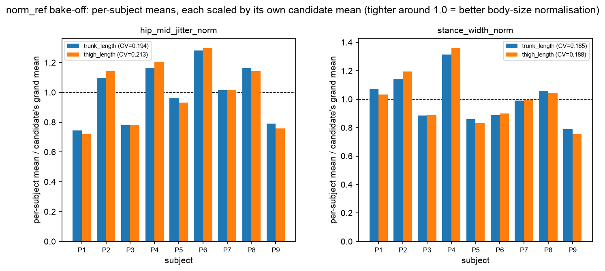

# Stage 5.4 — `norm_ref` bake-off (R5.3)

`norm_ref` is the body-size reference that `hip_mid_jitter_norm` and `stance_width_norm` divide by (the other 11 features do not use it). The better reference cancels body-size differences more completely — leaving **less spread between subjects** doing the same movement.

**Winner: `trunk_length`** (mean cross-subject CV 0.1796 vs 0.2005). Backend default was `trunk_length`.

---

## Table of Contents

- [Why the verdict uses CV, not raw variance](#why-the-verdict-uses-cv-not-raw-variance)
- [Numbers](#numbers)

---

## Why the verdict uses CV, not raw variance

`task.md` prescribes "compute cross-subject variance ... pick the lower". Taken literally that is **scale-confounded**: the two references have different magnitudes, so dividing by the larger one shrinks the feature and shrinks its raw variance too — a reference that is uniformly 2x larger would win on raw variance while normalising nothing. The verdict is therefore taken on the **coefficient of variation** of the per-subject means (std/mean across subjects), which is dimensionless and immune to that artefact. Raw variance is reported below anyway, so the confound is visible rather than hidden.

## Numbers

| feature               | candidate    | cross-subject CV | cross-subject variance | mean      |
| --------------------- | ------------ | ---------------- | ---------------------- | --------- |
| `hip_mid_jitter_norm` | trunk_length | 0.1938 **<-**    | 7.430e-12              | 1.407e-05 |
| `hip_mid_jitter_norm` | thigh_length | 0.2130           | 1.285e-11              | 1.683e-05 |
| `stance_width_norm`   | trunk_length | 0.1654 **<-**    | 1.546e-02              | 7.518e-01 |
| `stance_width_norm`   | thigh_length | 0.1881           | 2.862e-02              | 8.997e-01 |

Note how the raw-variance column moves with the feature's absolute scale (the `mean` column) while CV does not — that is the confound above, made concrete.

Each bar is a subject's mean **divided by that candidate's own grand mean**, so both candidates centre on 1.0 and the visible spread is the CV being compared. Raw bars were deliberately _not_ plotted: `trunk_length` is the longer reference, so its raw values sit uniformly lower and would look tighter through scale alone — a reader would have seen the right answer for the wrong reason. Scaled this way the comparison is fair, and `trunk_length` still clusters more closely around 1.0.

**The verdict is robust to the metric choice.** `trunk_length` wins on CV _and_ on raw variance, for both features — so the scale confound described above did not decide the outcome here; it only means CV is the honest number to quote.
