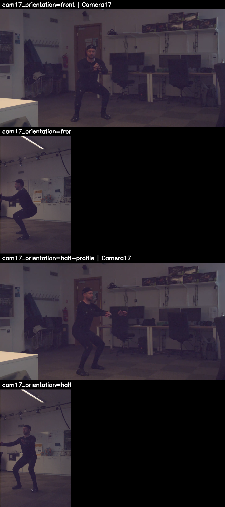
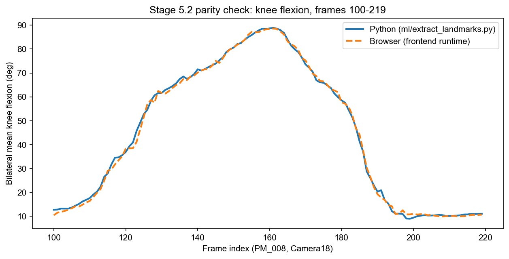
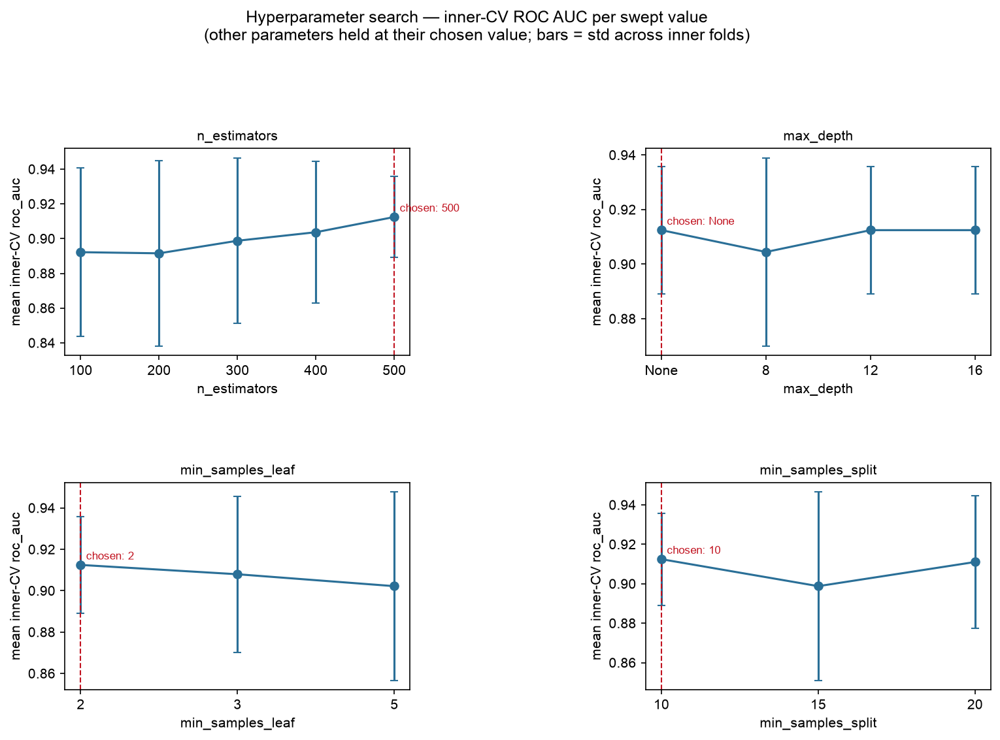
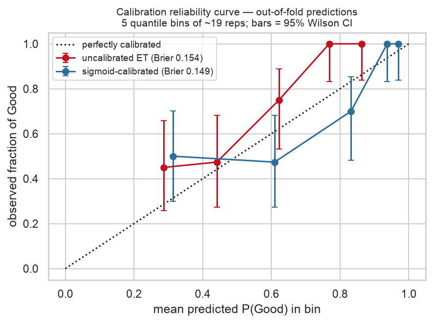
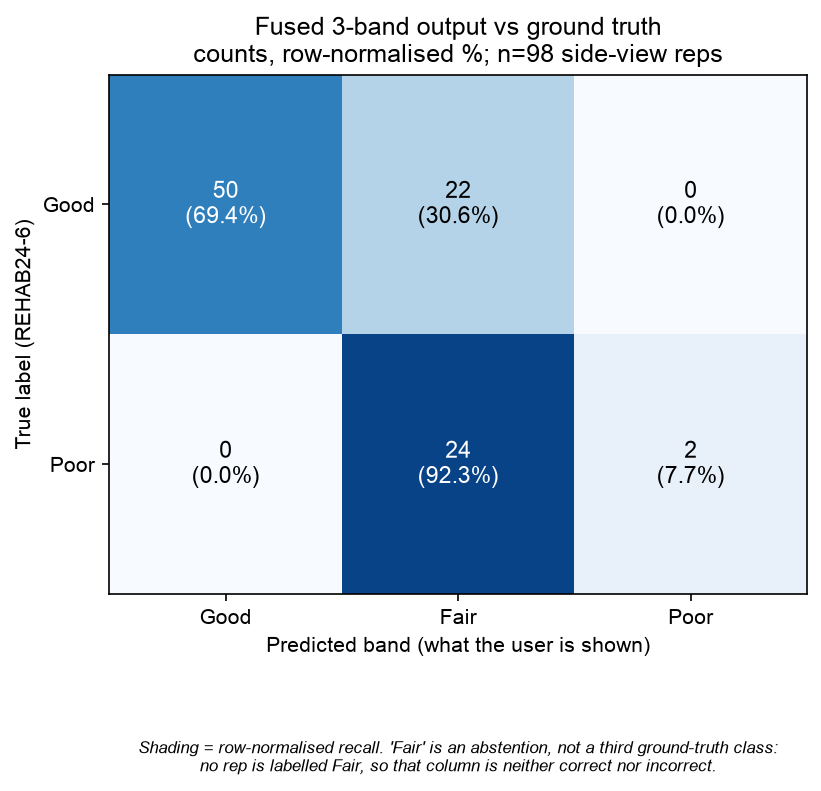
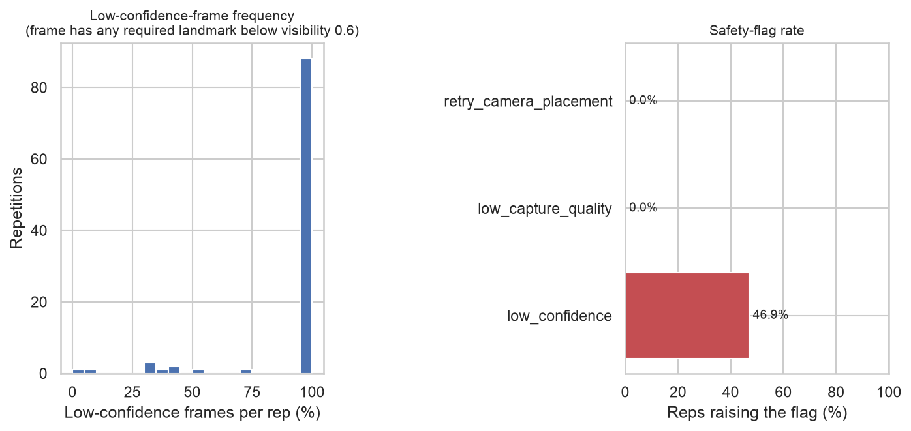
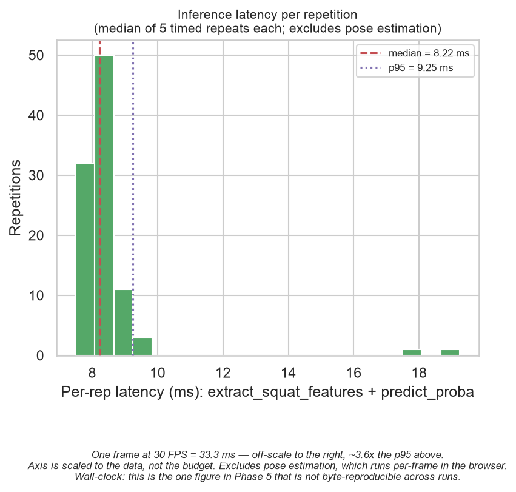
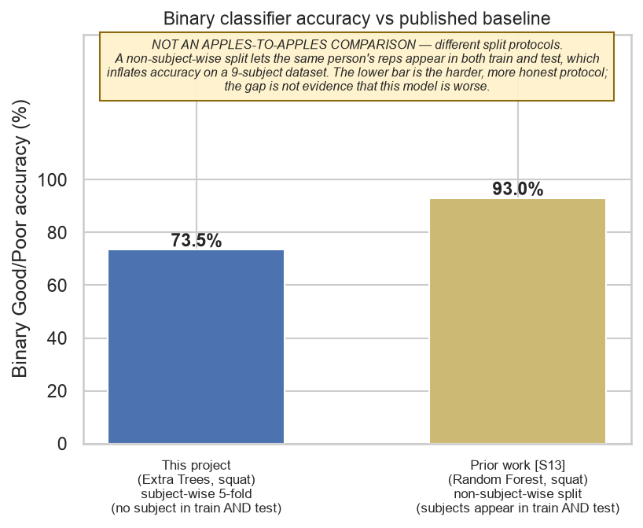
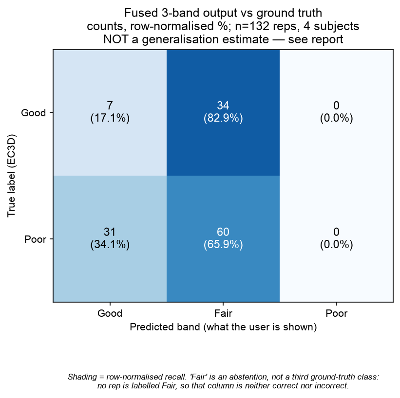

# Phase 5 — Model Development: Dataset, Feature Pipeline, Classifier Training, Evaluation, and Deployment

_Draft source material for the Results and Discussion chapter. Sections 1–10 cover the
squat model end to end: dataset audit, landmark extraction, feature engineering, feature
validity analysis, Extra Trees classifier training, fusion threshold/weight selection,
system evaluation including replay determinism, export to the production backend, and
external validation against an independent dataset. Section 11 covers the lunge's own
dataset audit and landmark extraction; the lunge model's feature engineering, training,
and evaluation will extend this chapter as that work is completed. Written for direct
adaptation into the dissertation; figures are embedded and referenced by their existing
filenames in `ml/reports/figures/`._

---

## 1. Dataset

The squat model is trained on the REHAB24-6 dataset, using exercise Ex6 (squat) only.
Before any training work began, the raw dataset was audited to establish how much of it
was actually usable under this project's design constraints.

### 1.1 Camera view selection

The system is designed around a single side-view (sagittal) camera, consistent with the
project's decision to exclude frontal-plane measurements such as knee valgus, which a
single camera cannot reliably resolve. REHAB24-6 provides two synchronised camera feeds
per recording, tagged by a `cam17_orientation` field with three possible values: `front`,
`half-profile`, and `profile`.

The mapping from this tag to actual camera geometry was verified visually rather than
assumed, by inspecting representative frames from both cameras under each orientation
label (Figure 1). This confirmed that when `cam17_orientation == "front"`, the secondary
camera (Camera 18) captures a clean, true sagittal view of the subject — hip, knee, and
ankle stacked in the image plane exactly as a side-on functional assessment requires. When
`cam17_orientation == "half-profile"`, neither camera provides a true side view; both show
the subject at a diagonal angle. The `profile` tag does not occur for Ex6 in this dataset.

_Figure 1. Visual verification of the camera-orientation mapping. Top row: `cam17_orientation == "front"`, Camera 18 (right) shows a true sagittal view. Bottom row: `cam17_orientation == "half-profile"`, neither camera is a usable side view._

Consequently, only `cam17_orientation == "front"` rows, sourced from Camera 18, are usable
for a system designed around a single true side view.

### 1.2 Usable sample size and class balance

Before the view filter, Ex6 contains 195 repetitions across 9 subjects, with a correctness
label (Good/Poor) split of 134/61 (69%/31%). After restricting to usable side-view rows,
98 repetitions remain — 50.3% of the exercise's total — with a split of 72 Good / 26 Poor
(73%/27%). Table 1 gives the per-subject breakdown.

_Table 1. Usable side-view repetitions per subject after the camera-view filter._

| Subject | Side-view reps | Good | Poor |
| ------- | -------------- | ---- | ---- |
| 1       | 17             | 16   | 1    |
| 2       | 10             | 10   | 0    |
| 3       | 10             | 5    | 5    |
| 4       | 10             | 10   | 0    |
| 5       | 10             | 5    | 5    |
| 6       | 10             | 5    | 5    |
| 7       | 10             | 5    | 5    |
| 8       | 10             | 5    | 5    |
| 9       | 11             | 11   | 0    |

All 9 subjects retain at least some data after filtering, but three subjects — 2, 4, and 9
— retain only Good repetitions; none of their Poor squats survive the view filter. This
has a direct consequence for the cross-validation scheme adopted during training,
discussed in Section 4.1.

The Poor class is the dataset's practical bottleneck: 26 examples across only 6 subjects
that contribute any Poor repetitions at all, one of whom (subject 1) contributes a single
Poor rep. Every result in this chapter should be read against that sample size. This
trade-off — a smaller, cleanly-defined side-view cohort versus a larger but geometrically
mixed one — was a deliberate design decision, accepting the smaller N in exchange for a
feature set computed under a single, consistent camera geometry.

---

## 2. Landmark Extraction and Runtime Parity

Because the same pose-estimation and feature-extraction code that runs in the browser at
inference time is reused for offline training (rather than reimplemented in Python), it
was necessary to confirm that the offline Python extraction pipeline and the production
browser runtime produce equivalent landmarks from the same video. Divergence here would
mean the model was trained on a subtly different signal from the one it would receive in
deployment.

A held-out clip (120 frames, approximately 4 seconds, spanning one full repetition) was
processed through both pipelines using identical MediaPipe Pose Landmarker configuration
(same model asset, same confidence thresholds, same `VIDEO` running mode), and the
resulting landmarks compared frame-by-frame.

Across all 33 landmarks' (x, y, z, visibility) values over 120 frames, the two pipelines
agreed with a Pearson correlation of 0.9996. Mean absolute positional difference was 5.5
mm (median 3.1 mm), with the largest single-frame discrepancy of 68.5 mm occurring at a
fast-moving extremity (a fingertip) not used by the squat feature set. Restricting the
comparison to the landmarks the squat features actually consume — shoulders, hips, knees,
ankles — mean positional difference ranged from 0.8 mm (hips) to 7.3 mm (right ankle). The
resulting knee flexion angle, the primary signal for squat depth, differed by a mean of
0.90° and a maximum of 4.6° across the full repetition (Figure 2).

_Figure 2. Knee flexion angle across one repetition, computed independently by the offline Python pipeline and the production browser runtime from the same source video._

These differences are consistent with expected floating-point variation between the
native TFLite inference backend (Python) and the browser's WASM/XNNPACK backend, rather
than any structural disagreement between the two pipelines — both curves track the same
shape throughout descent, the bottom of the squat, and ascent. This was treated as
confirmation that features trained offline are representative of what the live system
will compute at inference time.

---

## 3. Feature Engineering Pipeline

### 3.1 Preprocessing

Each video's landmark stream was passed through the same preprocessing pipeline used in
the live backend before feature extraction: a confidence filter, short-gap interpolation,
and a One Euro low-pass filter, applied once per video over the full chronological
recording (not per repetition) since the filter is stateful and resets its temporal
context if applied to isolated windows. Repetition boundaries were then taken from the
dataset's own physiotherapist-verified frame indices, and the 13-dimensional feature
vector for each repetition — including peak and range-of-motion knee flexion, hip
flexion, trunk lean, angular velocity, rep timing, and normalised measures of jitter and
stance width — was computed by the same feature-extraction function the live system uses.

### 3.2 A systematic camera-geometry limitation: far-limb occlusion

During this process, a systematic issue was identified that is a property of monocular
side-view capture generally, not of this dataset specifically. In a true side-on view, one
leg (nearer the camera) is clearly visible throughout the movement, while the other leg is
partially occluded by the torso and the near leg itself. Measured landmark confidence
(MediaPipe's `visibility` output) confirmed this asymmetry directly: across all 9 subjects,
the near-side knee and ankle averaged 0.95–0.99 confidence, while the far-side knee and
ankle averaged only 0.59–0.87, at times remaining below the system's confidence threshold
for an entire repetition.

This is not simply missing data — the far limb's landmark estimate continues to track a
plausible trajectory even at low confidence, it is merely less certain. Left unaddressed,
however, the existing preprocessing behaviour (holding the last known-good position when
confidence drops, intended to smooth brief tracking dropouts) would incorrectly freeze the
far leg at its standing posture for the entire duration of a squat whenever its confidence
stayed low for longer than the short-gap tolerance. Because the squat's principal feature
is a bilateral average of both knees, this had the effect of roughly halving the effective
depth signal in every affected repetition, and was confirmed to collapse automatic
repetition-detection accuracy on side-view footage from 92/98 to 32/98 repetitions when
first observed.

The preprocessing pipeline was corrected so that persistent low-confidence runs longer
than the system's existing short-gap tolerance release the "hold last position" behaviour
and instead allow the low-pass filter to smooth the landmark's own live (if less certain)
estimate, while genuinely brief tracking dropouts continue to be bridged as before. This
restored automatic repetition-detection accuracy to 93/98 (94.9%) on side-view footage —
marginally better than the original unfiltered baseline of 92/98, indicating the corrected
preprocessing now assists repetition detection rather than harming it. This fix was
deliberately scoped to the squat-specific preprocessing layer only, leaving the underlying
smoothing filter shared with the system's other exercise modules unchanged.

Whether the far leg's corrected estimate is not just plausible but _accurate_ is a
separate question, addressed against motion-capture ground truth in Section 4.3.

### 3.3 Repetition-detection validation against ground truth

As an incidental validation exercise, the system's own automatic repetition-boundary
detector (used at inference time to segment a live session into individual repetitions)
was run over the same preprocessed streams and its output compared against the dataset's
physiotherapist-verified boundaries — the boundaries actually used to build the training
set. Using strict one-to-one matching (so that no single detection could be credited
against more than one ground-truth repetition), the detector achieved 94.4% recall and
95.8% precision across all 195 repetitions in the recordings (both camera orientations
combined, since the detector itself is orientation-agnostic), and 94.9% recall on the
side-view subset used for training. Boundary timing error on correctly matched repetitions
had a median of 20 frames (~0.67 s) at the start of a repetition and 13 frames (~0.43 s)
at the end, consistent with the detector's built-in hysteresis intentionally delaying its
response to avoid triggering on noise.

---

## 4. Feature Validity Analysis

Before any model training, every candidate feature was checked for whether it actually
separates correct from incorrect squats in this dataset, and whether that separation is
consistent across subjects rather than an artefact of one or two individuals.

### 4.1 Method

For each of the 13 candidate features, class separation was quantified using the Area
Under the ROC Curve (AUC) interpretation of the Mann-Whitney U statistic: an AUC of 0.5
indicates no separation between Good and Poor squats, and the distance from 0.5 is the
effect size. Because the 98 repetitions come from only 9 subjects, repetitions are not
statistically independent of one another — treating them as if they were would produce
anti-conservative p-values. Rather than relying on p-values as the basis for any decision,
a secondary, more conservative check was used: for every subject who contributed at least
two repetitions of both classes, whether that subject's own Good-versus-Poor difference
pointed in the same direction as the pooled result. A feature was retained only if it
showed both a meaningful pooled effect (|AUC − 0.5| ≥ 0.10) and cross-subject direction
agreement (≥ 60% of eligible subjects agreeing), with the acceptance thresholds fixed
before any results were examined.

### 4.2 Gate result and a reversed assumption

The single feature nominated in advance as the sanity check for the entire pipeline —
peak knee flexion angle — showed a clear and consistent effect (AUC 0.837, Good median
92.8° versus Poor median 107.7°, direction consistent across all 5 subjects eligible to
vote). This confirmed the extraction, view-filtering, and repetition-windowing pipeline
was functioning correctly, and training was permitted to proceed.

The direction of this effect is worth highlighting on its own terms. The original
expectation — that an incorrect squat is typically too shallow — is not borne out in this
dataset: incorrect repetitions are systematically _deeper_, not shallower. REHAB24-6's
Ex6 "incorrect" label captures a mix of deliberately introduced technical faults, not
specifically insufficient depth, so squat depth alone does not encode correctness in the
direction that was initially assumed. Any downstream logic that treats "deeper" as
synonymous with "better form" would be inverted for this population, and this should be
stated explicitly rather than left implicit.

### 4.3 Full feature verdicts

Table 2 gives the complete per-feature analysis. Ten of thirteen candidate features
showed both a meaningful effect size and cross-subject consistency and were retained; one
showed a meaningful pooled effect but inconsistent direction across subjects (retained
with a caveat, since a subsequent multivariate model can down-weight it); and three showed
no meaningful separation by either measure.

_Table 2. Per-feature class-separation analysis, ranked by effect size._

| Feature                | Good median | Poor median | AUC   | Direction   | Subjects agreeing | Verdict       |
| ---------------------- | ----------- | ----------- | ----- | ----------- | ----------------- | ------------- |
| `ankle_df_proxy_deg`   | 29.71       | 41.93       | 0.882 | Poor higher | 5/5               | Keep          |
| `knee_rom_deg`         | 81.46       | 96.42       | 0.859 | Poor higher | 5/5               | Keep          |
| `knee_flex_peak_deg`   | 92.76       | 107.68      | 0.837 | Poor higher | 5/5               | Keep          |
| `hip_flex_peak_deg`    | 96.88       | 113.98      | 0.784 | Poor higher | 4/5               | Keep          |
| `trunk_lean_peak_deg`  | 34.10       | 46.02       | 0.762 | Poor higher | 3/5               | Keep          |
| `knee_ang_vel_max_dps` | 141.01      | 179.20      | 0.750 | Poor higher | 4/5               | Keep          |
| `trunk_lean_mean_deg`  | 19.37       | 24.55       | 0.695 | Poor higher | 3/5               | Keep          |
| `knee_flex_min_deg`    | 12.68       | 10.92       | 0.315 | Poor lower  | 4/5               | Keep          |
| `hip_mid_jitter_norm`  | 0.00        | 0.00        | 0.650 | Poor higher | 4/5               | Keep          |
| `stance_width_norm`    | 0.79        | 0.70        | 0.374 | Poor lower  | 1/5               | Keep (caveat) |
| `symmetry_index_pct`   | 29.57       | 30.28       | 0.442 | Poor lower  | 4/5               | Drop          |
| `descent_ascent_ratio` | 1.26        | 1.13        | 0.467 | Poor lower  | 2/5               | Drop          |
| `rep_duration_s`       | 3.13        | 3.08        | 0.492 | Poor lower  | 3/5               | Drop          |

_Figure 3. Distribution of each candidate feature, split by Good/Poor class label._

Two candidate features were also found to be strongly correlated with one another and
therefore partially redundant as inputs: peak knee flexion and knee range-of-motion
(r = 0.97), and peak and mean trunk lean (r = 0.93). This redundancy was noted but not
acted on at this stage, deferred to be resolved with model evidence in hand once training
was complete (Section 5.4).

_Figure 4. Pearson correlation matrix across all 13 candidate features._

A specific concern was raised about the left-right symmetry feature
(`symmetry_index_pct`), independent of its class-separation result. As defined — the
absolute difference between left and right knee angle, divided by their mean, expressed
as a percentage — the measure is numerically unstable near standing posture, where both
knee angles approach zero and the denominator collapses, causing the ratio to spike even
for a small absolute left-right difference. This partially explains why the feature failed
to separate the two classes: much of its value is dominated by frames in which the measure
is least meaningful. This concern is examined directly against ground-truth motion capture
in Section 4.5, where it receives independent, mechanistic confirmation.

### 4.4 Selecting a normalisation reference

Two of the thirteen features (`hip_mid_jitter_norm`, `stance_width_norm`) are normalised
by a body-size reference to make them comparable across subjects of different builds. Two
candidate references were evaluated: trunk length (hip-midpoint to shoulder-midpoint) and
thigh length (hip to knee). The better reference is the one that leaves less residual
spread between subjects performing the same movement, measured as the coefficient of
variation (standard deviation divided by mean) of each subject's average value, rather
than raw variance — raw variance is scale-dependent and would spuriously favour whichever
reference happens to be numerically larger, independent of how well it actually normalises
anything.

Trunk length produced a lower coefficient of variation for both normalised features
(0.194 vs. 0.213 for jitter; 0.165 vs. 0.188 for stance width; mean 0.180 vs. 0.201) and
was adopted as the system default. The result held under both metrics — trunk length also
won on raw variance for both features — so the choice was not an artefact of the scale
confound described above.

_Figure 5. Per-subject mean of each normalised feature under both candidate references, each scaled by its own grand mean so the comparison is not confounded by the references' different absolute scales._

### 4.5 Validation against motion-capture ground truth

A further question could not be answered from the dataset's class labels alone: does the
pipeline's knee flexion angle correspond to a physically accurate measurement, or only to
an internally consistent one? REHAB24-6 additionally provides synchronised 3D
motion-capture (OptiTrack) marker data, which was used purely as an external validation
reference and never as a training input.

Comparing the peak of the bilateral mean knee flexion — the same value the feature-
validity gate above tested — against the equivalent motion-capture angle across all 98
repetitions gave an Intraclass Correlation Coefficient (ICC(2,1)) of 0.726, a bias of
−11.96° (this pipeline reads lower than motion capture), 95% limits of agreement of
[−21.00°, −2.94°], and a Pearson correlation of 0.956 (Figure 6).

_Figure 6. Bland-Altman comparison of peak knee flexion between the pose-estimation pipeline and OptiTrack motion capture, across 98 repetitions._

The gap between a very high correlation (0.956) and a comparatively modest ICC (0.726) is
informative in its own right: correlation asks only whether the two measurements move
together, which they do very closely, while ICC is sensitive to absolute agreement and is
pulled down by the systematic offset. In other words, the pipeline tracks the _shape_ of
the squat faithfully but consistently mis-states its _magnitude_.

Examining the minimum flexion and total range-of-motion in addition to the peak shows this
is not a simple constant offset but a compression of the measured range: the pipeline
under-reads the peak (most flexed) angle by roughly 12° while over-reading the minimum
(most extended) angle by roughly 1.6°, so the apparent range of motion is compressed by
approximately 14° relative to ground truth (Table 3). This pattern — hedging toward an
intermediate pose — is characteristic of monocular landmark regression in general and is
compounded here by the far-limb occlusion described in Section 3.2.

_Table 3. Agreement with motion-capture ground truth by quantity, n = 98 repetitions._

| Quantity        | Bias (pipeline − mocap) | 95% limits of agreement | ICC(2,1) | Pearson r |
| --------------- | ----------------------- | ----------------------- | -------- | --------- |
| Peak flexion    | −11.96°                 | [−21.0°, −2.9°]         | 0.726    | 0.956     |
| Minimum flexion | +1.60°                  | [−8.8°, 12.0°]          | 0.438    | 0.507     |
| Range of motion | −13.56°                 | [−27.3°, 0.2°]          | 0.707    | 0.934     |

This has a direct practical consequence for any rule that compares this pipeline's raw
angle against a threshold derived from clinical literature: because the existing squat
depth banding rule's thresholds are defined in terms of true joint angle, and this
pipeline's angle reads systematically low, a genuinely deep 110° squat would be reported
by this pipeline as approximately 98° and risk being mis-classified as merely reaching
parallel. This does not affect a classifier trained end-to-end on this pipeline's own
measurements, since a monotonic offset does not change which repetitions separate from
which — but it does affect any rule-based threshold carried over unadjusted from clinical
norms, and is flagged here as a limitation to be addressed when that threshold logic is
next revisited.

**Left-right identity could not be established.** A remaining open question from feature
engineering was whether the occluded far leg's corrected estimate is not just plausible
but accurate. Answering this directly requires knowing which motion-capture leg
corresponds to which camera-estimated leg — and this mapping could not be confirmed.
Comparing each leg's absolute angle independently is uninformative, since both knees bend
together throughout a squat and any left-right pairing (correct or swapped) correlates at
approximately 0.97 regardless. The only signal that can actually discriminate a correct
pairing is the _difference_ between left and right angle, and this difference signal
correlated with the equivalent motion-capture difference at a mean r of only −0.053 across
the 9 subjects (individual per-subject values ranging from −0.71 to +0.56, with
inconsistent sign) — effectively no relationship. Because independent geometric evidence
(the orientation of each subject's hip axis in the motion-capture data) confirmed every
subject faced the camera set-up identically, the true camera-to-mocap leg mapping must
itself be consistent across subjects; the inconsistent per-subject correlations are
therefore attributable to noise in the difference signal itself, not to a genuine mapping
error. This leaves the question of per-leg accuracy formally unresolved, with only a
weaker, indirect answer available: because the bilateral mean (which is unaffected by
any left-right mislabelling) still agrees with motion capture as closely as reported
above, the far limb's estimate cannot be grossly inaccurate, but a clean, mapping-verified
per-leg comparison was not achievable with this dataset.

This finding independently and mechanistically confirms the concern raised in Section 4.3
about the symmetry feature: because that feature is defined entirely in terms of the
left-right difference signal, and that signal shows no measurable relationship with the
true left-right difference, the feature is not measuring asymmetry at all under a single
side-view camera — a direct consequence of one leg occluding the other, the same
underlying camera limitation that motivated excluding frontal-plane measurements from this
system's design.

---

## 5. Classifier Training

With the feature pipeline validated, a binary Good/Poor Extra Trees classifier was trained
on the 98-repetition, 13-feature dataset.

### 5.1 Cross-validation scheme

Leave-One-Subject-Out (LOSO) cross-validation was the originally planned evaluation
scheme, since it gives the strongest guarantee that reported performance reflects
generalisation to an unseen individual rather than memorisation of a subject's
idiosyncrasies. However, as established in Section 1.2, three of the nine subjects
contributed only Good repetitions after the side-view filter. Under LOSO, each of those
three subjects' held-out test folds would therefore contain no Poor example at all,
leaving fold-level metrics that require both classes — including the ROC AUC and
Poor-class recall reported below — undefined for a third of the folds.

Consequently, the pre-planned fallback scheme was adopted instead: subject-grouped,
class-stratified 5-fold cross-validation, in which no individual subject's data appears
in both the training and test portion of any fold, but folds are constructed to guarantee
both classes are represented. This preserves the property that matters most for an
honest generalisation estimate — no subject's data ever influences the prediction made
for that same subject — at the cost that each fold's held-out set contains data from
approximately two subjects rather than exactly one. Results reported below should
accordingly be described as a subject-independent, but not strictly leave-one-subject-out,
estimate. Table 4 gives the per-fold result.

_Table 4. Cross-validation fold composition and out-of-fold performance._

| Fold | Held-out subjects | Good | Poor | Out-of-fold AUC |
| ---- | ----------------- | ---- | ---- | --------------- |
| 1    | 1, 8              | 21   | 6    | 0.889           |
| 2    | 7, 9              | 16   | 5    | 0.887           |
| 3    | 2, 5              | 15   | 5    | 0.773           |
| 4    | 4, 6              | 15   | 5    | 0.893           |
| 5    | 3                 | 5    | 5    | 1.000           |

Class imbalance within each training fold was handled via class-weighted loss rather than
synthetic oversampling (e.g. SMOTE): with pose-derived features, an interpolated synthetic
example can represent a biomechanically impossible combination of joint angles, and with
so few Poor-class subjects, synthetic resampling risked generating near-duplicate examples
of the same individual's movement pattern across different folds, undermining the very
subject-independence the cross-validation scheme was designed to protect.

### 5.2 Hyperparameter search

A grid search over 180 combinations of the classifier's principal hyperparameters
(number of trees, maximum tree depth, minimum samples per leaf, minimum samples to split)
was conducted entirely within each training fold, so that no test-fold data ever
influenced the choice of hyperparameters for the fold it was later evaluated on. The
search was optimised for ROC AUC rather than a threshold-dependent metric such as F1 or
precision at a fixed 0.5 cut-off, since the classification threshold itself is subject to
later calibration and is not fixed at this stage (Section 5.6 below); AUC evaluates the
quality of the underlying probability ranking independent of any particular operating
point.

The winning combination — 500 trees, unrestricted maximum depth, a minimum of 2 samples
per leaf, and a minimum of 10 samples to split — achieved a mean inner-fold AUC of 0.9125.
However, the search results (Figure 7) show this result should be read cautiously: the
entire 180-combination grid spanned only 0.041 AUC from best to worst, while the typical
fold-to-fold variability at any single point in the grid was 0.046 — larger than the
grid's entire span. The overwhelming majority of combinations (163 of 180) fell within one
standard deviation of the top result. This indicates that, at this sample size, the
classifier's performance is largely insensitive to these particular hyperparameters, and
the selected combination should be understood as a representative point on an essentially
flat surface rather than a meaningfully optimised configuration. This was confirmed
mechanistically for tree depth: with the minimum-samples-to-split constraint active on a
dataset this size, trees naturally reached a mean depth of only 7.5 (maximum 13) regardless
of the nominal depth limit, so the depth hyperparameter had almost no opportunity to bind.

_Figure 7. Mean inner-cross-validation ROC AUC as each hyperparameter is varied, with the other three held at their selected value. Error bars show one standard deviation across inner folds._

### 5.3 Calibration

Extra Trees classifiers, like other tree ensembles, tend to produce probability estimates
that are more extreme than actual outcome frequencies warrant. Because a later stage of
this system depends on a well-calibrated confidence estimate (to define an uncertain
"Fair" band around the binary decision), the raw classifier's probabilities were
calibrated using Platt scaling (a sigmoid fit), rather than the more flexible isotonic
regression method: with only 26 Poor-class examples spread across 6 subjects, isotonic
regression's unconstrained step-function fit was judged too likely to overfit the small
calibration set. This is a genuine limitation of the available sample size rather than a
preference, since a two-parameter sigmoid cannot correct a non-monotonic miscalibration if
one were present.

Reliability was assessed using out-of-fold predictions only — evaluating calibration on
training data would trivially show near-perfect reliability for almost any model and prove
nothing — binned into five quantile groups of approximately 19 repetitions each, with 95%
confidence intervals computed via the Wilson method (rather than the simpler normal
approximation, which incorrectly collapses to zero width whenever a bin's observed
frequency is exactly 0 or 1, which occurred here) (Figure 8).

_Figure 8. Reliability diagram comparing predicted probability of a Good repetition against the observed frequency, before and after calibration, using out-of-fold predictions. Error bars are 95% Wilson confidence intervals._

Calibration produced only a modest improvement in Brier score (0.154 to 0.149), and,
honestly assessed, the reliability curves before and after calibration are not separated
by more than the sampling uncertainty within each bin at this sample size — this result
should be read as "calibration did not visibly hurt reliability" rather than as a clearly
demonstrated improvement. The practical justification for the classifier's probability
output therefore rests primarily on its ranking quality (AUC = 0.832), rather than on a
robustly demonstrated probability calibration, and this should be stated as an explicit
limitation of the confidence values used downstream.

**A specific and important finding from calibration** is that recall on the Poor class
falls sharply — from 0.808 to 0.385 — at the conventional 0.5 probability threshold once
calibration is applied, even though the underlying ranking (AUC) is provably unchanged by
calibration (a monotonic rescaling cannot alter which examples rank above others). The
mechanism is straightforward: class weighting during training causes the raw, uncalibrated
classifier's 0.5 output to sit near a _class-balanced_ decision boundary, whereas
calibration correctly adjusts probabilities to reflect the dataset's true class balance of
roughly 73% Good. Once probabilities are honestly calibrated to that base rate, fewer
repetitions fall below the 0.5 cut-off, and the classifier under this naïve threshold
misses roughly 62% of genuinely poor-form repetitions — the least acceptable failure mode
for a system intended to flag incorrect technique. This is not evidence that calibration
damaged the model; it is evidence that 0.5 is simply the wrong operating threshold once
probabilities are meaningful, and it directly motivates the deliberate threshold-selection
step planned as the next stage of development, rather than adopting the conventional
default.

### 5.4 Feature importance and resolution of earlier open questions

The trained classifier's feature importances (Table 5) were compared against the
univariate effect sizes established during feature-validity analysis (Section 4.3). These
two measures were derived by entirely independent methods — one a simple rank-based
comparison of two groups, the other the multivariate impurity reduction internal to a
trained tree ensemble — and their agreement (Spearman rank correlation of 0.775 between
the two orderings) provides mutually independent corroboration of the earlier feature
analysis.

_Table 5. Feature importance (mean Gini importance) against the earlier univariate effect size._

| Feature                | Importance | Earlier effect size | Earlier verdict |
| ---------------------- | ---------- | ------------------- | --------------- |
| `ankle_df_proxy_deg`   | 0.239      | 0.382               | Keep            |
| `knee_rom_deg`         | 0.127      | 0.359               | Keep            |
| `knee_flex_peak_deg`   | 0.104      | 0.337               | Keep            |
| `stance_width_norm`    | 0.078      | 0.126               | Keep (caveat)   |
| `knee_flex_min_deg`    | 0.072      | 0.185               | Keep            |
| `trunk_lean_peak_deg`  | 0.065      | 0.262               | Keep            |
| `hip_flex_peak_deg`    | 0.062      | 0.284               | Keep            |
| `knee_ang_vel_max_dps` | 0.061      | 0.250               | Keep            |
| `trunk_lean_mean_deg`  | 0.052      | 0.195               | Keep            |
| `rep_duration_s`       | 0.044      | 0.008               | Drop            |
| `symmetry_index_pct`   | 0.040      | 0.058               | Drop            |
| `hip_mid_jitter_norm`  | 0.038      | 0.150               | Keep            |
| `descent_ascent_ratio` | 0.019      | 0.033               | Drop            |

Notably, all three features earlier flagged for weak class separation ranked lowest by
the trained model's own importance measure as well, with the weakest (`descent_ascent_ratio`)
ranking last of all thirteen. These three low-value features were nonetheless retained in
the final feature set (rather than removed) for two reasons: removing a feature from the
system's fixed feature contract has implications for the deployed feature schema that were
judged out of scope for this stage, and because the earlier effect-size verdicts were
computed using the entire dataset, including subjects later held out during
cross-validation — retaining all thirteen features and allowing the model to assign them
low importance avoids that circularity while costing negligible predictive capacity, since
the model already assigns them minimal weight.

The symmetry-index feature deserves particular note here: given the earlier finding that
this feature does not measure genuine left-right asymmetry under a single side-view camera
(Section 4.5), a real risk was that the classifier might nonetheless assign it spurious
importance by learning to recognise individual subjects or recording sessions through
incidental patterns in a meaningless signal — an association that would not generalise to
a new camera set-up or population. This did not occur: the feature ranked eleventh of
thirteen by importance, consistent with the model having independently reached the same
conclusion as the direct motion-capture comparison.

The two pairs of strongly correlated features identified during feature-validity analysis
(Section 4.3) were resolved in favour of retaining both members of each pair. Peak knee
flexion and range of motion, correlated at r = 0.97, ranked second and third by importance
respectively (0.127 and 0.104) — consistent with a tree ensemble splitting its attention
between two features that carry closely related information, such that their combined
importance (approximately 0.23) is comparable to the single most important feature. Since
tree ensembles are not destabilised by correlated inputs in the way linear models are, and
removing either feature would alter the deployed feature contract for no measurable
benefit, both were retained.

### 5.5 Summary of training result

The final calibrated classifier achieved an out-of-fold ROC AUC of 0.832 across the
subject-independent 5-fold scheme described above, with a Brier score of 0.149 after
calibration. This is the classifier evaluated further in subsequent stages of development
(threshold selection, fusion with the existing rule-based system, and full evaluation
against a three-band Good/Fair/Poor output), which are outside the scope of this chapter
section.

---

## 6. Fusion Threshold and Weight Selection

The trained classifier from Section 5 is not used on its own: the deployed system
combines its probability output with an independent rule-based score (covering
range-of-motion completeness and movement stability) into a single three-band
Good/Fair/Poor decision. Two parameters governing that combination had, until this
point, been set to provisional placeholder values pending empirical justification: the
confidence level below which the system abstains into an uncertain "Fair" verdict
rather than committing to Good or Poor, and the relative weight given to the rule-based
score versus the classifier's score when they are blended.

### 6.1 Method

Both parameters were evaluated using the same out-of-fold, cross-validated classifier
probabilities produced in Section 5, so no optimistic bias from re-using training data
entered the selection. Because the ground-truth labels in this dataset are binary
(Good/Poor only), the "Fair" band has no ground-truth counterpart to be scored against
as correct or incorrect; precision and recall were therefore computed for the Good and
Poor classes only, with the rate of repetitions routed into Fair reported separately as
a descriptive abstention statistic rather than folded into a precision figure that
would have no basis.

### 6.2 A mechanistic problem with the naive selection order

The direct approach — sweep the confidence threshold once with the fusion weight held
at its existing placeholder value, then sweep the fusion weight once at whichever
threshold that selected — was attempted first and found to produce a degenerate
result: **at the placeholder fusion weight, no repetition in the dataset could ever be
classified Poor, at any confidence threshold whatsoever.**

Investigating why revealed a substantive and previously undetected problem with the
rule-based score itself, rather than a fault in the sweep. The rule-based score treats
greater knee flexion as an indicator of better technique — but Section 4 already
established that in this dataset, incorrect repetitions are systematically _deeper_
than correct ones. As a direct consequence, the rule-based score is measurably higher
for Poor repetitions than for Good ones (median 8.83 versus 7.71, on a 0–10 scale), and
essentially never falls low enough, on its own, to indicate poor technique. When
blended with the classifier's score at the placeholder weight, even the single
repetition the classifier itself identified most confidently as Poor (assigned only a
13.4% probability of being Good) still produced a combined score inside the
mid-range "Fair" band rather than the "Poor" band. A confidence threshold selected
under this condition would not be a meaningful choice, and proceeding to select a
fusion weight on top of it would have compounded the problem rather than resolved it.

This finding is reported as a substantive result in its own right: the rule-based
scoring component, designed independently of this dataset, encodes an assumption about
squat depth that this population directly contradicts, and materially degrades the
system's ability to detect incorrect repetitions unless its influence is
counterbalanced.

### 6.3 An iterated joint search

Because the two parameters proved not to be independent, they were resolved by
alternating the two single-parameter searches — sweeping the confidence threshold at
the current fusion weight, then sweeping the fusion weight at the resulting threshold,
feeding each round's result into the next — until neither value changed between
rounds. This is a standard coordinate-ascent procedure; no additional parameter was
introduced beyond the two the analysis was already responsible for resolving; only the
fact that they interact was recognised and accounted for. Table 6 shows the full
sequence of rounds, including the initial, subsequently revised result, so the
correction is auditable rather than presented as a single unexplained answer.

_Table 6. Iterated joint search over the confidence threshold and fusion weight._

| Round | Input fusion weight | Resulting threshold | Resulting fusion weight |
| ----- | ------------------- | ------------------- | ----------------------- |
| 1     | 0.4                 | 0.55                | 0.2                     |
| 2     | 0.2                 | 0.85                | 0.2                     |
| 3     | 0.2                 | 0.85                | 0.2                     |

The search converged after three rounds. The first round's threshold (0.55) was
selected necessarily on the Good class alone, since the Poor class could not be
evaluated at all under the placeholder fusion weight in that round — a further
illustration of why that first-pass result could not be trusted as the final answer.

### 6.4 Selection criteria and result

The confidence threshold was selected, before any results were examined, as the
smallest candidate value at which precision reached at least 90% on both classes among
confidently-classified repetitions — avoiding unnecessary abstention once an adequate
precision level was reached.

_Figure 9. Precision on each class and the resulting abstention ("Fair") rate, at the converged fusion weight, across the swept confidence-threshold candidates._

The fusion weight was selected against an explicit stakeholder-defined priority:
misclassifying a genuinely incorrect repetition as correct (telling a user with poor
technique that their form is fine) was designated the single failure mode of greatest
concern for a rehabilitation-grading system, ahead of the reverse error or of overall
accuracy. The selection procedure accordingly used the count of this specific
error type as its primary criterion — deliberately not combined into a single blended
"error rate" with the reverse error type, since doing so could allow an increase in the
more serious error to be masked by a decrease in the less serious one. The reverse
error count, then the macro-averaged F1 score across the two classes with ground
truth, were used only to break ties.

The converged result: a confidence threshold of 0.85, and a fusion weight placing 20%
weight on the rule-based score and 80% on the classifier (compared with the previous
placeholder's 40%/60% split, and the architecture plan's originally proposed 60%/40%
split). At this operating point, precision on both classes among confidently-classified
repetitions reached 100%, and the count of the safety-critical misclassification
(incorrect-rated-as-correct) fell to zero across the full dataset. This was achieved at
a substantial and deliberate cost: 46.9% of repetitions (46 of 98) were routed into the
uncertain "Fair" band rather than receiving a confident Good or Poor verdict. This
trade-off is reported plainly rather than minimised: a system that abstains on nearly
half its cases in exchange for eliminating its most dangerous error type is a
defensible design choice for a rehabilitation context, but it is a real and substantial
one, not a free improvement.

_Figure 10. Precision among confidently-classified repetitions, macro-averaged F1, and the safety-critical (incorrect-rated-as-correct plus correct-rated-as-incorrect) error rate, at the converged confidence threshold, across the swept fusion-weight candidates._

### 6.5 Why the comparison weights are not equivalent, despite an identical error count

Both the original placeholder weight (40% rule-based) and the architecture plan's
originally proposed weight (60% rule-based) also achieve zero safety-critical
misclassifications at the converged threshold — the same headline number as the
selected weight. These are not, however, equivalent outcomes. At both of the
higher rule-based weights, this occurs because **every genuinely incorrect
repetition in the dataset is routed into the uncertain "Fair" band, and none is ever
correctly and confidently identified as incorrect** — a safe but entirely
uninformative outcome. At the selected, lower rule-based weight, a small number of
incorrect repetitions are correctly and confidently identified as such, while the
safety-critical error count remains at zero. The macro-averaged F1 score (0.481 versus
0.410) is what distinguishes these two outcomes; the safety-critical error count alone,
considered in isolation, would not have revealed the difference. This is offered as a
methodological note: a single headline safety metric, however well-motivated, can
obscure a materially different and worse outcome if not read alongside a measure of
whether the system is doing anything useful at all.

---

## 7. System Evaluation

The preceding sections developed and configured the system. This section evaluates it as
configured: every figure and metric below was produced against the fusion weights and
confidence threshold selected in Section 6, read from the deployed configuration at
evaluation time rather than restated, so that what is measured is the system as it would
run rather than a variant of it.

### 7.1 Why a single accuracy figure cannot honestly be reported

The evaluation set provides a binary ground-truth label for each repetition — correct or
incorrect. The system, however, returns one of _three_ verdicts: Good, Poor, or Fair,
where Fair denotes an explicit refusal to judge rather than an intermediate assessment.
Accuracy is consequently ambiguous, and the ambiguity is not a technicality: the two
available conventions differ here by more than 46 percentage points.

Counting an abstention as an error yields an accuracy of **0.531**. This penalises the
system for declining to judge, which is precisely the safety behaviour that Section 6
deliberately purchased. Excluding abstentions instead yields an accuracy of **1.000**,
which flatters the system: a system that abstained on ninety-seven of ninety-eight
repetitions and judged the remaining one correctly would also score 1.000 under that
convention. Neither figure is reported here as _the_ accuracy. Both are reported together
with the abstention rate, which is the quantity that makes either of them interpretable.

The defensible summary is the pair: **the system commits to a verdict on 52 of 98
repetitions (53.1%), and every verdict it commits to is correct.** Table 4 gives the full
metric set.

| Metric                                  | Value         |
| --------------------------------------- | ------------- |
| Accuracy, abstentions counted as errors | 0.531         |
| Accuracy, abstentions excluded          | 1.000         |
| Abstention rate                         | 0.469         |
| Macro-averaged F1                       | 0.481         |
| Macro-averaged precision                | 1.000         |
| Macro-averaged recall                   | 0.386         |
| Precision / recall, correct class       | 1.000 / 0.694 |
| Precision / recall, incorrect class     | 1.000 / 0.077 |

_Table 4. Evaluation metrics for the fused three-band output across 98 side-view
repetitions, computed from out-of-fold predictions under the subject-grouped
cross-validation scheme of Section 5.1._

Precision is emphasised in this evaluation because misinforming a user that poor technique
is acceptable is the failure mode with the most serious consequence in a rehabilitation
setting. That is a value judgement, stated as such, rather than a finding. Its honest
corollary is recorded alongside it: a precision of 1.000 on the incorrect class does not
mean the system reliably detects poor technique. It means only that on the rare occasions
it declares a repetition incorrect, it is right — it does so for just 2 of 26 genuinely
incorrect repetitions. **The precision is purchased almost entirely through abstention,
and neither number is meaningful without the other.**

### 7.2 Confusion over the three-band output

The confusion matrix in Figure 11 is computed over the verdict the user is actually shown,
rather than over the binary classifier beneath it, since the fused verdict is what the
system delivers.

_Figure 11. Confusion matrix over the final fused three-band output. Rows are ground-truth
labels (correct/incorrect); columns are the verdict presented to the user
(Good/Fair/Poor). The matrix is deliberately non-square: no repetition carries a
ground-truth Fair label, so that column represents abstention and is neither correct nor
incorrect._

Both safety-critical cells are zero: no incorrect repetition was rated Good, and no correct
repetition was rated Poor. This is consistent with the operating point selected in
Section 6 but is **not independent confirmation of it**, because the same out-of-fold
predictions informed that selection; it is reported because its absence would have
indicated a defect. The substantive observation is the abstention column: 46 of 98
repetitions, including 24 of the 26 genuinely incorrect ones. Nearly every incorrect
repetition is routed to "uncertain" rather than identified. **The system is safe here, but
it is not informative.**

### 7.3 Fault-classification performance could not be evaluated

The system's design anticipates per-fault labels identifying _which_ technique error
occurred. No such evaluation is reported, for two independent reasons. First, the dataset
provides only a single binary correctness label per repetition and does not annotate
individual faults, so no reference exists. Second — established by inspection of the
implementation rather than assumed — the analysis endpoint does not currently emit
movement-fault tags at all; the only tags persisted are system-level capture and
confidence flags, with the movement-fault taxonomy deferred to a later phase. As neither
a prediction nor a reference exists, no metric is computed and no figure is presented.
Fabricating either would have produced a result with no evidential basis. The independent
dataset introduced in the external-validation work is the only legitimate source for this
evaluation, and only for the faults it labels.

### 7.4 Robustness signals and a saturated quality metric

Two capture-robustness signals were measured on raw, pre-smoothing frames, matching the
semantics the deployed system uses.

_Figure 12. Left: distribution of the per-repetition proportion of low-confidence frames,
presented as a histogram rather than a single mean so that individual poor captures remain
visible. Right: the rate at which each safety flag is raised. Both are measured on raw
frames prior to preprocessing._

The first signal produced the most consequential finding of this evaluation. A frame counts
as low-confidence when _any_ of the eight required landmarks falls below the visibility
threshold. **For 87 of 98 repetitions (89%), not a single frame clears that bar**; the
median repetition therefore has a low-confidence-frame proportion of 100%. A metric pinned
at its worst possible value for 89% of the data cannot distinguish a good capture from a
poor one, and **should not be used as a robustness gate in its present form.**

The mechanism was measured rather than inferred. Sampling one repetition's raw landmark
visibilities shows the near-side limb tracked almost perfectly (knee median 0.982, ankle
0.991, no frames below threshold) while the far-side limb is effectively untracked (knee
median 0.396, below threshold in all 121 frames; ankle median 0.598, below threshold in 68
of 121). Because the validity criterion requires all eight landmarks to clear the threshold
_simultaneously_, a single persistently occluded landmark reduces the measure to zero for
the entire repetition. This is the far-limb occlusion property established in Section 3.2,
observed here through a second, independent measure.

The second signal exposes a related and previously unrecorded limitation. The capture-
quality score _q_ raised no rejection at all: its range across the evaluation set was
[0.828, 0.930], and **no repetition fell below the rejection threshold of 0.6**, despite
the far limb being invisible in nearly all of them. The reason is structural: _q_ is a
_mean_ visibility across the eight landmarks, and the four near-side landmarks are tracked
so well that they hold the mean comfortably above the threshold regardless of the far
side. **The capture-quality metric is therefore insensitive to the dominant failure mode of
the very camera geometry the system prescribes.** Abstention in this system is driven by
model confidence, not by capture quality.

### 7.5 Inference latency

Per-repetition inference latency was measured to support the claim that the analysis layer
is compatible with real-time operation.

_Figure 13. Distribution of per-repetition inference latency (feature extraction and
calibrated prediction), with median and 95th percentile marked. The horizontal axis is
scaled to the observed data; the 33.3 ms single-frame budget at 30 frames per second lies
off-scale to the right. Pose estimation, which executes per-frame in the browser, is
excluded._

The median was 8.11 ms and the 95th percentile 9.10 ms, against a single-frame budget of
33.3 ms at 30 frames per second — roughly a 3.7-fold margin. The scope of this measurement
is stated precisely because the term "latency" invites over-claiming: it covers feature
extraction and prediction for one already-segmented repetition, and **excludes pose
estimation and preprocessing**, which are per-frame costs incurred during capture. It
therefore supports the claim that **the analysis layer is not the system's bottleneck**;
it does not establish that the complete system operates in real time. The measurement was
taken on a single development machine and, unlike every other result in this chapter, is
not exactly reproducible, since it measures elapsed wall-clock time.

### 7.6 Comparison against published work

Comparable classical-classifier work reports approximately 93% accuracy for squat
correctness classification using a Random Forest. The corresponding figure for this system
is **0.735**.

_Figure 14. Binary correctness-classification accuracy for this system, evaluated under a
subject-wise split, against a published Random Forest baseline evaluated under a
non-subject-wise split. As the annotation within the figure states, these protocols are not
comparable; the figure carries that caveat internally so that it cannot be reproduced out
of context._

The quantity compared is the **binary classifier's** accuracy rather than the fused
three-band system's, because a conventional classifier cannot abstain and comparing it
against a system whose principal behaviour is abstention would compare two different
things.

**The gap between these figures is not evidence that this model is inferior.** A
non-subject-wise split permits repetitions from the same individual to appear in both
training and test partitions. With nine subjects and strongly within-subject-correlated
repetitions, a model may score well under such a protocol by recognising the individual
rather than the movement. The subject-wise protocol adopted here forbids that, and answers
the harder and more clinically meaningful question: whether the system generalises to a
patient it has never observed. Reporting these two numbers as though they were
commensurable would be a methodological error, and the comparison is presented only with
that qualification attached.

The dataset authors' own published baseline is deliberately **not** quoted. Establishing it
requires their evaluation protocol as well as their headline figure, since a
non-subject-wise number would again be incomparable; the source publication was not
accessible, and no verified protocol could be obtained. An unverified number would be worse
than an absent one, and none is reported.

One property of this accuracy figure warrants explicit comment, since it invites a natural
misreading. The correct-class base rate in the evaluation set is 72/98 = 0.7347, and the
classifier's accuracy is **0.7347** — identical. This coincidence does not indicate a
degenerate classifier that always predicts the majority class. The model predicts the
incorrect class for 20 of 98 repetitions and is right about 10 of them; it gains those 10
correct identifications at the cost of 10 correct repetitions it now misclassifies, for a
net change of zero against the majority baseline. It breaks even. **Accuracy is simply an
unsuitable summary for an imbalanced problem of this kind**: it weights both classes
equally, when the entire clinical motivation is that they are not equally costly. Two
systems with identical accuracy — this one and an always-predict-correct rule — differ by
ten correctly identified poor-technique repetitions, which is the only difference a
rehabilitation user would care about. The ranking-based measure of Section 5.5 and the
confusion structure of Section 7.2 are the meaningful results; this accuracy figure exists
solely to permit the comparison above.

### 7.7 Reproducibility and replay determinism

A rehabilitation assessment that returned different verdicts for identical input would be
unusable, and the property is easy to lose silently through unstable iteration order or
uninitialised state. It was therefore verified rather than assumed.

A replay harness re-executes the complete analysis pipeline — capture-quality assessment,
preprocessing, repetition segmentation, feature extraction, rule scoring, and fusion — and
asserts that two independent executions over identical frames produce identical results. It
runs against a committed fixed-seed corpus of seven synthetic sets spanning every verdict
the system can currently produce, together with a deliberately degraded capture that the
quality gate should reject. Nine automated tests exercise this corpus, including the
degraded capture, which follows a different branch through the fusion logic and is
therefore checked separately rather than assumed covered.

The corpus manifest records the verdict each sample **actually produced** when passed
through the real pipeline, rather than the verdict its specification intended. This
distinction proved immediately valuable: on first construction, both samples designed to be
rated Poor were in fact rated Fair, and several repetitions were being silently discarded
by the segmentation stage for falling below its minimum-duration threshold. A hand-written
expectation would have recorded the intended outcome and concealed both faults.

Two further properties were established during this construction and are recorded because
each is a genuine, non-obvious behaviour of the deployed pipeline. First, the smoothing
filter's cutoff is speed-adaptive, which couples whole-body translation to _angle_
smoothing: a large simulated postural sway leaves the raw knee-flexion trajectory exactly
unchanged (peak 36.19° at both zero and maximal sway) yet shifts the _smoothed_ peak from
35.44° to 36.44°, which is sufficient to change how many repetitions are detected.
Instability and depth are independent in the raw pose but not downstream of the filter.
Second, a landmark occluded for an extended period has its coordinates preserved rather
than discarded, which is why the degraded sample still segments correctly and is rejected
on capture quality rather than through a collapsed skeleton.

One limit on this verification is structural and worth stating. The system **does not
persist raw frames**, by deliberate privacy design — only the derived feature vectors and
the analysis snapshot are stored. A previously recorded session therefore cannot be
replayed from its original frames, because they were never retained; only the rule-scoring
and fusion stages can be re-derived from stored features. End-to-end replay requires frames
captured and saved at acquisition time. This is a stronger constraint than the equivalent
limitation in the earlier assessment module, where the frames exist but individual attempts
cannot be distinguished.

Every evaluation result in this chapter, apart from the latency measurement of Section 7.5,
was verified to be reproducible to the byte across repeated execution.

---

## 8. Model Export and Backend Integration

The preceding sections developed, configured and evaluated the system. This section
describes its export into a form the production backend can load, and integration
verification against the live system.

### 8.1 Artifact export

The final calibrated model — one Extra Trees forest fitted on the complete training
set, calibrated by a single sigmoid fitted on out-of-fold scores (Section 5.3) — was
serialised as two separate files rather than one combined object: the fitted forest,
and the sigmoid's two scalar parameters as a plain data structure rather than a
library-internal object. This choice trades a small amount of implementation
complexity for two properties considered more important for a deployed artifact: the
calibration parameters are inspectable without importing machine-learning library
internals, and the artifact does not depend on the internal representation of a
private library class remaining compatible across future upgrades. The equivalence of
this split representation to the original combined model was not assumed from reading
the library's documentation; it was checked directly, exporting only after confirming
that recomposing calibrated probabilities from the two separate files reproduced the
original combined model's output exactly, to the last bit, on the full training
matrix.

The exported artifact was assigned a version identifier derived from the source
control revision at the time of export, rather than a version string chosen by hand,
so that any deployed grade can be traced back to the exact code that produced it.

### 8.2 A finding specific to the shipped artifact: confident "Poor" verdicts may be

unreachable

Exporting the artifact created the first opportunity to examine the specific,
single calibrated model that would be deployed — as distinct from the pooled,
cross-validated estimate of its expected behaviour reported in Section 7. Examining it
directly surfaced a finding not anticipated by the development plan: **the shipped
model does not reach the confidence threshold required to report a "Poor" verdict on
any of the 98 repetitions it was trained on.** The single most Poor-leaning prediction
across the entire training set reaches a calibrated probability of correctness of
0.244, corresponding to a confidence of 0.756 — short of the 0.85 threshold the fusion
logic requires before it will report either extreme verdict with confidence.

This does not contradict the recall figure reported in Section 7.1 (0.077, i.e. two of
twenty-six incorrect repetitions caught); it complements it. That figure describes the
pooled, out-of-fold estimate from five independently calibrated cross-validation
folds — a proper estimate of how well the _method_ generalises. The finding here
concerns the one _specific_ calibration that was actually exported: fitted on all
available data through a single calibration step, its behaviour differs in this
respect from the pooled estimate, and is, if anything, more conservative. Both are
correct facts about different objects, and the distinction — an aggregate estimate of
a method's generalisation versus a direct examination of the one artifact that will
run in production — is one this chapter did not have occasion to draw before this
model existed to examine.

A deliberate search for a synthetic input that would produce a confident "Poor"
verdict, conducted while rebuilding the deterministic test corpus described below,
reached a closest calibrated probability of approximately 0.50 across depth, trunk
lean, tempo and postural sway extremes, including combinations well beyond plausible
human movement. No such input was found. The practical implication is stated plainly:
**this system, as currently calibrated, should not be assumed capable of returning a
confident "technique is incorrect" verdict at all**, and any account of its clinical
utility should treat this as an open, unresolved property of the deployed artifact
rather than a settled one.

### 8.3 Deterministic test corpus: a second confirmation of the same finding

The synthetic repetitions used to test the analysis pipeline's determinism (Section
7.7) had originally been constructed to exercise all three output verdicts, tuned
against the rule-based scoring component's own logic. Following model export, every
synthetic repetition was re-evaluated against the newly deployed model, and the
majority no longer produced their intended verdict. The underlying cause connects to
an earlier finding in this chapter (Section 5.4): the rule-based component rewards
greater joint flexion as better technique, but the learned model captured the opposite
relationship for this population, in which incorrect repetitions are on average
_deeper_. Synthetic repetitions constructed to appear confidently poor under the
rule-based logic were, under the learned model, confidently rated as correct instead —
independent, corpus-construction confirmation of the finding in Section 8.2, obtained
before that finding had been checked directly against the model's own training data.

The test corpus was rebuilt around the deployed model's actual measured behaviour
rather than assumptions carried over from the rule-based component, and now spans only
the verdicts confirmed reachable — correct and uncertain — alongside a
capture-quality rejection case unaffected by the change. The two repetitions
constructed to probe the incorrect-technique boundary most aggressively are retained
in the corpus specifically as evidence of the finding in Section 8.2, honestly labelled
as producing an uncertain rather than a confident result.

### 8.4 Integration verification

Beyond the offline evaluation reported in Section 7, the exported model's integration
into the production backend was verified against a running instance of the full
system: a real database, a real application server, and a complete authenticated
request sequence through registration, session creation and analysis, using a
realistic repetition sequence. The version identifier returned by the live endpoint,
persisted in the database, and read back through the results endpoint were confirmed
identical to the version identifier of the artifact on disk, and the response reflected
the deployed model rather than the development-phase placeholder it replaced. A
physical camera was not available for this verification; the sequence used was
constructed to exercise every stage a live capture would, and is considered the
strongest verification available without one.

---

## 9. External Validation Against an Independent Dataset

Every result reported to this point derives from a single dataset. Because the training
design deliberately reserved a second public dataset of 3D exercise recordings — never
using it for feature selection, training, calibration or threshold selection — that
dataset remained available as a genuinely independent cohort. This section reports the
attempt to use it, which produced a **negative result**: the external dataset proved
unable to serve as a generalisation check for this model, for three independent and
separately measured reasons. The reasons are more informative than the metric, and are
reported in place of it.

### 9.1 Recovering the external dataset's skeleton format

The external dataset distributes 29,789 frames of 25-joint 3D coordinates covering
squats, lunges and planks from four subjects at 30 frames per second. Its repository
documents the array's shape but not its joint ordering, and names no skeleton format, so
the ordering had to be recovered from the data before any mapping could be trusted.

Four independent checks were used, rather than the visual limb-labelling that had been
anticipated as a fallback. First, the coefficient of variation of every inter-joint
distance was computed across 10,283 squat frames: a genuine skeletal segment holds
constant length, an incorrect pairing does not. Every segment predicted by the OpenPose
`BODY_25` convention proved rigid (coefficient of variation 0.00007–0.00173) at
anatomically plausible lengths — thigh 0.1403, shank 0.1357, torso 0.1954 in the
dataset's normalised units. Second, and decisively, each foot's three-joint group was
tested against both ankles: the groups separated along exactly the `BODY_25` grouping
with an approximately 130-fold rigidity margin, with the heel nearest its ankle and the
big toe furthest — the correct anatomy of a foot. Third, joint 8 was found to be exactly
the origin in every frame, which only a mid-hip root plausibly explains. Fourth, two
unrelated anatomical indicators — the big-toe-minus-heel direction and the
nose-minus-ear-midpoint direction — agreed on which axis was anterior. The dataset's
joint order is therefore established as OpenPose `BODY_25`.

Only the eight landmarks the squat feature extractor actually reads (shoulders, hips,
knees and ankles) were mapped onto the runtime's 33-landmark format, and the mapped
frames were passed through the _same_ preprocessing and feature-extraction code the live
system runs, rather than a reimplementation.

One ambiguity could not be resolved: whether the convention's "right" joints are
anatomically right depends on a handedness convention the distributed file does not
record. Rather than guess, its consequence was measured — swapping the left and right
halves of the mapping and re-extracting leaves all thirteen features bit-identical across
all 132 repetitions, because every squat feature is a both-legs mean, an absolute
difference, a midpoint, or an inter-ankle distance. The ambiguity is therefore immaterial
to this analysis, though it would not be for any side-specific movement.

### 9.2 The external poses are canonicalised, not raw motion capture

The decisive property of the external data emerged from direct measurement of its
coordinates. Across every squat frame, the mid-hip joint sits at exactly the origin; the
neck's vertical coordinate has a standard deviation of 4.7 × 10⁻¹⁷ — floating-point
zero — about a fixed value, and its anterior coordinate is identically zero. This holds
under every instruction label, including the label denoting excessive forward trunk
flexion. Separately, the four subjects' thigh lengths agree to within 0.160%, which four
different people's anatomy cannot do.

The distributed poses are therefore root-centred, orientation-normalised and retargeted
onto a single template skeleton. Three-point joint angles survive such processing
unchanged, being invariant to rigid transformation, and the extracted knee and hip
flexion values were indeed physiologically plausible. Two classes of feature do not
survive. Features measured against **gravity** lose their reference, because after
orientation normalisation no world vertical remains — the canonical vertical axis _is_
the torso axis. Peak trunk lean collapsed from a mean of roughly 35–44° in the training
data to roughly 3–4°, and the forward-flexion fault class exhibited **no more** trunk
lean than the correct class: the single fault that feature exists to detect is erased by
the normalisation. Features measured from **global translation** are likewise lost; the
hip-midpoint jitter feature is approximately zero for every repetition, the hip having
been pinned to the origin.

This finding overturns an assumption made when the validation was planned, namely that
recomputing "the angle-based features only" would suffice. It does not: the model's
single most important feature (Gini importance 0.2388) is an angle, but an angle measured
against gravity, and so does not transfer. The distinction that governs transferability
is not angle versus non-angle but **intrinsic** (invariant to rigid transformation)
versus **world-referenced**.

Reconstructing the discarded orientation — by fitting a ground plane to the feet and
un-rotating each frame — was considered and rejected. It would introduce an invented
estimator of unquantified accuracy into the model's most influential feature, and could
not in any case restore the global translation or the per-subject anatomy, both of which
are absent rather than merely rotated.

### 9.3 The two datasets encode incompatible definitions of "incorrect"

The most consequential finding is one of construct rather than measurement. As
established in Section 4.2, the training dataset's incorrect repetitions are _deeper_
than its correct ones. The external dataset's fault taxonomy, by contrast, explicitly
includes an insufficient-depth fault, so its incorrect repetitions are _shallower_. The
relationship the classifier learned is therefore not merely uninformative on the external
cohort — it is reversed.

Quantifying this by comparing each feature's univariate separation direction in both
datasets, weighted by the deployed forest's own Gini importance, **56.7% of the model's
importance mass sits on features whose correct/incorrect direction inverts between the
two datasets.** Knee range of motion separates the classes at an AUC of 0.86 in training
and 0.42 externally; peak knee flexion 0.84 versus 0.42; peak hip flexion 0.78 versus
0.24; normalised stance width 0.37 versus 0.66. An inverted feature is more damaging than
an absent one, because the model does not abstain on it — it reads the evidence
confidently in the wrong direction.

The clearest expression of this is not in the feature statistics but in the outcome. Of
the 21 insufficient-depth repetitions — the most unambiguously faulty squats in the
external cohort — the system rated 17 (81.0%) as correct. Of the 41 genuinely correct
repetitions it rated only 7 (17.1%) as correct. **The system is 4.7 times more likely to
approve an insufficient-depth fault than a correctly performed squat.** No threshold
adjustment repairs this, because the ordering itself is wrong for this population.

This is not a defect in either dataset. It is direct evidence that the classifier learned
a **population-specific** conception of squat correctness rather than a transferable one,
and it is the most substantive contribution this validation makes.

### 9.4 Half of the external fault class lies outside this system's design scope

The external dataset's four squat faults comprise excessive stance width, medial knee
collapse, insufficient depth, and excessive forward trunk flexion. The first two are
frontal-plane faults. As established in Section 1.1, frontal-plane assessment was
deliberately excluded from this system as infeasible from a single sagittal viewpoint: no
corresponding feature, rule or fault tag exists anywhere in it. Those repetitions remain
labelled incorrect in the external ground truth, and account for 46 of its 91 faulty
repetitions. The system is thus penalised for failing an assessment it was explicitly
designed never to perform.

The concern anticipated when this validation was planned was the opposite one — that a
frontal-plane feature would score well on true 3D data while being unavailable in a
monocular runtime, and so should not be credited. The real problem proves to be that the
external dataset's fault _class_, not merely its features, is substantially frontal.

### 9.5 Result

_Figure 15. Confusion matrix over the fused three-band output for the 132 external
repetitions. Rows are external ground truth (correct/incorrect); columns are the verdict
presented to the user. Drawn by the same plotting routine as Figure 11 to permit direct
side-by-side comparison. **This matrix is derived from only four subjects and is not a
generalisation estimate**: it depicts the response of the deployed model to input that is
simultaneously out-of-distribution (Section 9.2) and inversely labelled (Section 9.3).
Read alongside Figure 11 it characterises what differs between the two cohorts, not how
well the model transfers._

For completeness, and explicitly not as a generalisation estimate in either direction:
strict accuracy 0.053, accuracy among confidently-classified repetitions 0.184,
macro-averaged F1 0.089, abstention rate 0.712, recall on the correct class 0.171, recall
on the incorrect class 0.000, over 132 repetitions.

Two of these figures carry the result. The first is that **recall on the incorrect class
is exactly zero**: across all 91 faulty repetitions the model returned not one confident
incorrect verdict. The calibrated probability of "correct" never fell below 0.618, so
confidence toward "incorrect" never exceeded 0.382 against the 0.85 threshold the fusion
logic requires. This independently reproduces the finding of Section 8.2 — which was
measured in-sample, on the model's own training repetitions — on **four subjects the
model has never seen, from a different dataset recorded on different equipment**. Two
unrelated methods reaching the same conclusion is considerably stronger evidence than
either alone, and it substantially raises confidence that the limitation is a real
property of the deployed model rather than an artefact of one measurement.

The second is that accuracy among confidently-classified repetitions, at 0.184, is
**below chance**. A model reading uninformative features would score near 0.5 on the
repetitions it commits to, or would abstain. This model commits to 38 repetitions and is
wrong on 81.6% of them. It is not confused; it is confidently reversed — which is the
signature of Section 9.3's inversion rather than of noise, and is why the metric is
reported as a diagnostic rather than a performance figure.

### 9.6 What this establishes

The validation firewall held: the external dataset was never involved in any modelling
decision, and this was the first occasion the deployed artifact encountered it. The
skeleton mapping is sound, as the physiological plausibility of the extracted angles
confirms — the failure lies in comparability, not in the pipeline. What the exercise
establishes is that the deployed model's notion of correct technique is specific to the
population it was trained on, and that this project possesses no dataset capable of
testing its generalisation. A genuine external check would require a cohort whose
incorrect class is defined by the same faults, or unnormalised external motion capture,
or a model restricted to intrinsic features — the last of which would be a different
artifact from the one deployed, and would still face the construct mismatch of
Section 9.3.

---

## 10. Summary of Limitations Established in This Phase

The following limitations were established through direct measurement during this phase,
rather than assumed, and should inform the discussion of this system's validity:

1. **Sample size.** All results in this chapter rest on 98 repetitions from 9 subjects,
   with the Poor class represented by only 26 repetitions across 6 subjects. Effect sizes
   and cross-subject consistency were prioritised over statistical significance testing
   throughout, since repetitions from the same subject are not independent observations.
2. **Not Leave-One-Subject-Out.** The adopted cross-validation scheme is subject-grouped
   5-fold, not literal LOSO, because three subjects retained only one class after the
   camera-view filter. This should be described precisely in any reporting of these
   results.
3. **Systematic measurement bias versus clinical ground truth.** This pipeline's knee
   flexion angle under-reads peak flexion by approximately 12° and compresses the
   apparent range of motion by approximately 14° relative to motion-capture ground truth.
   This does not affect the trained classifier (which learns from its own measurement
   scale consistently) but does affect any rule-based threshold defined in terms of true
   clinical angle.
4. **Left-right leg identity in motion-capture validation could not be confirmed**,
   leaving true per-leg measurement accuracy for the camera-occluded limb formally
   unresolved, though indirect evidence (bilateral-mean agreement with ground truth)
   suggests the occluded limb's estimate is not grossly inaccurate.
5. **The symmetry feature does not measure genuine asymmetry** under a single side-view
   camera, confirmed both by its lack of correlation with ground-truth asymmetry and by
   the trained classifier's own low assigned importance to it.
6. **Calibration quality is limited by sample size** and is better justified by the
   classifier's ranking performance than by a robustly demonstrated probability
   calibration.
7. **The direction of the depth-correctness relationship in this dataset runs contrary
   to initial clinical expectation** — incorrect squats in this population were deeper,
   not shallower — and this should not be generalised as a universal rule without
   qualification.
8. **The independent rule-based scoring component encodes an assumption this dataset
   contradicts.** Its range-of-motion sub-score treats greater knee flexion as better
   technique, but incorrect repetitions in this population are deeper (limitation 7
   above), so the rule score runs backwards relative to correctness and, if given
   substantial weight in the fused decision, actively prevents incorrect repetitions
   from being identified. This was corrected by minimising the rule score's weighting
   in the fused decision, not by altering the rule score itself, which remains outside
   this phase's scope.
9. **The final operating point trades a large abstention rate for safety.** Nearly half
   of all repetitions (46.9%) receive an uncertain "Fair" verdict rather than a
   confident Good or Poor one, in exchange for eliminating the safety-critical
   misclassification entirely. This is a deliberate design choice appropriate to a
   rehabilitation context, but it means the system commits to a confident verdict on
   only a slim majority of cases, which should be stated plainly in any account of the
   system's practical utility.
10. **The capture-quality metric is insensitive to this camera geometry's dominant
    failure mode.** No repetition in the evaluation set was rejected on capture quality
    despite the far limb being untracked in nearly all of them, because the quality score
    averages visibility across landmarks and the well-tracked near-side limb holds that
    average above the rejection threshold (Section 7.4). The metric cannot detect the one
    problem the prescribed camera position reliably produces.
11. **The low-confidence-frame measure is saturated and cannot discriminate.** It reports
    its worst possible value for 89% of repetitions (Section 7.4), because it requires all
    eight landmarks to be simultaneously visible and one is persistently occluded by the
    geometry. As defined, it separates nothing.
12. **The evaluation's operating point was selected on the same predictions used to
    evaluate it.** The absence of safety-critical misclassifications reported in
    Section 7.2 is consistent with the selection made in Section 6 rather than independent
    evidence for it. A genuinely held-out estimate would require subjects untouched by both
    training and threshold selection, which nine subjects did not permit. The external
    dataset used for independent validation is the closest available substitute.
13. **Per-repetition evaluation, per-session deployment.** Ground truth exists per
    repetition, so all evaluation is per-repetition, whereas the deployed system fuses one
    verdict per session. The selected configuration values transfer, but **the confusion
    counts of Section 7.2 characterise per-repetition behaviour and must not be quoted as
    per-session figures.**
14. **Recorded sessions cannot be replayed end-to-end.** Raw frames are not persisted, by
    deliberate privacy design, so only the rule-scoring and fusion stages of a stored
    session can be re-derived (Section 7.7). Full reproduction requires frames retained at
    capture time.
15. **⚠ The deployed model may not currently be capable of returning a confident
    "incorrect technique" verdict for any input (Section 8.2).** Checked directly
    against every repetition in its own training set, the model's single most
    incorrect-leaning prediction still falls short of the confidence threshold the
    fusion logic requires, and no synthetic repetition constructed during corpus
    rebuilding reached that threshold either. This is arguably the most consequential
    limitation in this chapter for the system's stated clinical purpose, and should be
    the first candidate for investigation in any continuation of this work — whether
    through recalibration, additional incorrect-technique examples, or a revised
    confidence threshold specific to this class. **This limitation has since been
    independently reproduced on an unseen external cohort (Section 9.5)**, which
    considerably strengthens it: it is a property of the model, not of one measurement.
16. **⚠⚠ The classifier's conception of correct technique is population-specific, and
    reverses on a cohort whose faults are defined differently (Section 9.3).** 56.7% of
    the model's importance mass sits on features whose correct/incorrect direction
    inverts between the training dataset and the external one, because the former's
    incorrect repetitions are deeper while the latter's include an insufficient-depth
    fault. On that cohort the system approves an insufficient-depth fault 4.7 times more
    readily than a correctly performed squat. No threshold adjustment repairs an
    inverted ordering. Together with limitation 15 this bounds what the classifier can
    be claimed to have learned: a discriminator between two groups of repetitions in one
    dataset, not a transferable model of squat correctness.
17. **No external generalisation estimate exists for this system, and none could be
    obtained (Section 9).** The one reserved independent dataset proved unusable as a
    check for three separate reasons — its poses are canonicalised, destroying every
    gravity-referenced and translation-derived feature (Section 9.2); its fault taxonomy
    is incompatible (limitation 16); and half its faulty repetitions are frontal-plane
    faults this system is designed never to detect (Section 9.4). Every performance
    figure in this chapter is therefore internal to one dataset of 98 repetitions from 9
    subjects. This is a limitation of the available evidence, not a measurement of poor
    generalisation: the model may or may not generalise, and this work cannot say which.
18. **Frontal-plane faults are undetectable by design, and this is quantifiable.** The
    exclusion of frontal-plane assessment (Section 1.1) is sound for a single sagittal
    camera, but the external dataset shows its cost concretely: excessive stance width
    and medial knee collapse together accounted for 46 of 91 faulty repetitions in an
    independently constructed squat-fault taxonomy. Roughly half of the faults an
    external source considered worth labelling lie outside this system's scope.

These limitations do not undermine the validity of the trained classifier for its stated
purpose, but they define the boundary of what can honestly be claimed from this dataset and
should be stated explicitly rather than discovered by an examiner. Limitations 15–17 in
particular should be read together: the deployed model abstains rather than warns, its
learned notion of correctness did not transfer to the one cohort available to test it,
and no evidence exists either way as to whether it would transfer to a comparable one.

---

## 11. The Lunge Dataset

The second graded exercise, the leg lunge, draws on the same source as the squat —
REHAB24-6, using exercise Ex5 — and was audited under the same constraints before any
training work began. The audit is reported here because its findings differ from the
squat's in ways that change what can be claimed, and because two of them are structural
properties of the dataset that no modelling choice can remedy.

### 11.1 Availability of labelled lunge data

The project's working assumption had been that REHAB24-6 was the only public dataset of
labelled lunge repetitions, leaving no independent source against which to cross-check a
trained model. The audit established that this was incorrect. At least two other public
sources contain lunges performed both correctly and incorrectly: the EC3D dataset, which
contains 127 lunge sequences from 4 subjects, and UI-PRMD, which contains both inline and
side lunge performed correctly and incorrectly by 10 subjects.

The assumption's practical consequence nevertheless survives, for a reason worth stating
precisely. Both alternatives distribute skeleton data only — EC3D as canonicalised 3D
poses, UI-PRMD as Kinect and Vicon joint streams — whereas this project's feature
pipeline is defined on landmarks extracted from RGB video by the same pose estimator the
deployed system runs in the browser. REHAB24-6 is therefore the only viable _training_
source, not because it is the only labelled lunge dataset, but because it is the only one
carrying RGB video alongside repetition boundaries and correctness labels. The corrected
statement is narrower than the original and better supported.

The distinction matters because it changes the outlook for external validation. The squat
model had no usable independent cohort (Section 9). The lunge has one already in hand: the
same EC3D file, whose lunge partition is in fact larger than its squat partition (12,754
frames against 11,109). Its label structure is also better matched to this system than the
squat partition's was. EC3D annotates lunges with two faults, "Not low enough" and "Knee
passes toe", both of which lie in the sagittal plane; neither is excluded by this project's
decision to drop frontal-plane assessment, and the latter corresponds directly to a fault
signal the lunge implementation already computes. The squat partition, by contrast,
devoted roughly half its faulty repetitions to frontal-plane faults this system is
designed never to detect (limitation 18).

This is an improvement in prospect, not a result. Two of the three failure modes that
made the squat's external check unusable are properties of the EC3D file as a whole and
will apply unchanged to its lunge partition: the poses are canonicalised, which destroys
gravity-referenced and translation-derived features (Section 9.2), and an insufficient-depth
fault label raises the same risk of directional inversion that dominated the squat result
(limitation 16), depending on whether REHAB24-6's incorrect lunges prove deeper or
shallower than its correct ones — a question the feature-validity analysis has yet to
answer. The honest position is that the lunge has a better-matched independent cohort
available than the squat did, and that this does not yet establish the check will succeed.

### 11.2 Camera view selection

The camera-orientation mapping was re-verified for the lunge rather than carried over from
the squat. This was not a formality: a lunge is a directional movement in which the subject
steps along their facing axis, so the relationship between the orientation tag and the
resulting sagittal geometry does not follow from the squat's verification on its own.

Frames were extracted from both cameras at the mid-point of a repetition — the deepest
position, where view geometry matters most — under each orientation label (Figure 16). The
result matches the squat's. Where `cam17_orientation == "front"`, Camera 17 views the
subject dead-on and the split stance is foreshortened almost to overlap, because the lunge
travels along that camera's optical axis; Camera 18 shows a clean sagittal view in which
the forward leg, the dropped rear knee, and the hip-knee-ankle chain are all separated in
the image plane. Where the tag reads `half-profile`, both cameras show a diagonal and
neither is usable. The `profile` tag does not occur for Ex5. Unlike the squat's
verification, which rested on a single recording, this one was repeated on a second subject
with the opposite lead leg, confirming the result is not specific to one subject's
placement.

_Figure 16. Visual verification of the camera-orientation mapping for the lunge. Top row: `cam17_orientation == "front"`, Camera 18 (right) shows a true sagittal view of the split stance. Bottom row: `cam17_orientation == "half-profile"`, neither camera is a usable side view._

### 11.3 Usable sample size and class balance

Before the view filter, Ex5 contains 174 repetitions across 8 subjects, with a Good/Poor
split of 78/96. Two differences from the squat are already visible at this stage. The
incorrect class is the _majority_ here, inverting the squat's 134/61 imbalance; and the
exercise has 8 subjects rather than 9, one subject having performed no lunges at all.

After restricting to usable side-view rows, 88 repetitions remain — 50.6% of the exercise's
total — split 39 Good / 49 Poor. Table 7 gives the per-subject breakdown.

_Table 7. Usable side-view lunge repetitions per subject after the camera-view filter, with each subject's lead leg._

| Subject | Lead leg | Side-view reps | Good | Poor |
| ------- | -------- | -------------- | ---- | ---- |
| 2       | left     | 10             | 5    | 5    |
| 3       | right    | 11             | 0    | 11   |
| 4       | right    | 10             | 5    | 5    |
| 5       | right    | 13             | 7    | 6    |
| 6       | left     | 10             | 5    | 5    |
| 7       | left     | 10             | 5    | 5    |
| 8       | right    | 12             | 6    | 6    |
| 9       | left     | 12             | 6    | 6    |

The lunge cohort is therefore small but well balanced, where the squat's was larger but
severely lopsided. This is a materially better starting position than the squat's in three
respects. The class split is near-even (39/49) rather than 72/26, removing the
minority-class scarcity that dominated the squat's training and evaluation findings. The
view filter introduces no new single-class subject: subject 3 contributes only incorrect
repetitions, but did so already in the unfiltered data, whereas the squat's filter turned
three otherwise-healthy subjects single-class. And seven of eight subjects retain both
classes, against six of nine for the squat. The total sample is comparable (88 against 98),
so the improvement is in structure rather than size.

The residual weakness is subject 3, whose fold would have no correct repetitions to
predict. Excluding that subject entirely would leave 77 repetitions from 7 subjects split
39 Good / 38 Poor — near-perfect balance at the cost of roughly an eighth of the data.

### 11.4 A structural confound: lead leg is fixed per subject

The audit examined the dataset's own lead-leg annotation and found that it is constant
within every recording and, more consequentially, within every subject. Each of the eight
subjects performed lunges leading with one leg only; not one performed both. Lead leg is
thus a subject-level constant rather than a within-subject variable.

Two consequences follow, and neither is a function of the view filter — they hold for any
subset of this dataset.

First, under leave-one-subject-out cross-validation, lead leg is perfectly collinear with
the held-out subject. A model given lead leg as a feature would be given a subject
identifier in disguise, and the validation scheme is structurally incapable of detecting
the substitution. The apparent association between lead leg and label in the side-view
data — 21 Good / 21 Poor for left-leading repetitions against 18 Good / 28 Poor for
right-leading ones — is entirely attributable to subject 3, whose eleven repetitions are
all incorrect and all right-leading; with that subject removed the right-leading split is
18 Good / 17 Poor. The lead-leg signal that a naive reading would find in this data is a
single-subject artefact.

Second, the cross-repetition symmetry measurement the lunge implementation computes — which
compares peak flexion and range of motion between left-leading and right-leading
repetitions within a single set — has no ground truth in this dataset whatsoever. No
recording and no subject contains both lead legs, so the quantity cannot be validated
against REHAB24-6 by any filtering of it. The measurement was already specified as
report-only, contributing no weight to the rule score, so nothing in the deployed system
depends on an unvalidated number; but it cannot be evidenced by this phase, and should be
presented as an uncorroborated descriptive statistic rather than a validated one.

A related question is deferred rather than answered. Because each subject faces a fixed
direction with a fixed lead leg, whether the leading limb is the near or the far limb from
the sagittal camera may itself be fixed per subject, which would couple the far-limb
occlusion problem established for the squat (Section 3.2) to lead leg and thus to subject
identity. The extracted frames are consistent with this possibility but cannot establish
it, since near and far limb identity is not reliably readable by eye from a single frame.
It requires landmark-level measurement of per-limb visibility and depth ordering, and is
recorded here as a risk to be measured rather than a finding.

### 11.5 Additional limitations established by the lunge audit

These extend the running list in Section 10 and are specific to the lunge scope.

19. **Lead leg cannot be used as a feature without incurring subject leakage.** Every
    subject in the lunge data leads with one leg only (Section 11.4), making lead leg
    perfectly collinear with subject identity under leave-one-subject-out validation. Any
    apparent lead-leg effect in this dataset is indistinguishable from a subject effect,
    and the one visible in the raw counts is traceable to a single subject.
20. **The cross-repetition symmetry measurement is unvalidated and cannot be validated on
    this dataset.** It compares left-leading against right-leading repetitions within a
    set, and no subject in REHAB24-6 performs both (Section 11.4). It is reported to users
    as a descriptive measurement only and carries no weight in the rule score, but no
    evidence exists as to its agreement with any ground truth.
21. **The lunge training cohort is 88 repetitions from 8 subjects, one of which
    contributes no correct repetitions.** Balance is better than the squat's and the
    sample is comparable in size (Section 11.3), but it remains small, single-source, and
    single-site. Every caveat in limitations 1 and 17 about single-dataset evidence
    applies here unchanged.

### 11.6 Landmark Extraction

Landmark extraction for the lunge followed the same procedure as the squat (Section 2):
the same self-hosted pose model, the same detection configuration, world landmarks only,
one cached file per video. All nine side-view Ex5 recordings were processed, yielding
26,087 frames with a pose detected in every single one — a slightly cleaner result than
the squat's own extraction, which recorded one frame with no detection out of 30,028.

The parity result established for the squat (Section 2) was not re-measured for the
lunge. That check compared the same pose model, the same detection configuration, and the
same delegate across the native Python runtime and the browser's WASM runtime, and found
the divergence attributable to floating-point differences between the two backends rather
than to any property of the movement being tracked. Because the infrastructure under test
is identical for both exercises, re-running the comparison on a lunge clip would measure
the same fact a second time rather than establish anything new, and the temporary
browser-side harness used for the original check had already been removed once its
purpose was served.

Two further checks were specific to the lunge and had not arisen for the squat. The first
concerns the joint used for the knee-passes-toe feature (Section 4.2 of the lunge
implementation, not reproduced here): the pose model's foot-tip landmarks were present in
every one of the 26,087 extracted frames, with mean visibility no lower than 0.826 on
either side, and their coordinates changed frame to frame in a manner consistent with
genuine tracking rather than a frozen or missing signal. No fallback to an ankle-based
approximation was required.

The second concerns the far-limb occlusion problem identified for the squat (Section
3.2), where a single side-view camera tracks the leg nearer the camera substantially
better than the leg farther from it. The same pattern recurs for the lunge, but with a
finding that was not anticipated when the dataset audit was written. Mean knee and ankle
visibility, measured within each recording's labelled repetition windows, is higher on
the left side than the right in every one of the nine videos — and this holds regardless
of which leg a given subject led with. Table 8 shows visibility split by both side and
lead leg to make the pattern explicit.

_Table 8. Mean knee and ankle visibility within labelled repetition windows, by video, alongside each video's lead leg._

| Video     | Lead leg | Knee (L) | Knee (R) | Ankle (L) | Ankle (R) |
| --------- | -------- | -------- | -------- | --------- | --------- |
| `PM_021`  | left     | 0.982    | 0.825    | 0.994     | 0.931     |
| `PM_028`  | right    | 0.996    | 0.966    | 0.995     | 0.990     |
| `PM_037`  | right    | 0.998    | 0.979    | 0.980     | 0.993     |
| `PM_042`  | right    | 0.995    | 0.957    | 0.987     | 0.985     |
| `PM_104`  | left     | 0.981    | 0.773    | 0.988     | 0.893     |
| `PM_112`  | right    | 0.996    | 0.967    | 0.985     | 0.988     |
| `PM_117a` | left     | 0.974    | 0.743    | 0.989     | 0.906     |
| `PM_117b` | left     | 0.988    | 0.672    | 0.988     | 0.899     |
| `PM_125`  | left     | 0.988    | 0.778    | 0.995     | 0.939     |

Left-side visibility exceeds right-side visibility in every row, whether the subject's
lead leg for that recording was left or right. This partially resolves a question the
dataset audit (Section 11.4) had left open — whether the near/far-limb asymmetry might be
coupled to lead leg, and therefore, through Section 11.4's confound, to subject identity.
It is not: the asymmetry tracks a fixed relationship between the subject and Camera18
common to the whole cohort, independent of stance. The mechanism producing that fixed
relationship — most plausibly a recording convention about which way subjects were asked
to face — is not established by this measurement and remains unexplained.

The severity of the asymmetry is milder here than it was for the squat, where the
far knee's visibility fell as low as 0.59 across entire repetitions, below the
threshold used to detect brief occlusion and severe enough to substantially damage
the resulting joint-angle signal before that damage was corrected (Section 3.2). The
lowest value recorded here, 0.672 for one subject's right knee, remains above that
threshold when averaged over a repetition window. This is not sufficient to conclude the
lunge is free of the same problem: a window average can conceal a lower minimum at the
specific point in a repetition where flexion, and therefore occlusion, is greatest. Rather
than assume either outcome, this is left as an explicit question for the feature-validity
analysis to answer once per-frame data is examined at that resolution.
