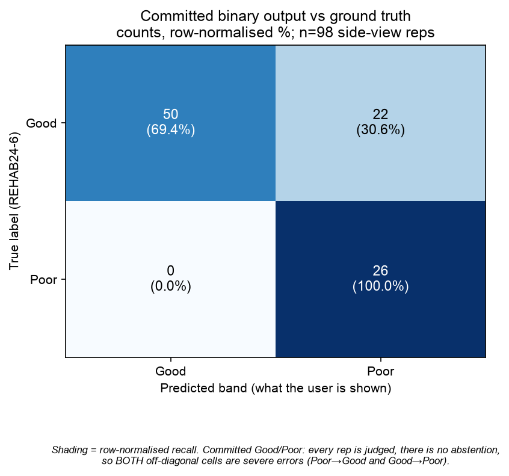

# Squat Evaluation Report — committed binary Good/Poor (Stage 5.11)

Generated by `ml/scripts/tune_squat_binary_band.py`. This is the **deployed** squat
policy as of Stage 5.11: the app commits to a binary **Good/Poor** verdict on every rep.
The earlier 3-band abstaining evaluation is preserved in
[SQUAT_EVALUATION_REPORT_3BAND.md](SQUAT_EVALUATION_REPORT_3BAND.md) as the historical
record; it is no longer the shipped behaviour.

**The model is unchanged.** The forest and sigmoid in `ml/artifacts/squat/` are
byte-identical to Stage 5.8 — this stage chose a _decision policy_ (a threshold and a
fusion weight), not a new model. Probabilities are **out-of-fold** from Stage 5.5's
nested `StratifiedGroupKFold(5, groups=person_id)` (subjects 2, 4, 9 have reps of only one class, so LOSO would give them single-class test folds); no rep is scored by a model that saw its subject in
training.

**Evaluation set:** 98 side-view squat repetitions from 9 subjects
(72 Good, 26 Poor).

---

## Table of Contents

- [1. What changed and why](#1-what-changed-and-why)
- [2. Operating point](#2-operating-point)
  - [Fusion-weight sweep (best threshold per weight)](#fusion-weight-sweep-best-threshold-per-weight)
- [3. Confusion matrix (committed binary output)](#3-confusion-matrix-committed-binary-output)
- [4. Honest reading of the trade-off](#4-honest-reading-of-the-trade-off)
- [5. Deliberately not done here](#5-deliberately-not-done-here)

---

## 1. What changed and why

Phase 4/5 shipped a 3-band Good/Fair/Poor output in which **Fair was an abstention**:
the fusion layer forced Fair whenever calibrated confidence fell below 0.85. This
model's confidence never exceeds ~0.76, so that override fired on almost every rep and
"Poor" was effectively never shown (3-band recall(Poor) ~ 0.077). That design bought a
_zero severe-misclassification_ guarantee at the cost of never actually flagging poor
form.

HY's decision (2026-07-19) is to **commit** to Good or Poor on every rep so the app can
flag poor form, explicitly accepting the trade-off: without abstention, some severe
errors will occur. This report measures that trade-off honestly rather than hiding it.

## 2. Operating point

Chosen for **maximum macro-F1** over Good/Poor (HY's "Balanced" preference), swept
jointly over the fusion weight and the score threshold:

| Parameter                                      | Value          |
| ---------------------------------------------- | -------------- |
| `w_rule` / `w_ml`                              | **0.0 / 1.0**  |
| `decision_threshold` (on the fused 0-10 score) | **8.4480**     |
| threshold plateau (all give the same matrix)   | [8.448, 8.448] |

The threshold is the **median of the plateau** so it sits far from any rep's score (X8).

### Fusion-weight sweep (best threshold per weight)

The ROM rule is inverted for this population (it rewards depth, but incorrect reps are
deeper — Stage 5.4/5.5), so any rule weight pulls a Poor rep's fused score up toward
Good. The sweep is free to prefer pure ML:

| w_rule | w_ml | macro-F1 | recall(Good) | recall(Poor) | severe |
| ------ | ---- | -------- | ------------ | ------------ | ------ |
| 0.0    | 1.0  | 0.761    | 0.694        | 1.000        | 22     | **<- chosen weight** |
| 0.1    | 0.9  | 0.761    | 0.694        | 1.000        | 22     |
| 0.2    | 0.8  | 0.761    | 0.694        | 1.000        | 22     |
| 0.3    | 0.7  | 0.761    | 0.694        | 1.000        | 22     |

## 3. Confusion matrix (committed binary output)

| True \ Predicted | Good | Poor |
| ---------------- | ---- | ---- |
| **Good** (n=72)  | 50   | 22   |
| **Poor** (n=26)  | 0    | 26   |

| Metric                         | Value                              |
| ------------------------------ | ---------------------------------- |
| macro-F1                       | **0.761**                          |
| precision(Good) / recall(Good) | 1.000 / 0.694                      |
| precision(Poor) / recall(Poor) | 0.542 / 1.000                      |
| severe misclassifications      | **22** (Poor→Good 0, Good→Poor 22) |

## 4. Honest reading of the trade-off

- **"Poor" is now reachable.** recall(Poor) rises from ~0.077 (3-band) to
  **1.000** here — the system now flags roughly
  100% of poor reps instead of almost none.
- **The zero-severe guarantee is gone, by design.** There are now
  22 severe misclassifications (0 Poor
  reps called Good, 22 Good reps called Poor). The most costly
  case in a rehab setting — a poor-form rep told it is fine — occurs
  0 time(s) here. This is the price of committing, and it is
  reported rather than abstracted away.
- **Same small-N caveat as every squat report.** 98 reps, 26 Poor, from
  9 subjects, out-of-fold — the per-cell counts are small integers and a
  single rep changing hands moves a rate by several points. Treat these as the honest
  order of magnitude, not precise estimates.
- **What "Poor" means.** The classifier learned "resembles REHAB24-6's incorrect reps",
  which in this cohort skew deeper/faster — not a clinical "you exceeded a safe angle"
  rule. Stage 5.9 showed this construct is population-specific (it did not transfer to
  EC3D). The binary commitment does not change that; it only stops hiding the verdict
  behind abstention.

## 5. Deliberately not done here

- **No retrain, no re-export.** The forest/sigmoid are unchanged; only the fusion
  decision policy moved. `model_version` is unchanged for the same reason.
- **ROM rule not realigned.** It still rewards depth; the binary sweep simply weights it
  down (or to 0). Realigning it so excessive depth lowers the score is a separate,
  deliberately-deferred change (HY, 2026-07-19).
- **Squat only.** Module A keeps its 3-band scheme.
