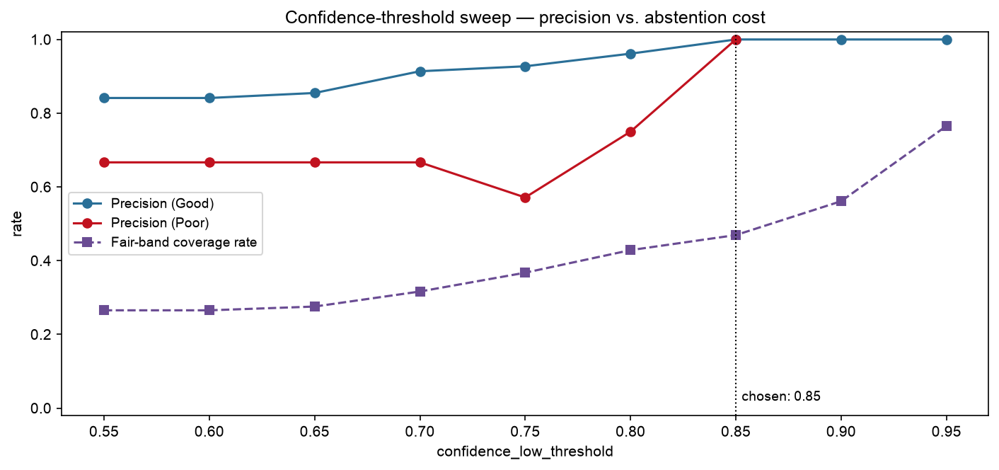
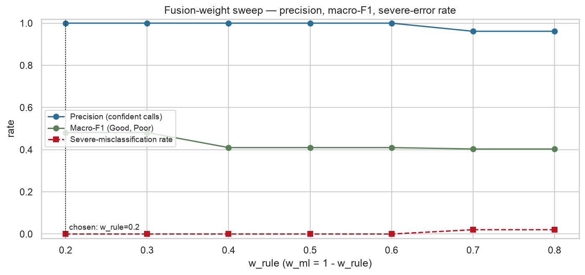

# Stage 5.6 — Fair threshold + fusion weight sweep

Source: the same 98 side-view repetitions and the same seeded `nested_cv()` Stage 5.5 used, so the calibrated P(Good) fed into this sweep is identical to Stage 5.5's out-of-fold predictions (re-run here rather than cached, since nothing about the model changed between stages).

## Why this is an iterated joint search, not one pass

The obvious reading of the checklist sweeps `confidence_low_threshold` once at the existing Stage 4.0 fusion weight (0.4/0.6), then sweeps the fusion weight once at whatever threshold that picked. Running exactly that first (round 1 below) surfaced a real, mechanistic problem: **at `w_rule=0.4`, precision(Poor) is undefined at every one of the 9 candidate thresholds** — no repetition in the dataset can ever be banded Poor at that weight, no matter how the threshold is set.

The cause is checkable, not a sweep artefact. `rule_score`'s ROM component rewards greater knee flexion as better technique, but Stage 5.4/5.5 already established that in this population **incorrect repetitions are deeper**. Measured here: `rule_score` median is **8.83 for Poor** repetitions versus **7.71 for Good** — the rule score runs backwards relative to correctness — and it never drops below 6.43 for anyone. At `w_rule=0.4`, even the single most confidently-Poor repetition in the whole dataset (calibrated P(Good)=0.134, rule_score=9.71) fuses to a score of ~4.7 — inside the Fair band, never Poor. A confidence threshold chosen against that Poor-blind setup is not a meaningful answer, and running the fusion-weight sweep on top of it would compound the problem rather than fix it.

**Fix: alternate the two sweeps until neither winner moves.** Sweep the threshold at the current weight, sweep the weight at that threshold, feed the result back in, repeat. This introduces no new sweep dimension beyond what the checklist specifies — it only recognises that the two must be resolved jointly. The full round history:

| round | input w_rule | -> chosen threshold | -> chosen w_rule |
| ----- | ------------ | -------------------- | ------------------ |
| 1 | 0.4 | 0.55 | 0.2 |
| 2 | 0.2 | 0.85 | 0.2 |
| 3 | 0.2 | 0.85 | 0.2 |

**Round 1's threshold (0.55) was chosen no candidate reached the pre-declared 0.90 bar on both classes; fell back to maximising the worse of the two class precisions, preferring the smaller threshold on ties** — necessarily on Good-class precision alone, since Poor precision was undefined throughout that round. It is shown here rather than discarded, because it is the honest first answer and the reason it was revised is the point of this section.

Converged after round 3. Every result below (tables, both figures) is the **final, converged round** (`confidence_low_threshold=0.85`, `w_rule=0.2`), not round 1.

## Scope: evaluated per repetition, not per session

REHAB24-6 labels each **repetition** Good/Poor. Production instead fuses one grade per **session**: `score_squat_set()` aggregates rule sub-scores across a full set (duration-weighted for stability, needs >= 2 reps for tempo), and the ML score comes from only the session's first repetition — an existing Phase 4 architecture decision, not this stage's to redesign. Since ground truth only exists at repetition granularity, this sweep stays there: each repetition's own `score_squat_rep()` rule score (ROM + stability; tempo is undefined for a lone rep) and its own calibrated P(Good). The threshold/weight **values** below transfer to production, because the confidence measure and the 0-10 rule scale are computed identically at either granularity — but the **confusion counts and rates characterise per-repetition performance**, not per-session performance, and should not be conflated when quoted.

## Capture quality — measured, not assumed

`q_min` is not swept (fixed, out of scope), but it still gates whether `fuse_scores()` forces Fair via `low_capture_quality`, so real per-repetition `q` was computed from each rep's **raw**, pre-preprocessing frame window via the live `assess_capture_quality()` — q ranged [0.828, 0.930] (median 0.858), with **0/98 reps below q_min=0.6**. None did, confirming this dataset's clean capture does not itself force Fair — the sweeps below characterise the confidence/weight mechanisms cleanly, not a confound from capture quality.

## Method: no ground-truth Fair label exists

REHAB24-6 is binary — there is no repetition labelled 'Fair' to score a Fair prediction against. Precision, recall and macro-F1 below are therefore computed for **Good and Poor only** (the classes with real ground truth); a predicted Fair counts as a miss for whichever true class it came from (affecting recall, as any wrong prediction would) but Fair itself has no precision figure, because there is no true-Fair count to make one meaningful. Fair's own rate is reported separately as a descriptive **coverage** statistic. This mirrors the position Stage 5.7's own checklist already takes for the analogous multi-label tag evaluation — applied here, one stage earlier, to the same underlying limitation.

## `confidence_low_threshold` sweep (final, converged round)

Fusion weight held at the converged `w_rule=0.2` throughout this table — the round-1 version of this table (fusion weight at the Stage 4.0 placeholder) is shown above and is not repeated here, since precision(Poor) was undefined in every one of its rows.

**Pre-declared selection rule:** the smallest candidate threshold at which precision reaches >= 0.90 on **both** confidently-classified classes — fixed before the sweep ran, so the bar is not fitted to the outcome. Rationale: R7's default (0.65) is already a conservative starting point above the 0.5 floor Option A's binary probabilities allow; once a precision bar is met, raising the threshold further only trades additional Fair-band abstention for no precision benefit, so the smallest sufficient value is preferred.

| threshold | precision (Good) | precision (Poor) | Fair-band coverage |
| --------- | ----------------- | ----------------- | ------------------ |
| 0.55 | 0.841 | 0.667 | 0.265 |
| 0.60 | 0.841 | 0.667 | 0.265 |
| 0.65 | 0.855 | 0.667 | 0.276 |
| 0.70 | 0.914 | 0.667 | 0.316 |
| 0.75 | 0.927 | 0.571 | 0.367 |
| 0.80 | 0.962 | 0.750 | 0.429 |
| 0.85 | 1.000 | 1.000 | 0.469 **<-chosen** |
| 0.90 | 1.000 | nan | 0.561 |
| 0.95 | 1.000 | nan | 0.765 |

**Chosen: `confidence_low_threshold = 0.85`** — smallest candidate reaching >= 0.90 precision on both confidently-classified classes (pre-declared: once the bar is met, do not buy more abstention than necessary). At this value: precision(Good) = 1.000, precision(Poor) = 1.000, Fair-band coverage = 0.469 (46/98 reps abstained).

> **Read the small-N caveat before quoting these precision numbers precisely.** At n=98 (26 Poor), each threshold step can move only a handful of reps between bands — a single rep changing hands can shift a precision figure by several percentage points. Treat the table as showing a trend (precision rising, then plateauing, as the threshold climbs and more borderline reps are excluded into Fair), not as precise, low-variance estimates of each individual cell.

## Fusion weight (`w_rule`/`w_ml`) sweep (final, converged round)

`confidence_low_threshold` fixed at the converged threshold (0.85) throughout this table.

**Selection criteria (HY, 2026-07-16):** Poor→Good — telling a poor-form user they are fine — is named as **the one failure mode that matters most**, so it is used as its own primary key (see `_pick_fusion_weight()`), not summed with Good→Poor into one aggregate that could let a rise in the worse failure mode hide behind a fall in the milder one; Good→Poor and macro-F1 break ties, in that order. A weight with slightly lower precision but a materially lower Poor→Good count is the better choice.

| w_rule | w_ml | precision (confident calls) | macro-F1 | severe count (Poor→Good / Good→Poor) | severe rate | Fair coverage |
| ------ | ---- | ---------------------------- | -------- | ------------------------------------- | ----------- | ------------- |
| 0.2 | 0.8 | 1.000 | 0.481 | 0 (0 / 0) | 0.000 | 0.469 **<-chosen** |
| 0.3 | 0.7 | 1.000 | 0.481 | 0 (0 / 0) | 0.000 | 0.469 |
| 0.4 | 0.6 | 1.000 | 0.410 | 0 (0 / 0) | 0.000 | 0.490 (Stage 4.0 placeholder) |
| 0.5 | 0.5 | 1.000 | 0.410 | 0 (0 / 0) | 0.000 | 0.490 |
| 0.6 | 0.4 | 1.000 | 0.410 | 0 (0 / 0) | 0.000 | 0.490 |
| 0.7 | 0.3 | 0.962 | 0.403 | 2 (2 / 0) | 0.020 | 0.469 |
| 0.8 | 0.2 | 0.962 | 0.403 | 2 (2 / 0) | 0.020 | 0.469 |

**Chosen: `w_rule = 0.2`, `w_ml = 0.8`** — Poor→Good narrowed 7 candidates to 5 (within 1 of the minimum, 0); macro-F1 narrowed to 2 (best 0.481); smallest w_rule broke the remaining 2-way tie (rule score's ROM component is inverted for this population, so minimising its influence is the principled default when nothing else distinguishes).

At the winner: precision (confident calls) = 1.000, macro-F1 = 0.481, severe-misclassification = 0 (0 Poor→Good, 0 Good→Poor), Fair coverage = 0.469.

**Against the Stage 4.0 placeholder (`w_rule=0.4`):** precision 1.000, macro-F1 0.410, severe count 0 (0 / 0), recall(Poor) = 0.000.

**Against the architecture doc's §10.4 recommendation (`w_rule=0.6`):** precision 1.000, macro-F1 0.410, severe count 0 (0 / 0), recall(Poor) = 0.000.

> **Severe count alone hides an important difference here.** Both the Stage 4.0 placeholder and the §10.4 recommendation reach 0 severe misclassifications — the same as the chosen weight — but not for the same reason. At `w_rule=0.4` and `0.6`, `recall_poor=0`: **every Poor repetition is routed to Fair, and none is ever correctly identified as Poor.** That is safe but uninformative. At the chosen `w_rule=0.2`, some Poor repetitions are correctly identified as Poor (`recall_poor=0.077`) with the same 0 severe count — this is exactly the distinction macro-F1 is doing real work to catch above, and it is why the tie-break trace credits macro-F1 with narrowing the field rather than treating all zero-severe candidates as equivalent.

> **The same small-N caveat applies here, more so.** 7 candidate weights over 98 reps (26 Poor) means the Poor→Good and Good→Poor counts are small integers (typically single digits) — a difference of one event between two candidates is not a reliably distinguishable result. The within-1-event tie-break margin used in `_pick_fusion_weight()` is a deliberate acknowledgement of this, not an arbitrary allowance.

## What changed

`backend/app/module_b/core/config.py`: `w_rule_default`/`w_ml_default` replaced with this sweep's converged winner and retagged `[dataset-derived]` (previously `[proposed heuristic, R7]`); `confidence_low_threshold` replaced with the same converged run's threshold and retagged the same way. `w_rule_low_confidence` and `q_min` are untouched (out of scope for this stage).

## Deliberately not done here

- **`band_thresholds` (D6, Poor<4/Fair[4,7)/Good>=7) is unchanged.** This stage's checklist sweeps `confidence_low_threshold` and the fusion weight only; the score-to-band cut points are a separate, already-fixed heuristic not in scope here.
- **No 3-band confusion-matrix figure, no baseline comparison, no latency.** **Stage 5.7.**
- **No artifact export.** The classifier itself is still Stage 5.8's deliverable; this stage only changes fusion configuration.
