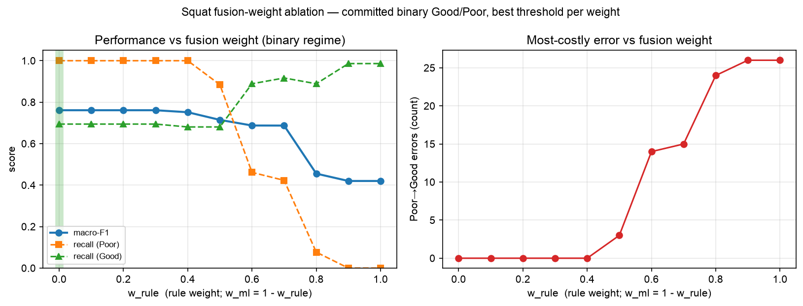

# Squat fusion-weight ablation — full 0.0→1.0 range (binary regime)

Generated by `ml/scripts/sweep_fusion_weights_full_range.py`. **Read-only ablation for
the thesis Results & Discussion** — it does not change the deployed model, config, or
`band_policy`. It answers one question directly: _given the committed binary Good/Poor
squat policy, is `w_rule = 0.0 / w_ml = 1.0` (100% ML) actually the best split, or was
it just assumed?_

**Setup (identical to the deployed tuner).** 98 side-view reps (72 Good,
26 Poor) from 9 subjects. Calibrated P(Good) is **out-of-fold** from
Stage 5.5's seeded nested `StratifiedGroupKFold(5, groups=person_id)` (subjects 2, 4, 9 have reps of only one class, so LOSO would give them single-class test folds) — no rep is scored by a model that saw
its subject in training. The fused 0–10 score is read from the real `fuse_scores()`
(X1), and at each weight the decision threshold is re-optimised for **max macro-F1**
(the same objective and tie-break the deployed tuner uses). The model artifact is
unchanged throughout; only the _fusion weight_ moves.

---

## Table of Contents

- [Result: every weight, best threshold per weight](#result-every-weight-best-threshold-per-weight)
- [Reading](#reading)

---

## Result: every weight, best threshold per weight

`w_rule` is the weight on the rule score; `w_ml = 1 − w_rule`. So `w_rule=0.0` is 100% ML
(deployed), `w_rule=0.5` is the 5/5 split, `0.4` is 4/6, `0.3` is 3/7, etc.

| w_rule | w_ml | best threshold | macro-F1          | precision(Good) | recall(Good) | precision(Poor) | recall(Poor) | Poor→Good | Good→Poor                |
| ------ | ---- | -------------- | ----------------- | --------------- | ------------ | --------------- | ------------ | --------- | ------------------------ |
| 0.0    | 1.0  | 8.448          | 0.761             | 1.000           | 0.694        | 0.542           | 1.000        | 0         | 22 **← deployed / best** |
| 0.1    | 0.9  | 8.327          | 0.761 (tied best) | 1.000           | 0.694        | 0.542           | 1.000        | 0         | 22                       |
| 0.2    | 0.8  | 8.242          | 0.761 (tied best) | 1.000           | 0.694        | 0.542           | 1.000        | 0         | 22                       |
| 0.3    | 0.7  | 8.175          | 0.761 (tied best) | 1.000           | 0.694        | 0.542           | 1.000        | 0         | 22                       |
| 0.4    | 0.6  | 8.286          | 0.752             | 1.000           | 0.681        | 0.531           | 1.000        | 0         | 23                       |
| 0.5    | 0.5  | 8.053          | 0.715             | 0.942           | 0.681        | 0.500           | 0.885        | 3         | 23                       |
| 0.6    | 0.4  | 7.109          | 0.688             | 0.821           | 0.889        | 0.600           | 0.462        | 14        | 8                        |
| 0.7    | 0.3  | 7.355          | 0.687             | 0.815           | 0.917        | 0.647           | 0.423        | 15        | 6                        |
| 0.8    | 0.2  | 7.330          | 0.456             | 0.727           | 0.889        | 0.200           | 0.077        | 24        | 8                        |
| 0.9    | 0.1  | 6.806          | 0.420             | 0.732           | 0.986        | 0.000           | 0.000        | 26        | 1                        |
| 1.0    | 0.0  | 6.478          | 0.420             | 0.732           | 0.986        | 0.000           | 0.000        | 26        | 1                        |

## Reading

- **100% ML is on the best-macro-F1 plateau, not an arbitrary pick.** Macro-F1 is flat
  at its maximum across the ML-heavy weights and then **falls** as the rule gains weight.
  Adding rule signal never _improves_ the binary verdict on this dataset; past a point it
  strictly degrades it.
- **Why the rule can only hurt here.** The ROM component of the rule score is _inverted_
  for this REHAB24-6 cohort — it rewards knee depth as "better", but the incorrectly-
  performed reps in this dataset are the _deeper_ ones (Stage 5.4–5.6; rule_score median
  8.83 for Poor vs 7.71 for Good). Mixing an inverted signal into the fused score pulls
  genuinely-Poor reps _up_ toward Good, which is why the most costly error — **Poor→Good**
  (a bad rep told it is fine) — climbs as `w_rule` rises.
- **Tie-break to the smallest rule weight.** Where several ML-heavy weights tie on
  macro-F1, `w_rule=0` is chosen on the principled default of giving the demonstrably-
  inverted rule signal _zero_ influence rather than a token non-zero weight that only
  adds risk without measured benefit.
- **This is an ablation, not the headline result.** It characterises the _fusion weight_
  only. The binary threshold, the small-N caveat (single reps move a rate by points), and
  the population-specificity of what "Poor" means (Stage 5.9, EC3D) are all as documented
  in `SQUAT_EVALUATION_REPORT_2BAND.md` and are unchanged by this sweep.

